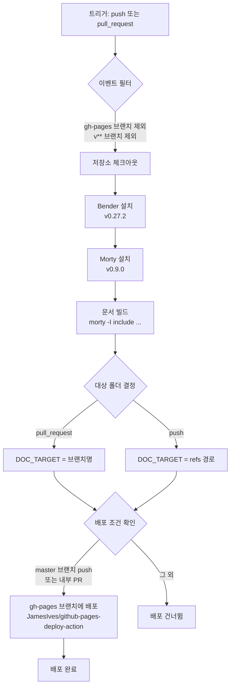

# .github/workflows/doc.yml

## 파일 개요 및 목적

`doc.yml`은 AXI 프로젝트의 **GitHub Actions 문서 빌드 및 배포 워크플로우**입니다. `morty` 도구를 사용하여 SystemVerilog 소스에서 HTML 문서를 생성하고, 생성된 문서를 `gh-pages` 브랜치에 자동으로 배포합니다. PR 이벤트와 push 이벤트 모두에서 실행되며, `master` 브랜치에 대한 push 또는 내부 PR에서만 실제 배포가 이루어집니다.

---

## Mermaid 블록 다이어그램



---

## 주요 섹션/타겟/변수/파라미터 설명 테이블

| 항목 | 값 / 설명 |
|------|----------|
| `name` | `Build and deploy documentation` |
| `on.push.branches-ignore` | `gh-pages`, `v**` 브랜치 무시 |
| `on.push.tags` | `v**` 태그에서 실행 |
| `on.pull_request.branches-ignore` | `gh-pages`, `v**` 브랜치 무시 |
| `jobs.build-and-deploy.runs-on` | `ubuntu-latest` |
| `if` 조건 | `github.repository == 'pulp-platform/axi'` (포크에서는 실행 안 함) |

### 주요 스텝 설명

| 스텝명 | 도구/액션 | 설명 |
|--------|----------|------|
| Checkout | `actions/checkout@v3` | 저장소 체크아웃 (크리덴셜 미지속) |
| Install Bender | `pulp-platform/pulp-actions/bender-install@v2` | 의존성 관리 툴 Bender 0.27.2 설치 |
| Install Morty | `curl` + `bash` | SystemVerilog 문서화 도구 Morty 0.9.0 설치 (`/tools/morty`) |
| Build documentation | `morty` 명령 | `src/*.sv` 파일 파싱, `docs/` 폴더에 HTML 생성 |
| Determine target folder | `bash` | 이벤트 유형에 따라 배포 대상 폴더명 결정 |
| Deploy documentation | `JamesIves/github-pages-deploy-action@v4` | `gh-pages` 브랜치에 `docs/` 폴더 내용 배포 |

### 환경 변수

| 변수 | 설명 |
|------|------|
| `DOC_TARGET` | 배포 대상 서브폴더명 (PR이면 브랜치명, push면 ref 경로) |
| `GITHUB_ENV` | GitHub Actions 환경변수 파일 경로 |
| `secrets.GH_PAGES` | gh-pages 브랜치 쓰기 권한용 토큰 |

### 문서 빌드 명령 상세

```bash
mkdir -p docs
cp doc/axi_demux.png docs/module.axi_demux.png
cp doc/svg/axi_id_remap_table.svg docs/axi_id_remap_table.svg
morty -I include -I $(bender path common_cells)/include src/*.sv -d docs
```

| 옵션 | 설명 |
|------|------|
| `-I include` | AXI 프로젝트 include 디렉토리 |
| `-I $(bender path common_cells)/include` | common_cells 의존성의 include 디렉토리 |
| `src/*.sv` | 모든 소스 SystemVerilog 파일 |
| `-d docs` | 출력 디렉토리 |

---

## 동작 방식 상세 설명

1. **트리거 조건**: `gh-pages`와 `v**` 브랜치를 제외한 모든 push/PR 이벤트에서 실행됩니다. 단, 실제 잡 실행은 `pulp-platform/axi` 원본 저장소에서만 이루어집니다(포크 제외).

2. **문서 생성**: `morty`가 `src/*.sv` 파일을 파싱하여 SystemVerilog 모듈 문서를 HTML로 변환합니다. PNG 및 SVG 다이어그램도 함께 복사됩니다.

3. **배포 대상 폴더 결정**:
   - PR 이벤트: `$GITHUB_HEAD_REF` (PR 소스 브랜치명)
   - push 이벤트: `refs/heads/<브랜치명>` 또는 `refs/tags/<태그명>`에서 브랜치/태그명 추출

4. **배포 조건**: master 브랜치에 대한 push이거나, 내부(포크가 아닌) PR인 경우에만 `gh-pages` 브랜치에 배포합니다. `clean: true` 옵션으로 기존 파일은 삭제됩니다.

---

## 사용 방법 및 예시

이 워크플로우는 자동으로 실행됩니다. 수동 트리거는 지원하지 않습니다.

```
# 문서 배포 결과 확인
https://pulp-platform.github.io/axi/master/

# PR에서 문서 프리뷰
https://pulp-platform.github.io/axi/<PR-브랜치명>/
```

로컬에서 문서를 빌드하려면:

```bash
# Morty 설치
curl --proto '=https' --tlsv1.2 https://pulp-platform.github.io/morty/init -sSf | bash -s -- 0.9.0

# 문서 빌드
mkdir -p docs
morty -I include -I $(bender path common_cells)/include src/*.sv -d docs
```
