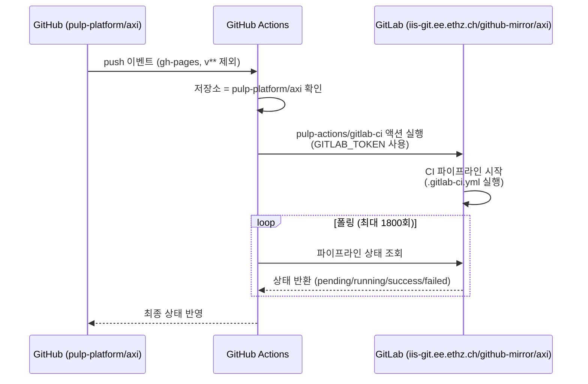

# .github/workflows/gitlab-ci.yml

## 파일 개요 및 목적

`gitlab-ci.yml`은 **GitHub Actions에서 GitLab CI를 트리거하는 브리지 워크플로우**입니다. GitHub 저장소에 push가 발생하면 ETH Zurich의 내부 GitLab 인스턴스(`iis-git.ee.ethz.ch`)의 미러 저장소에서 CI 파이프라인을 실행하고, 그 결과를 GitHub에 폴링(polling)하여 반영합니다. 내부 하드웨어 시뮬레이션 툴(Questa, Synopsys DC 등)은 GitLab 러너에서만 접근 가능하기 때문에 이 브리지가 필요합니다.

---

## Mermaid 블록 다이어그램



---

## 주요 섹션/타겟/변수/파라미터 설명 테이블

| 항목 | 값 | 설명 |
|------|-----|------|
| `name` | `Internal CI` | 워크플로우 표시 이름 |
| `on.push.branches-ignore` | `gh-pages`, `v**` | 이 브랜치 push는 무시 |
| `on.workflow_dispatch` | (없음) | 수동 트리거 허용 |
| `jobs.gitlab-ci.runs-on` | `ubuntu-latest` | GitHub Actions 러너 환경 |
| `jobs.gitlab-ci.timeout-minutes` | `310` | 최대 실행 시간 (약 5시간 10분) |

### 주요 스텝 파라미터

| 파라미터 | 값 | 설명 |
|---------|-----|------|
| `uses` | `pulp-platform/pulp-actions/gitlab-ci@v2` | GitLab CI 연동 액션 |
| `if` 조건 | 저장소가 `pulp-platform/axi`이고, 포크 PR이 아닌 경우 | 포크에서 시크릿 없음 |
| `domain` | `iis-git.ee.ethz.ch` | GitLab 인스턴스 도메인 |
| `repo` | `github-mirror/axi` | GitLab 내 미러 저장소 경로 |
| `token` | `secrets.GITLAB_TOKEN` | GitLab API 접근 토큰 |
| `poll-count` | `1800` | 상태 폴링 최대 횟수 |

### 시간 제한 계산

| 항목 | 값 |
|------|-----|
| `timeout-minutes` | 310분 (~5시간 10분) |
| `poll-count` | 1800회 |
| 폴링 간격 (추정) | ~10초 |
| 최대 대기 시간 | ~300분 (5시간) |

---

## 동작 방식 상세 설명

1. **트리거**: `gh-pages` 및 `v**` 브랜치를 제외한 모든 push, 또는 수동 트리거(`workflow_dispatch`)에서 실행됩니다.

2. **실행 조건 필터링**: 포크 저장소이거나 포크에서 생성된 PR은 `GITLAB_TOKEN` 시크릿에 접근할 수 없으므로 실행을 건너뜁니다.

3. **GitLab 파이프라인 트리거**: `pulp-platform/pulp-actions/gitlab-ci@v2` 액션이 GitLab API를 통해 `iis-git.ee.ethz.ch/github-mirror/axi` 저장소의 CI 파이프라인을 시작합니다. GitLab 저장소는 GitHub의 미러입니다.

4. **폴링**: 파이프라인 완료까지 최대 1800회 상태를 폴링합니다. 파이프라인 결과(성공/실패)가 GitHub Actions 상태로 반영됩니다.

5. **내부 CI 목적**: GitLab에는 Questa, Synopsys DC 등 라이선스가 필요한 EDA 툴이 설치된 러너가 있으므로, 실제 하드웨어 시뮬레이션 및 합성 검증은 GitLab에서 수행됩니다.

---

## 사용 방법 및 예시

이 워크플로우는 대부분 자동으로 실행됩니다.

**수동 트리거 방법** (GitHub UI):
1. 저장소 > Actions > Internal CI > "Run workflow" 버튼 클릭

**필요한 시크릿 설정** (저장소 관리자):
```
Settings > Secrets and variables > Actions > New repository secret
이름: GITLAB_TOKEN
값: GitLab Personal Access Token (api 스코프 필요)
```

**포크 기여자를 위한 주의사항**:
- 포크 저장소에서는 `GITLAB_TOKEN`이 없으므로 내부 CI가 실행되지 않습니다.
- 내부 CI 결과는 원본 저장소 관리자가 PR을 검토할 때 확인합니다.
