# .gitlab-ci.yml

## 파일 개요 및 목적

`.gitlab-ci.yml`은 AXI 프로젝트의 **GitLab CI/CD 파이프라인 설정 파일**입니다. 빌드(Build) 스테이지와 테스트(Test) 스테이지로 구성되며, Memora 캐시 시스템을 활용하여 불필요한 재컴파일을 방지합니다. 지원하는 CI 작업은 다음과 같습니다:

- **vsim**: Questa/ModelSim을 사용한 SystemVerilog 컴파일
- **synopsys_dc**: Synopsys Design Compiler를 사용한 RTL 합성
- **fuse_xsim**: FuseSoC + Xilinx XSim을 사용한 빌드 (실패 허용)
- **verilator_lint**: Verilator를 사용한 린트 검사
- **run_vsim (21개 테스트)**: 개별 AXI 모듈 시뮬레이션 테스트

---

## Mermaid 블록 다이어그램

```mermaid
flowchart TD
    subgraph build_stage[빌드 스테이지]
        vsim["vsim<br/>(Questa 컴파일<br/>VSIM_VER: 2025.1)"]
        dc["synopsys_dc<br/>(Synopsys DC 합성)"]
        xsim["fuse_xsim<br/>(FuseSoC+XSim)<br/>[allow_failure]"]
        vlint["verilator_lint<br/>(Verilator 5.020 린트)"]
    end

    subgraph test_stage[테스트 스테이지]
        t1[axi_addr_test]
        t2[axi_atop_filter]
        t3[axi_cdc]
        t4[axi_delayer]
        t5[axi_dw_downsizer]
        t6[axi_dw_upsizer]
        t7[axi_fifo]
        t8[axi_isolate]
        t9[axi_iw_converter]
        t10[axi_lite_dw_converter]
        t11[axi_lite_mailbox]
        t12[axi_lite_regs]
        t13[axi_lite_to_apb]
        t14[axi_lite_to_axi]
        t15[axi_lite_xbar]
        t16[axi_modify_address]
        t17[axi_serializer]
        t18[axi_sim_mem]
        t19[axi_to_axi_lite]
        t20[axi_to_mem_banked]
        t21[axi_xbar]
    end

    vsim --> t1 & t2 & t3 & t4 & t5 & t6 & t7 & t8 & t9 & t10
    vsim --> t11 & t12 & t13 & t14 & t15 & t16 & t17 & t18 & t19 & t20 & t21
```



---

## 주요 섹션/타겟/변수/파라미터 설명 테이블

### 전역 변수

| 변수 | 값 | 설명 |
|------|-----|------|
| `SYNOPSYS_DC` | `synopsys-2022.03 dcnxt_shell` | Synopsys DC 실행 명령 |

### before_script

| 명령 | 설명 |
|------|------|
| `export PATH=~/.cargo/bin:$PATH` | Rust 기반 도구(Bender 등) PATH 추가 |
| `mkdir -p build` | 빌드 출력 디렉토리 생성 |

### 빌드 스테이지 작업

| 작업명 | 스테이지 | 설명 |
|--------|----------|------|
| `vsim` | `build` | VSIM_VER 행렬에 따라 Questa/vsim으로 컴파일. Memora 캐시 활용 |
| `synopsys_dc` | `build` | Synopsys DC로 합성 실행. Memora 캐시 활용 |
| `fuse_xsim` | `build` | FuseSoC + XSim 빌드. `allow_failure: true`, 5분 제한 |
| `verilator_lint` | `build` | Verilator 5.020으로 린트 검사. 스크립트: `scripts/run_verilator.sh` |

### vsim 작업 행렬

| 매개변수 | 값 |
|---------|-----|
| `VSIM_VER` | `['2025.1']` |

### vsim 버전별 명령 매핑

| VSIM_VER 패턴 | VSIM 명령 | VLIB 명령 | VLOG 명령 |
|--------------|-----------|-----------|-----------|
| `20*` (20으로 시작) | `questa-<VER> vsim -64` | `questa-<VER> vlib` | `questa-<VER> vlog -64` |
| 그 외 | `vsim-<VER> -64` | `vlib-<VER>` | `vlog-<VER> -64` |

### 테스트 스테이지 `.run_vsim` 템플릿

| 항목 | 설명 |
|------|------|
| `stage` | `test` |
| `needs: [vsim]` | vsim 빌드 작업 완료 후 실행 |
| Memora lookup | `$TEST_MODULE-vsim_$VSIM_VER` 아티팩트 조회 |
| Memora get | `vsim-$VSIM_VER` 아티팩트 다운로드 |
| 실행 명령 | `scripts/run_vsim.sh --random-seed $TEST_MODULE` |
| 완료 표시 | `touch $ARTIFACT.tested` |

### 테스트 작업 목록 (21개)

| 작업명 | TEST_MODULE |
|--------|-------------|
| `axi_addr_test` | `axi_addr_test` |
| `axi_atop_filter` | `axi_atop_filter` |
| `axi_cdc` | `axi_cdc` |
| `axi_delayer` | `axi_delayer` |
| `axi_dw_downsizer` | `axi_dw_downsizer` |
| `axi_dw_upsizer` | `axi_dw_upsizer` |
| `axi_fifo` | `axi_fifo` |
| `axi_isolate` | `axi_isolate` |
| `axi_iw_converter` | `axi_iw_converter` |
| `axi_lite_dw_converter` | `axi_lite_dw_converter` |
| `axi_lite_mailbox` | `axi_lite_mailbox` |
| `axi_lite_regs` | `axi_lite_regs` |
| `axi_lite_to_apb` | `axi_lite_to_apb` |
| `axi_lite_to_axi` | `axi_lite_to_axi` |
| `axi_lite_xbar` | `axi_lite_xbar` |
| `axi_modify_address` | `axi_modify_address` |
| `axi_serializer` | `axi_serializer` |
| `axi_sim_mem` | `axi_sim_mem` |
| `axi_to_axi_lite` | `axi_to_axi_lite` |
| `axi_to_mem_banked` | `axi_to_mem_banked` |
| `axi_xbar` | `axi_xbar` |

---

## 동작 방식 상세 설명

### 빌드 캐시 전략

모든 빌드/테스트 작업은 Memora 캐시를 다음과 같이 활용합니다:

1. `memora_retry.sh lookup <아티팩트>`: 입력 파일 해시 기반으로 캐시 확인
2. **캐시 히트**: 재빌드 없이 `get`으로 아티팩트 다운로드
3. **캐시 미스**: 실제 빌드/테스트 실행 후 `insert`로 캐시 등록

### vsim 컴파일 흐름

```
1. VSIM_VER에 따라 Questa 또는 vsim 명령 결정
2. Memora lookup으로 캐시 확인
3. 캐시 미스 시: cd build && scripts/compile_vsim.sh
4. 컴파일된 work 디렉토리를 work-<VSIM_VER>로 이름 변경
5. Memora insert로 캐시 등록
```

### 테스트 실행 흐름

```
1. Memora lookup으로 테스트 결과 캐시 확인
2. 캐시 미스 시:
   a. Memora get으로 vsim 컴파일 결과 다운로드
   b. work-<VSIM_VER> -> work로 이름 변경
   c. scripts/run_vsim.sh --random-seed <모듈명> 실행
   d. .tested 파일 생성
3. Memora insert로 테스트 결과 캐시 등록
```

### fuse_xsim 동작

FuseSoC와 Xilinx Vitis 2022.1 XSim을 사용하는 보조 빌드입니다:
- `allow_failure: true`로 실패해도 전체 파이프라인에 영향 없음
- 5분 제한으로 긴 실행 방지
- FuseSoC 버전 파일은 `VERSION` 파일에서 읽어 `-`를 `.`으로 변환

---

## 사용 방법 및 예시

이 파일은 GitLab CI에서 자동으로 사용됩니다. GitHub에서 push 이벤트가 발생하면 `.github/workflows/gitlab-ci.yml`이 이 파이프라인을 트리거합니다.

**새 VSIM 버전 추가**:
```yaml
vsim:
  parallel:
    matrix:
      - VSIM_VER: ['2025.1', '2026.1']  # 새 버전 추가
```

**새 테스트 모듈 추가**:
```yaml
axi_new_module:
  <<: *run_vsim
  variables:
    TEST_MODULE: axi_new_module
```

**Verilator 버전 변경**:
```yaml
verilator_lint:
  variables:
    VERILATOR: verilator-5.030 verilator  # 버전 업데이트
```
