# Bender.yml - AXI 패키지 의존성 관리 설정

## 파일 개요 및 목적

`Bender.yml`은 PULP-Platform의 하드웨어 의존성 관리 도구인 [Bender](https://github.com/pulp-platform/bender)의 패키지 매니페스트 파일입니다. AXI IP 패키지의 메타데이터(이름, 저자), 외부 의존성(Git 저장소), 포함 디렉터리, 소스 파일 목록을 계층적으로 정의합니다. Bender는 이 파일을 기반으로 시뮬레이션/합성 도구용 파일 리스트를 자동 생성합니다.

---

## Mermaid 다이어그램

```mermaid
graph TD
    A["Bender.yml\n(axi 패키지)"] --> B[패키지 메타데이터]
    A --> C[의존성 dependencies]
    A --> D[export_include_dirs]
    A --> E[소스 파일 sources]
    A --> F[타겟 targets]

    C --> C1["common_cells v1.40.0\ngithub/chorus96/common_cells"]
    C --> C2["common_verification v0.2.6\ngithub/chorus96/common_verification"]
    C --> C3["tech_cells_generic v0.2.14\ngithub/chorus96/tech_cells_generic"]

    E --> L0["Level 0: axi_pkg.sv\n(의존성 없음)"]
    E --> L1["Level 1: axi_demux_id_counters.sv\naxi_intf.sv"]
    E --> L2["Level 2: 34개 RTL 모듈\n(Level 0/1에만 의존)"]
    E --> L3["Level 3: 12개 RTL 모듈\n(Level 0~2에 의존)"]
    E --> L4["Level 4: 7개 RTL 모듈\n(Level 0~3에 의존)"]
    E --> L5["Level 5: axi_xbar.sv"]
    E --> L6["Level 6: axi_xp.sv"]
    E --> TG1["target: synth_test\naxi_synth_bench.sv"]
    E --> TG2["target: simulation\n시뮬레이션 전용 파일"]
    E --> TG3["target: test\n테스트벤치 파일들"]

    F --> F1["default: RTL만 포함"]
    F --> F2["simulation targets\n각 TB별 개별 시뮬레이션 타겟"]

    style A fill:#2c3e50,color:#fff
    style C fill:#2980b9,color:#fff
    style E fill:#27ae60,color:#fff
    style F fill:#8e44ad,color:#fff
```



---

## 주요 섹션/구조 상세 설명

### 1. 패키지 메타데이터 (package)

```yaml
package:
  name: axi
  authors:
    - "Thomas Benz <tbenz@iis.ee.ethz.ch>"   # 현재 유지관리자
    - "Michael Rogenmoser <michaero@iis.ee.ethz.ch>"  # 현재 유지관리자
    # ... 14명의 기여자
```

- 패키지 이름: `axi`
- 현재 유지관리자: Thomas Benz, Michael Rogenmoser
- 총 15명의 저자 (ETH Zurich IIS, University of Bologna 등)

### 2. 외부 의존성 (dependencies)

| 패키지 | Git 저장소 | 버전 |
|---|---|---|
| `common_cells` | github.com/chorus96/common_cells | 1.40.0 |
| `common_verification` | github.com/chorus96/common_verification | 0.2.6 |
| `tech_cells_generic` | github.com/chorus96/tech_cells_generic | 0.2.14 |

### 3. 포함 디렉터리 (export_include_dirs)

```yaml
export_include_dirs:
  - include
```

패키지를 사용하는 다른 프로젝트에 자동으로 `include/` 디렉터리가 노출됩니다. 이 디렉터리에는 `axi/assign.svh`, `axi/typedef.svh` 등의 SystemVerilog 헤더 파일이 포함됩니다.

### 4. 소스 파일 계층 구조 (sources)

파일은 컴파일 의존성 순서에 따라 레벨로 분류됩니다:

| 레벨 | 파일 수 | 대표 파일 | 설명 |
|---|---|---|---|
| Level 0 | 1 | `axi_pkg.sv` | 기본 타입/파라미터 패키지, 의존성 없음 |
| Level 1 | 2 | `axi_demux_id_counters.sv`, `axi_intf.sv` | Level 0에만 의존 |
| Level 2 | 34 | `axi_atop_filter.sv`, `axi_lite_regs_wrapper.sv` 등 | Level 0/1에만 의존 |
| Level 3 | 12 | `axi_burst_splitter.sv`, `axi_cdc.sv` 등 | Level 0~2에 의존 |
| Level 4 | 7 | `axi_iw_converter.sv`, `axi_xbar_unmuxed.sv` 등 | Level 0~3에 의존 |
| Level 5 | 1 | `axi_xbar.sv` | 최상위 크로스바 |
| Level 6 | 1 | `axi_xp.sv` | 크로스포인트 스위치 |

**타겟별 조건부 소스:**

| 타겟 | 파일 | 용도 |
|---|---|---|
| `synth_test` | `test/axi_synth_bench.sv` | 합성 검증 벤치 |
| `simulation` | `axi_chan_compare.sv`, `axi_dumper.sv`, `axi_sim_mem.sv`, `axi_test.sv` | 시뮬레이션 전용 |
| `test` | `test/tb_*.sv` (21개) | 테스트벤치 |

### 5. 시뮬레이션 타겟 (targets)

```yaml
targets:
  default:
    filesets: [rtl]
  sim: &sim
    filesets: [rtl, benchs]
    toplevel: tb_axi_delayer
  sim_xbar:
    filesets: [rtl, benchs]
    toplevel: tb_axi_xbar
  # ... 총 22개 시뮬레이션 타겟
```

각 TB에 대한 개별 시뮬레이션 타겟이 정의되어 있으며, YAML 앵커(`&sim`, `<<: *sim`)로 중복을 줄입니다.

---

## 의존성 및 연관 파일

```
Bender.yml
├── include/                        (export_include_dirs)
│   ├── axi/assign.svh
│   └── axi/typedef.svh
├── src/*.sv                        (RTL 소스)
├── test/tb_*.sv                    (테스트벤치)
├── scripts/compile_vsim.sh         (bender script vsim 사용)
├── scripts/compile_verilator.sh    (bender script verilator 사용)
├── scripts/synth.sh                (bender script synopsys 사용)
└── ips_list.yml                    (FuseSoC 스타일 구버전 의존성 목록)
```

외부 의존 패키지:
- `common_cells`: FIFO, CDC 등 기본 셀 라이브러리
- `common_verification`: 시뮬레이션 검증 유틸리티
- `tech_cells_generic`: 공정 독립적 기술 셀

---

## 사용법

```bash
# 의존성 업데이트 및 잠금 파일 생성
bender update

# 소스 파일 목록 확인
bender sources

# Questasim 컴파일 스크립트 생성
bender script vsim -t test -t rtl

# Verilator 파일 리스트 생성
bender script verilator -t simulation -t test

# Synopsys DC 스크립트 생성
bender script synopsys -t synth_test

# 특정 패키지 경로 확인
bender path common_cells

# 의존성 트리 확인
bender packages
```

---

## 주요 변수/설정 항목

| 설정 키 | 값 | 설명 |
|---|---|---|
| `package.name` | `axi` | Bender 패키지 식별자 |
| `dependencies.common_cells.version` | `1.40.0` | 최소 요구 버전 |
| `dependencies.common_verification.version` | `0.2.6` | 최소 요구 버전 |
| `dependencies.tech_cells_generic.version` | `0.2.14` | 최소 요구 버전 |
| `export_include_dirs` | `[include]` | 외부 공개 헤더 경로 |
| `sources` (레벨 구조) | Level 0~6 | 컴파일 순서 보장 |
