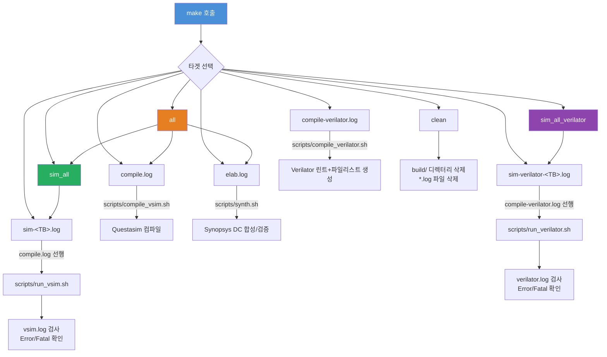

# Makefile - AXI IP 빌드 및 시뮬레이션 자동화

## 파일 개요 및 목적

`Makefile`은 PULP-Platform AXI IP의 전체 개발 워크플로를 자동화하는 GNU Make 빌드 스크립트입니다. Synopsys Design Compiler를 이용한 합성, Questasim을 이용한 RTL 시뮬레이션, Verilator를 이용한 오픈소스 시뮬레이션/린트 검사까지 세 가지 EDA 플로우를 통합합니다.

라이선스: Solderpad Hardware License v0.51 (SHL-0.51)  
저자: Thomas Benz (tbenz@iis.ee.ethz.ch)

---

## Mermaid 플로우차트



---

## 주요 섹션/구조 상세 설명

### 1. 환경 감지 및 도구 설정

```makefile
ifneq (,$(wildcard /etc/iis.version))
    VSIM        ?= questa-2025.1 vsim
    SYNOPSYS_DC ?= synopsys-2022.03 dcnxt_shell
else
    VSIM        ?= vsim
    SYNOPSYS_DC ?= dc_shell
endif
VERILATOR ?= verilator
```

- `/etc/iis.version` 파일 존재 여부로 ETH Zurich IIS 내부 서버인지 감지
- IIS 환경에서는 버전이 명시된 래퍼 명령어 사용 (e.g., `questa-2025.1 vsim`)
- 외부 환경에서는 PATH에 있는 기본 명령어 사용
- 모든 변수는 `?=` 연산자로 환경변수 오버라이드 가능

### 2. 테스트벤치 목록 (TBS)

총 20개의 테스트벤치가 정의되어 있습니다:

| 테스트벤치 | 검증 대상 모듈 |
|---|---|
| axi_addr_test | AXI 주소 생성 로직 |
| axi_atop_filter | Atomic Operation 필터 |
| axi_cdc | Clock Domain Crossing |
| axi_delayer | AXI 지연 삽입기 |
| axi_dw_downsizer | 데이터 폭 다운사이저 |
| axi_dw_upsizer | 데이터 폭 업사이저 |
| axi_fifo | AXI FIFO |
| axi_isolate | AXI 격리 모듈 |
| axi_iw_converter | ID 폭 변환기 |
| axi_lite_regs | AXI Lite 레지스터 |
| axi_lite_to_apb | AXI Lite → APB 브릿지 |
| axi_lite_to_axi | AXI Lite → AXI 변환 |
| axi_lite_mailbox | AXI Lite 메일박스 |
| axi_lite_xbar | AXI Lite 크로스바 |
| axi_modify_address | 주소 수정 모듈 |
| axi_serializer | AXI 직렬화기 |
| axi_sim_mem | 시뮬레이션 메모리 |
| axi_to_axi_lite | AXI → AXI Lite 변환 |
| axi_to_mem_banked | 뱅크형 메모리 인터페이스 |
| axi_xbar | AXI 크로스바 스위치 |

### 3. 타겟별 동작

| 타겟 | 설명 | 선행 조건 |
|---|---|---|
| `help` | 사용법 출력 | 없음 |
| `all` | 컴파일+합성+전체 시뮬레이션 | 없음 |
| `build` | build 디렉터리 생성 | 없음 |
| `elab.log` | Synopsys DC 합성 검증 | `Bender.yml`, `build/` |
| `compile.log` | Questasim 컴파일 | `Bender.yml`, `build/` |
| `sim-%.log` | 특정 TB Questasim 시뮬레이션 | `compile.log` |
| `sim_all` | 전체 TB Questasim 시뮬레이션 | `compile.log` |
| `compile-verilator.log` | Verilator 린트 및 파일리스트 | `Bender.yml`, `build/` |
| `sim-verilator-%.log` | 특정 TB Verilator 시뮬레이션 | `compile-verilator.log` |
| `sim_all_verilator` | 전체 TB Verilator 시뮬레이션 | `compile-verilator.log` |
| `clean` | 생성 파일 전체 삭제 | 없음 |

### 4. 오류 검사 패턴

모든 시뮬레이션/합성 타겟은 로그에서 오류를 자동 검사합니다:
```makefile
(! grep -n "Error:" $@)
(! grep -n "Fatal:" $@)
```
`Error:` 또는 `Fatal:` 문자열이 발견되면 make가 실패 상태로 종료됩니다.

---

## 의존성 및 연관 파일

```
Makefile
├── Bender.yml                        (의존성 관리)
├── scripts/compile_vsim.sh           (Questasim 컴파일)
├── scripts/run_vsim.sh               (Questasim 시뮬레이션)
├── scripts/compile_verilator.sh      (Verilator 컴파일/린트)
├── scripts/run_verilator.sh          (Verilator 시뮬레이션)
├── scripts/synth.sh                  (Synopsys DC 합성)
└── build/                            (빌드 결과물 디렉터리)
```

---

## 사용법

```bash
# 도움말 보기
make help

# 전체 빌드 (컴파일 + 합성 + 전체 시뮬레이션)
make all

# Questasim 컴파일만
make compile.log

# 특정 테스트벤치 Questasim 시뮬레이션
make sim-axi_xbar.log
make sim-axi_cdc.log

# 전체 Questasim 시뮬레이션
make sim_all

# Verilator 린트 검사
make compile-verilator.log

# 특정 테스트벤치 Verilator 시뮬레이션
make sim-verilator-axi_fifo.log

# 전체 Verilator 시뮬레이션
make sim_all_verilator

# Synopsys DC 합성 검증
make elab.log

# 빌드 결과물 삭제
make clean

# 커스텀 시뮬레이터 경로 지정
make compile.log VSIM="questa-2024.3 vsim"
make elab.log SYNOPSYS_DC="synopsys-2023.03 dcnxt_shell"
make compile-verilator.log VERILATOR=/opt/verilator/bin/verilator
```

---

## 주요 변수/설정 항목

| 변수 | 기본값 (IIS) | 기본값 (외부) | 설명 |
|---|---|---|---|
| `VSIM` | `questa-2025.1 vsim` | `vsim` | Questasim 실행 명령 |
| `SYNOPSYS_DC` | `synopsys-2022.03 dcnxt_shell` | `dc_shell` | Synopsys DC 실행 명령 |
| `VERILATOR` | `verilator` | `verilator` | Verilator 실행 명령 |
| `TBS` | (20개 테스트벤치 목록) | 동일 | 실행할 테스트벤치 목록 |
| `SIM_TARGETS` | `$(TBS)` 기반 자동 생성 | 동일 | Questasim 시뮬레이션 타겟 목록 |
| `SIM_VERILATOR_TARGETS` | `$(TBS)` 기반 자동 생성 | 동일 | Verilator 시뮬레이션 타겟 목록 |
