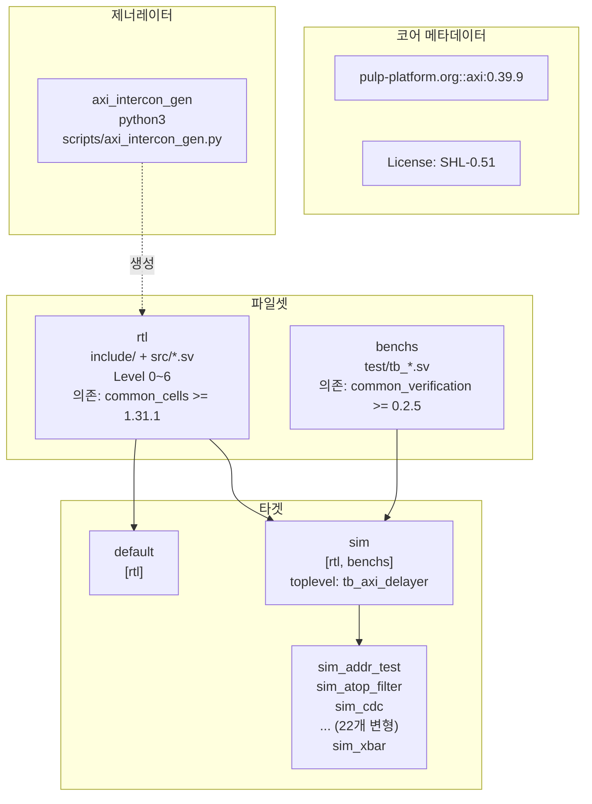

# axi.core

## 파일 개요 및 목적

`axi.core`는 **FuseSoC Core Description File (CAPI2 형식)**입니다. FuseSoC는 하드웨어 IP 코어 패키지 관리 도구로, 이 파일은 AXI IP 라이브러리의 메타데이터, 파일셋(filesets), 제너레이터(generators), 타겟(targets)을 정의합니다. Bender 기반 워크플로우와 병행하여 FuseSoC 기반 툴체인(예: XSim, Xilinx Vivado 등)에서 사용할 수 있도록 합니다.

---

## Mermaid 블록 다이어그램



---

## 주요 섹션/타겟/변수/파라미터 설명 테이블

### 코어 식별 정보

| 항목 | 값 |
|------|-----|
| CAPI 버전 | `2` |
| 이름 | `pulp-platform.org::axi:0.39.9` |
| 설명 | AXI SystemVerilog 합성 가능한 IP 모듈 및 검증 인프라 |
| 라이선스 | `SHL-0.51` (Solderpad Hardware License) |

### 파일셋 (Filesets)

#### `rtl` 파일셋

| 레벨 | 파일들 | 설명 |
|------|--------|------|
| Level 0 | `src/axi_pkg.sv` | 패키지 정의 (의존성 없음) |
| Level 1 | `src/axi_intf.sv` | AXI 인터페이스 (axi_pkg 의존) |
| Level 2 | `src/axi_atop_filter.sv` ... `src/axi_to_detailed_mem.sv` (32개) | 기본 모듈들 |
| Level 3 | `src/axi_burst_splitter.sv` ... `src/axi_zero_mem.sv` (11개) | Level 2 의존 모듈 |
| Level 4 | `src/axi_interleaved_xbar.sv` ... `src/axi_xbar_unmuxed.sv` (10개) | Level 3 의존 모듈 |
| Level 5 | `src/axi_xbar.sv` | 크로스바 모듈 |
| Level 6 | `src/axi_xp.sv` | 크로스포인트 모듈 |

포함 파일:
- `include/axi/assign.svh` (include_path: `include`)
- `include/axi/typedef.svh` (include_path: `include`)

의존성: `pulp-platform.org::common_cells >= 1.31.1`

#### `benchs` 파일셋

| 파일 | 설명 |
|------|------|
| `test/tb_axi_dw_pkg.sv` | 데이터 폭 테스트 패키지 |
| `test/tb_axi_xbar_pkg.sv` | 크로스바 테스트 패키지 |
| `test/axi_synth_bench.sv` | 합성 벤치마크 |
| `test/tb_axi_*.sv` (22개) | 개별 모듈 테스트벤치 |

의존성: `pulp-platform.org::common_verification >= 0.2.5`

### 제너레이터 (Generator)

| 항목 | 값 |
|------|-----|
| 이름 | `axi_intercon_gen` |
| 인터프리터 | `python3` |
| 스크립트 | `scripts/axi_intercon_gen.py` |
| 목적 | `axi_xbar` 주변의 인터커넥트 래퍼 자동 생성 |

#### axi_intercon_gen 파라미터

| 파라미터 | 타입 | 설명 |
|---------|------|------|
| `masters` | dict | 마스터 인터페이스 딕셔너리. 키: 인터페이스명, 값: `{id_width, slaves}` |
| `masters.<name>.id_width` | int | 마스터의 ID 신호 비트 폭 |
| `masters.<name>.slaves` | list | 접근 허용된 슬레이브 목록 (생략 시 전체 허용) |
| `slaves` | dict | 슬레이브 인터페이스 딕셔너리. 키: 인터페이스명 |
| `slaves.<name>.offset` | int | 슬레이브 베이스 주소 |
| `slaves.<name>.size` | int | 슬레이브 메모리 맵 크기 |

### 타겟 (Targets)

| 타겟명 | 파일셋 | toplevel | 설명 |
|--------|--------|----------|------|
| `default` | `[rtl]` | - | 기본 합성/구현 타겟 |
| `sim` | `[rtl, benchs]` | `tb_axi_delayer` | 기본 시뮬레이션 |
| `sim_dw_downsizer` | `[rtl, benchs]` | `tb_axi_dw_downsizer` | 데이터폭 다운사이저 시뮬레이션 |
| `sim_addr_test` | `[rtl, benchs]` | `tb_axi_addr_test` | 주소 테스트 시뮬레이션 |
| `sim_xbar` | `[rtl, benchs]` | `tb_axi_xbar` | 크로스바 시뮬레이션 |
| ... (총 25개 sim 타겟) | | | |

---

## 동작 방식 상세 설명

### 파일 레벨 시스템

파일들은 의존성 레벨에 따라 정렬됩니다. 툴체인이 순서를 지켜 컴파일하도록 보장합니다:
- **Level 0**: 외부 의존성 없는 패키지 정의
- **Level 1**: Level 0 의존
- **Level N**: Level 0~N-1 의존

### FuseSoC와의 통합

FuseSoC는 이 파일을 읽어 다음 작업을 수행합니다:
1. 의존성(`common_cells`, `common_verification`) 자동 다운로드 및 설치
2. 지정된 타겟의 파일셋 수집
3. 선택된 툴(xsim, modelsim 등)에 맞는 빌드 스크립트 생성
4. 시뮬레이션/합성 실행

---

## 사용 방법 및 예시

```bash
# FuseSoC 설치
pip install fusesoc

# 라이브러리 등록
fusesoc library add axi /path/to/axi

# 코어 목록 확인
fusesoc core list

# XSim으로 시뮬레이션 실행
fusesoc run --tool xsim --target sim_xbar pulp-platform.org::axi:0.39.9

# axi_intercon_gen 제너레이터 사용 예시 (FuseSoC .core 파일 내)
soc_intercon:
  generator: axi_intercon_gen
  parameters:
    masters:
      dma:
        id_width: 1
      ibus:
        id_width: 2
        slaves: [ram, rom]
    slaves:
      ram:
        offset: 0
        size: 0x10000000
      gpio:
        offset: 0x91000000
        size: 0x1000
      rom:
        offset: 0xffff0000
        size: 32768
```

```bash
# 합성 타겟으로 실행 (기본)
fusesoc run --tool vivado pulp-platform.org::axi:0.39.9

# 특정 시뮬레이션 타겟 실행
fusesoc run --tool modelsim --target sim_cdc pulp-platform.org::axi:0.39.9
```
