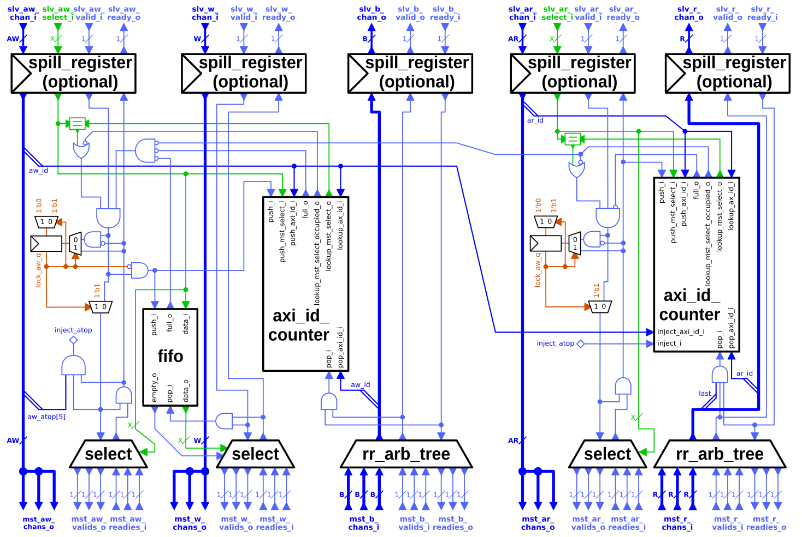

# AXI Demultiplexer

`axi_demux`는 하나의 AXI 연결을 여러 개로 분리합니다. AXI4 전체 규격과 AXI5의 원자적 연산(ATOP)을 구현합니다.

## 설계 개요

디멀티플렉서는 하나의 *slave port*와 설정 가능한 수의 *master port*를 가집니다. 블록 다이어그램은 아래와 같습니다:

AW 및 AR 채널은 각각 *select* 입력을 가지며, 이를 통해 신호를 전송할 master port를 결정합니다. 예를 들어, select는 주소 범위를 서로 다른 AXI 슬레이브에 매핑하기 위해 (외부) 주소 디코더로 구동될 수 있습니다.

W 채널의 비트는 해당 AW 비트의 선택에 따라 디멀티플렉서가 라우팅합니다. 이는 W 버스트가 AW 비트와 동일한 순서로 전송되어야 하며, 서로 다른 W 버스트의 비트는 인터리빙될 수 없다는 AXI 특성에 기반합니다.

B 및 R 채널의 비트는 라운드 로빈 중재 트리를 사용하여 master port에서 slave port로 멀티플렉싱됩니다.

## 설정

이 디멀티플렉서는 다음 표에 나열된 파라미터를 통해 설정됩니다:

| Name                 | Type               | Definition |
|:---------------------|:-------------------|:-----------|
| `AxiIdWidth`         | `int unsigned`     | AXI ID 폭 (모든 포트 공통). |
| `NoMstPorts`         | `int unsigned`     | 디멀티플렉서의 AXI master port 수 (즉, 연결 가능한 AXI 슬레이브 모듈의 수). |
| `MaxTrans`           | `int unsigned`     | slave port에서 동시에 [in flight](../doc#in-flight) 상태로 허용되는 최대 트랜잭션 수. |
| `AxiLookBits`        | `int unsigned`     | 디멀티플렉서가 AXI ID의 고유성을 판별하는 데 사용하는 ID 비트 수(최하위 비트부터). 아래 *순서 및 스톨* 절을 참조하십시오. 이 값은 `AxiIdWidth` 이하이어야 합니다. |
| `UniqueIds`          | `bit`              | 동일 방향으로 in-flight 중인 모든 트랜잭션에서 각 트랜잭션의 ID가 항상 고유함을 보장할 수 있다면, 이 파라미터를 `1'b1`로 설정하면 디멀티플렉서가 단순화됩니다 (아래 *순서 및 스톨* 절 참조). 기본값은 `1'b0`. |
| `FallThrough`        | `bit`              | AW 채널의 라우팅 결정이 W 채널로 fall through됩니다. 이를 활성화하면 디멀티플렉서가 AW 비트와 동일한 사이클에 W 비트를 수신할 수 있지만, `slv_aw_select_i`의 로직이 W 채널의 조합 경로를 늘립니다. |
| `SpillXX`            | `bit`              | 디멀티플렉서 앞의 해당 채널(AW, W, B, AR, R)에 스필 레지스터를 하나씩 삽입합니다. |

나머지 파라미터는 디멀티플렉서의 포트를 정의하는 타입입니다. `_*chan_t` 타입은 `axi/typedef.svh`에 정의된 `AXI_TYPEDEF` 매크로를 사용하여 설정에 맞게 바인딩되어야 합니다.

### 파이프라이닝 및 레이턴시

`SpillXX` 파라미터를 사용하면 디멀티플렉서의 각 채널 앞에 스필 레지스터를 삽입할 수 있습니다. 스필 레지스터는 채널의 모든 조합 경로(페이로드와 handshake 모두)를 차단합니다. 따라서 채널당 1사이클의 레이턴시가 추가되지만 처리량에는 영향을 주지 않습니다.

모든 `SpillXX` 및 `FallThrough`가 비활성화된 경우, 이 멀티플렉서를 통한 모든 경로는 조합 경로입니다(즉, 순차적 레이턴시가 0).

## 포트

| Name                              | Description |
|:----------------------------------|:------------|
| `clk_i`                           | 다른 모든 신호(`rst_ni` 제외)가 동기화되는 클록. |
| `rst_ni`                          | 리셋, 비동기, 액티브 로우. |
| `test_i`                          | 테스트 모드 활성화 (액티브 하이). |
| `slv_*` (except `slv_*_select_i`) | 디멀티플렉서의 단일 slave port. |
| `slv_{aw,ar}_select_i`            | 쓰기 또는 읽기가 각각 디멀티플렉싱될 master port의 인덱스. 이 신호는 AW 또는 AR 채널의 handshake가 [pending](../doc#pending) 상태인 동안 안정적이어야 합니다. |
| `mst_*`                           | 디멀티플렉서의 master port 배열. 각 포트의 배열 인덱스는 master port의 인덱스. |

## 순서 및 스톨

디멀티플렉서가 ID와 방향이 동일한(즉, 모두 읽기 또는 모두 쓰기) 두 트랜잭션을 수신했지만 서로 다른 master port를 대상으로 할 때, 첫 번째 트랜잭션이 완료될 때까지 두 번째 트랜잭션을 수신하지 않습니다. 이 시간 동안 디멀티플렉서는 각각 AR 또는 AW 채널을 스톨합니다. 두 트랜잭션의 ID가 동일한지 판별할 때는 `AxiLookBits` 최하위 비트를 비교합니다. 이 파라미터를 `AxiIdWidth`의 전체 값으로 설정하면 잘못된 ID 충돌을 방지할 수 있으며, 더 낮은 값으로 설정하면 더 많은 잘못된 충돌이 발생하는 대신 면적과 지연을 줄일 수 있습니다.

이러한 동작의 이유는 AXI 순서 제약 때문입니다. 자세한 내용은 [crossbar 문서](axi_xbar.md#ordering-and-stalls)를 참조하십시오.

디멀티플렉서가 이러한 순서를 추적하고 강제할 필요가 없는 사용 사례가 있으며, 이 경우 `UniqueIds` 파라미터를 설정하여 디멀티플렉서를 특화할 수 있습니다.
`UniqueIds`를 `1'b1`로 설정할 수 있는 조건은 다음 중 하나 이상을 만족하는 경우에만 해당됩니다:
- 각 트랜잭션의 ID가 동일 방향으로 in-flight 중인 모든 트랜잭션 사이에서 항상 고유한 경우;
- 또는 어떤 ID에 대해서도, 해당 ID를 가진 모든 트랜잭션이 동일한 ID와 방향을 가진 다른 모든 in-flight 트랜잭션과 동일한 master port를 대상으로 하는 경우;
- 또는 두 조건 모두 해당하는 경우.

위 조건이 항상 충족되지 않는 상황에서 `UniqueIds` 파라미터를 `1'b1`로 설정하면 정의되지 않은 동작이 발생합니다.

`UniqueIds` 파라미터를 `1'b1`로 설정하면 디멀티플렉서의 면적 복잡도가 `O(2^I)`에서 `O(I)`로 감소합니다. 여기서 `I`는 ID 폭입니다.

### 구현

`2 * 2^AxiLookBits`개의 카운터가 [in-flight](../doc#in-flight) 트랜잭션 수를 추적합니다. 즉, `AxiLookBits` 비트의 (축소된) ID 집합 내 각 ID에 대해 쓰기 트랜잭션 카운터와 읽기 트랜잭션 카운터가 각각 하나씩 있습니다. 각 카운터는 최대 `MaxTrans`까지(포함) 셀 수 있으며, 카운터가 할당된 master port의 인덱스를 보유하는 레지스터가 있습니다.

디멀티플렉서가 AW 또는 AR을 수신하면, AXI ID로 카운터를 인덱싱합니다. 인덱싱된 카운터의 값이 0보다 크고 해당 master port 인덱스 레지스터가 AW 또는 AR을 전송할 인덱스와 다르면, 동일한 방향과 ID를 가진 트랜잭션이 이미 다른 master port로 in-flight 중인 것입니다. 이 경우 디멀티플렉서는 AW 또는 AR을 스톨합니다. 그 외의 모든 경우에는 AW 또는 AR을 전달하고, 인덱싱된 카운터 값을 증가시키며, 카운터의 master port 인덱스를 설정합니다. 카운터는 slave port에서 B 비트 또는 마지막 R 비트의 handshake 시 감소합니다.

W 비트는 해당 AW에 대한 `slv_aw_select_i` 값으로 정의된 master port로 라우팅됩니다. W 버스트의 순서는 AW의 순서에 의해 결정되므로, select 신호는 FIFO 큐에 저장됩니다. 이 FIFO는 AW slave 채널의 handshake 시 푸시되고, W master 채널에서 버스트의 마지막 W 비트 handshake 시 팝됩니다.

## 원자적 트랜잭션

디멀티플렉서는 AXI 원자적 트랜잭션(`atop` 필드가 0이 아닌 AW로 시작)도 지원합니다. AXI 원자적 트랜잭션의 일부인 원자적 로드는 B *및* R 채널 모두에서 응답이 필요합니다.

### 구현

원자적 로드는 AXI에서 원래 존재하지 않는 읽기 채널과 쓰기 채널 사이의 의존성을 도입합니다. 이 디멀티플렉서에서 읽기 채널의 ID 카운터는 대응하는 AR 없이 발생하는 R 비트를 인식해야 합니다. 그렇지 않으면 원자적 로드 시 언더플로우가 발생합니다. 이를 방지하기 위해 디멀티플렉서의 AW 채널은 원자적 로드의 ID를 AR 채널의 ID 카운터에 "주입"할 수 있습니다. 이는 원자적 트랜잭션이 현재 in-flight 중인 *모든* 다른 트랜잭션(즉, 읽기 *및* 쓰기)에 대해 고유한 ID를 가져야 하기 때문에 가능합니다.

두 트랜잭션의 ID 동일 여부를 판별할 때 AXI ID의 일부만 비교하므로(*순서 및 스톨* 절 참조), 원자적 로드는 읽기 채널에서 추가적인 잘못된 충돌 스톨을 유발할 수 있습니다. 그러나 원자적 트랜잭션은 짧은 버스트이므로 일반적으로 비교적 빠르게 완료되어, 정상적인 조건에서는 처리량을 감소시키지 않습니다.
