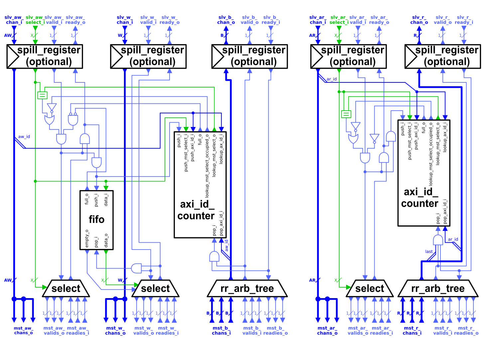

# AXI Demultiplexer

The functionality of the AXI Demultiplexer is to split one AXI connection into multiple ones. It hereby has to adhere to the AXI ordering scheme.

The main problem is to comply to the AXI4 ordering scheme, which arises by connecting one master module to multiple slave modules. As different slave modules could answer with different latencies, simple arbitration of the responses will not be enough. The demultiplexer has to have the capability to be aware to which slave a request was forwarded.

This implementation uses for this a number of counters to provide this functionality. Each counter has a unique mapping determined by the lower bits of the `axi_id` of the request. Further for each counter there exists a register which holds the selection signal of the request. This selection signal determines, which master port of the demultiplexer the request should be forwarded. When a transaction arrives at the demultiplexer it checks in the counters, if the `axi_id` is present and if yes, to which master port previous requests where forwarded. If the lookup is positive, meaning other requests with the same `axi_id` are in flight, the multiplexer will forward the request only if the selected master port of the previous transactions is the same. Otherwise the transaction gets stalled till the previous transactions are terminated. This prevents accidental reordering, as for each `axi_id` only one master port at a time can have active transaction with the ID in flight.

The selection determined by a AW request will be put into a FIFO which serves the W channel. As all AW requests have to be delivered in order the selection from the FIFO simply connects the handshakes to the right master port. When  the last flagged W beat is transmitted the selection gets poped from the FIFO.

All responses of the slave modules connected to the master port get merged with a round robin scheme provided by the `rr_arb_tree` module. This module is part of the *common_cells* repository of the *pulp-platform*. It is possible to use the simple round robin scheme, because the ID counters in it self provide that one particular `axi_id` could only be forwarded one of the master ports. The demultiplexer thus has the capability to interleave AXI responses with different id's.

When the last response of a AXI transaction gets sent over the slave port of the demultiplexer, the ID counter corresponding to the `axi_id` gets decreased.

The demultiplexer is also able to handle atomic AXI transactions. The issue with this type of transaction is that one AW request can lead to a response on the B *and* the R channel. This introduces a dependency between the channels which was previously not defined in the AXI protocol. To be able to also handle atomic transactions an injection into the ID counter of the read channels is introduced. Every time the demultiplexer forwards a atomic transaction having also a read response, the corresponding counter of both ID counters get increased. This injection into the counters of the read channels is necessary so that it does not go into an underflow state, as the responses from an atomic instruction are indistinguishable form a normal transaction. This injection can lead to increased latency in the read channels. The reason being that an injected atomic could stall an AR request when the `axi_id` maps to the same counter. However this should under normal circumstances only have a small impact as atomic transactions are limited to a small burst length, meaning the injected ID in the read channels gets cleared in a timely fashion.

The following table shows the parameters of the module. The module also needs the five structs describing the different AXI channels.

| Name          | Type | Function |
|:------------------ |:----------------- |:---------------------------------- |
| `AxiIdWidth`  | `int unsigned` | The width of the AXI transaction ID in bits. |
| `NoMstPorts`  | `int unsigned` | How many master ports the demultiplexer features. This many slave modules can be connected to the demultiplexer.|
| `MaxTrans` | `int unsigned` | The depth of the FIFO holding the selection signal between the AW and W channel. |
| `IdCounterWidth` | `int unsigned` | The bit-width of the `axi_id` counters. A good value is `$clog2(MaxTrans)` as then all bits can be used in the AW channel. |
| `AxiLookBits` | `int unsigned` | How many of the lower bits of the `axi_id` will be used for determining the mapping to the ID counters. |
| `FallThrough` | `bit` | Is the FIFO between the AW and W channel in fall-through mode. Enabling will lead to longer cycle delays. |
| `SpillXX` | `bit` | Enables the optional spill-register on the respective channel. |

The ports of the demultiplexer module are defined by the AXI4 channel structs. It features one slave port with and additional select input for the AW and AR channel respectively. The selection signal simply is the bit representation to which master port the transaction should be forwarded. The selection signal has to be stable as long as its respective `ax_valid` signal is high.
The master ports are split onto the five AXI channels. Each channel port is defined as an array. The selection signal from the slave port determines to which channel index of the array the request will be forwarded.
