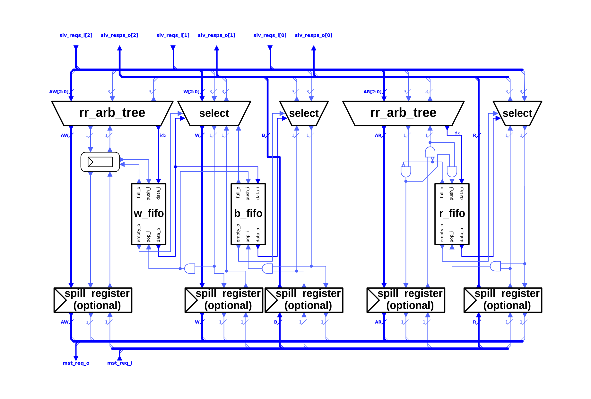

# AXI4-Lite 멀티플렉서

AXI4-Lite 디멀티플렉서와 반대 기능을 수행하는 것이 AXI4-Lite 멀티플렉서입니다. 여러 AXI4-Lite 연결을 하나로 병합합니다. 여러 슬레이브 포트에서 들어오는 요청들이 인터리브되어 단일 마스터 포트를 통해 전송됩니다.

AW 및 AR 채널의 요청들은 각각 라운드 로빈 중재 방식으로 병합됩니다. 중재 결정은 응답 라우팅을 처리하는 FIFO에 저장됩니다.

다음 표는 모듈의 파라미터를 보여줍니다. 모듈은 또한 다섯 개의 AXI4-Lite 채널을 설명하는 구조체를 필요로 합니다.

| Name          | Type           | Function                                                                                                       |
|:--------------|:---------------|:---------------------------------------------------------------------------------------------------------------|
| `NoSlvPorts`  | `int unsigned` | 멀티플렉서의 슬레이브 포트 수. 이 수만큼의 마스터 모듈을 멀티플렉서에 연결할 수 있습니다.                     |
| `MaxWTrans`   | `int unsigned` | AW 채널과 W 채널 사이에서 ID의 최상위 비트를 보관하는 FIFO의 깊이.                                            |
| `FallThrough` | `bit`          | AW 채널과 W 채널 사이의 FIFO가 폴-스루 모드인지 여부. 활성화하면 추가 지연 사이클이 발생합니다.               |
| `SpillXX`     | `bit`          | 해당 채널에 선택적 스필 레지스터를 활성화합니다.                                                               |
