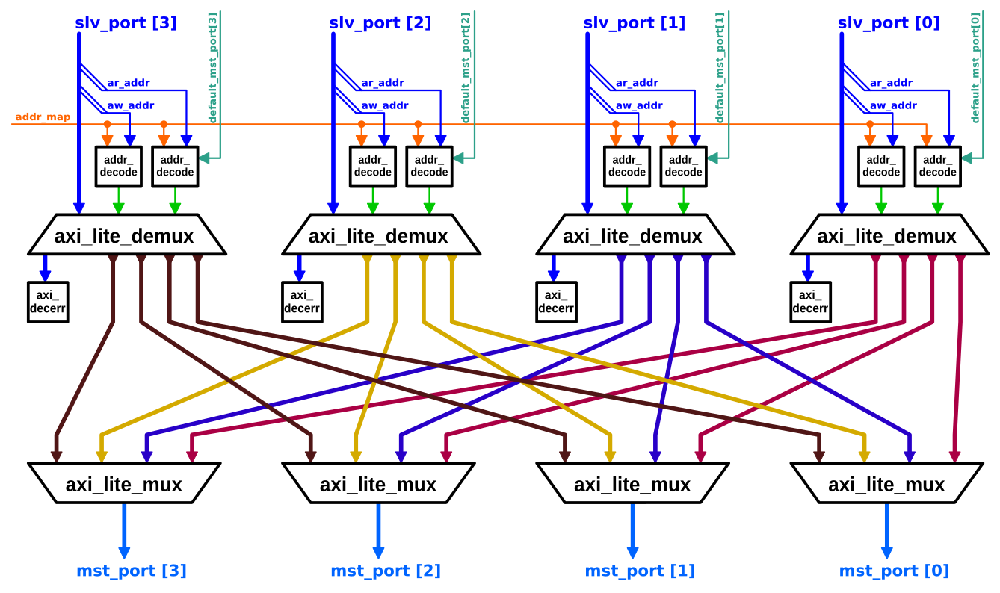

# AXI4-Lite 완전 연결 크로스바

`axi_lite_xbar`는 AXI4-Lite 사양을 구현하는 완전 연결 크로스바입니다.

## 설계 개요

`axi_lite_xbar`는 완전 연결 크로스바로, 크로스바의 *슬레이브 포트*에 연결된 각 마스터 모듈이 크로스바의 *마스터 포트*에 연결된 모든 슬레이브 모듈과 직접 와이어로 연결됩니다.
크로스바의 블록 다이어그램은 아래와 같습니다:

크로스바는 슬레이브 포트와 마스터 포트의 수를 설정할 수 있습니다.

## 주소 맵

`axi_lite_xbar`는 `axi_xbar`와 [동일한 주소 디코딩 방식](axi_xbar.md#address-map)을 사용합니다.

## 디코드 오류 및 기본 슬레이브 포트

각 슬레이브 포트는 자체적인 내부 *디코드 오류 슬레이브* 모듈을 가집니다. 트랜잭션의 주소가 어떤 규칙과도 일치하지 않으면, 해당 트랜잭션은 디코드 오류 슬레이브 모듈로 라우팅됩니다. 이 모듈은 각 트랜잭션을 수신하고 디코드 오류로 응답합니다 (적절한 수의 비트 포함). 각 읽기 응답 비트의 데이터는 `32'hBADCAB1E`입니다 (데이터 너비에 맞게 제로 확장 또는 잘림).

각 슬레이브 포트는 기본 마스터 포트를 가질 수 있습니다. 슬레이브 포트에 기본 마스터 포트가 활성화되면, 해당 슬레이브 포트에서 어떤 규칙과도 일치하지 않는 모든 주소는 디코드 오류 슬레이브 대신 기본 마스터 포트로 라우팅됩니다. 기본 마스터 포트는 런타임에 활성화하거나 변경할 수 있으며 (크로스바의 입력 신호), 주소 맵과 동일한 제약 조건이 적용됩니다.

## 구성

크로스바는 `axi_pkg::xbar_cfg_t` 구조체를 사용하는 `Cfg` 파라미터를 통해 구성됩니다. 해당 구조체의 필드는 다음과 같습니다:

| Name                 | Type               | Definition                                                                                                                                                                                                                                                        |
|:---------------------|:-------------------|:------------------------------------------------------------------------------------------------------------------------------------------------------------------------------------------------------------------------------------------------------------------|
| `NoSlvPorts`         | `int unsigned`     | 크로스바의 AXI4-Lite 슬레이브 포트 수 (즉, 연결 가능한 AXI4-Lite 마스터 모듈의 수).                                                                                                                                                                             |
| `NoMstPorts`         | `int unsigned`     | 크로스바의 AXI4-Lite 마스터 포트 수 (즉, 연결 가능한 AXI4-Lite 슬레이브 모듈의 수).                                                                                                                                                                             |
| `MaxMstTrans`        | `int unsigned`     | 각 슬레이브 포트에서 동시에 처리 가능한 최대 [진행 중](../doc#in-flight) 트랜잭션 수.                                                                                                                                                                            |
| `MaxSlvTrans`        | `int unsigned`     | 각 마스터 포트에서 동시에 처리 가능한 최대 [진행 중](../doc#in-flight) 트랜잭션 수.                                                                                                                                                                              |
| `FallThrough`        | `bit`              | AW 채널의 라우팅 결정이 W 채널로 폴-스루됩니다. 이를 활성화하면 크로스바가 AW 비트와 동일한 사이클에 W 비트를 수락할 수 있지만, AW 채널의 로직으로 인해 W 채널의 조합 경로가 길어집니다.                                                                       |
| `LatencyMode`        | `enum logic [9:0]` | 각 채널의 지연으로, 아래 *파이프라이닝 및 지연* 섹션에서 자세히 정의됩니다.                                                                                                                                                                                      |
| `AxiIdWidthSlvPorts` | `int unsigned`     | AXI4-Lite 크로스바에서는 사용되지 않습니다. `default: '0`으로 설정하세요.                                                                                                                                                                                        |
| `AxiIdUsedSlvPorts`  | `int unsigned`     | AXI4-Lite 크로스바에서는 사용되지 않습니다. `default: '0`으로 설정하세요.                                                                                                                                                                                        |
| `AxiAddrWidth`       | `int unsigned`     | AXI4-Lite 주소 너비.                                                                                                                                                                                                                                              |
| `AxiDataWidth`       | `int unsigned`     | AXI4-Lite 데이터 너비.                                                                                                                                                                                                                                            |
| `NoAddrRules`        | `int unsigned`     | 주소 맵 규칙의 수.                                                                                                                                                                                                                                                |

나머지 파라미터는 크로스바의 포트를 정의하는 타입입니다. `*_chan_t` 및 `*_req_t`/`*_resp_t` 타입은 `axi/typedef.svh`에 정의된 `AXI_TYPEDEF` 매크로를 사용하여 구성에 맞게 바인딩되어야 합니다. `rule_t` 타입은 구성과 동일한 주소 너비를 가진 주소 디코딩 규칙에 바인딩되어야 하며, `axi_pkg`에는 64비트 및 32비트 주소에 대한 정의가 포함되어 있습니다.

### 파이프라이닝 및 지연

`LatencyMode` 파라미터를 사용하면 각 마스터 포트(즉, 각 멀티플렉서)의 각 채널(AW, W, B, AR, R) 뒤와 각 슬레이브 포트(즉, 각 디멀티플렉서)의 각 채널 앞에 스필 레지스터를 삽입할 수 있습니다. 스필 레지스터는 조합 경로를 차단하므로, 이 파라미터는 크로스바를 통과하는 조합 경로의 길이를 줄입니다.

일반적인 구성들은 `xbar_latency_e` `enum`에 정의되어 있습니다. 권장 구성(`CUT_ALL_AX`)은 AW 및 AR 채널에 2의 지연을 두는 것으로, 이 채널들에 가장 많은 조합 로직이 있기 때문입니다. 또한 AW 채널의 로직이 W 채널의 조합 경로를 연장하지 않도록 `FallThrough`를 `0`으로 설정해야 합니다. 그러나 `LatencyMode`를 `NO_LATENCY`로, `FallThrough`를 `1`로 설정하면 크로스바를 완전한 조합 회로 구성으로 실행할 수도 있습니다.
두 크로스바가 양방향으로 연결된 경우, 즉 각 크로스바의 master_port 중 하나가 다른 크로스바의 slave_port에 연결된 경우, 두 크로스바의 구성으로 `CUT_SLV_PORTS`, `CUT_MST_PORTS`, 또는 `CUT_ALL_PORTS` 중 하나를 사용해야 합니다. 이는 타이밍 루프를 방지하기 위해서입니다. 다른 구성들은 두 크로스바 사이의 차단되지 않은 채널에서 시뮬레이션 및 합성 시 타이밍 루프를 유발합니다.

## 포트

| Name                    | Description                                                                                                                                                                   |
|:------------------------|:------------------------------------------------------------------------------------------------------------------------------------------------------------------------------|
| `clk_i`                 | 다른 모든 신호(`rst_ni` 제외)가 동기화되는 클럭.                                                                                                                              |
| `rst_ni`                | 리셋, 비동기, 액티브-로우.                                                                                                                                                    |
| `test_i`                | 테스트 모드 활성화 (액티브-하이).                                                                                                                                             |
| `slv_ports_*`           | 크로스바의 슬레이브 포트 배열. 각 포트의 배열 인덱스가 슬레이브 포트의 인덱스입니다. 이 인덱스는 마스터 포트 중 하나에서의 모든 요청에 앞에 추가됩니다.                        |
| `mst_ports_*`           | 크로스바의 마스터 포트 배열. 각 포트의 배열 인덱스가 마스터 포트의 인덱스입니다.                                                                                              |
| `addr_map_i`            | 크로스바의 주소 맵 (위의 *주소 맵* 섹션 참조).                                                                                                                                |
| `en_default_mst_port_i` | 각 슬레이브 포트에 대해 기본 마스터 포트가 활성화되어 있는지 여부를 정의하는 슬레이브 포트당 1비트 (위의 *디코드 오류 및 기본 슬레이브 포트* 섹션 참조).                       |
| `default_mst_port_i`    | 각 슬레이브 포트의 기본 마스터 포트를 정의하는 슬레이브 포트당 마스터 포트 인덱스 (활성화된 경우).                                                                             |

## 순서 및 스톨

크로스바 내부의 순서는 트랜잭션의 순차적 전송을 보장하는 FIFO 네트워크에 의해 관리됩니다. 서로 다른 마스터 포트로 향하는 여러 트랜잭션이 동시에 처리될 수 있지만, 이 마스터 포트들에 연결된 슬레이브 모듈 중 하나가 스톨되면 연속적인 다른 처리 중인 트랜잭션도 스톨됩니다.

## 검증 방법론

이 모듈은 `test/tb_axi_lite_xbar.sv`에 기술 및 구현된 지시적 랜덤 검증 테스트벤치로 검증되었습니다.

## 크로스바 내부 파이프라이닝 미적용에 대한 설계 근거

이는 [`axi_xbar`](axi_xbar.md#design-rationale-for-no-pipelining-inside-crossbar)에서 설명한 문제와 동일합니다.
