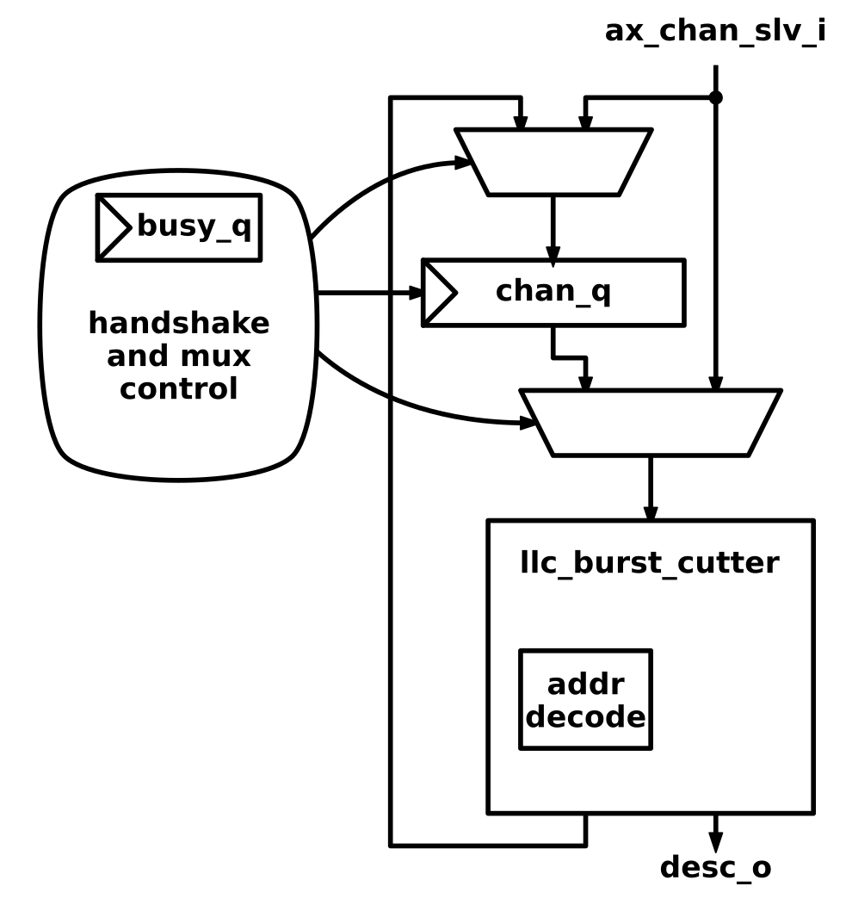
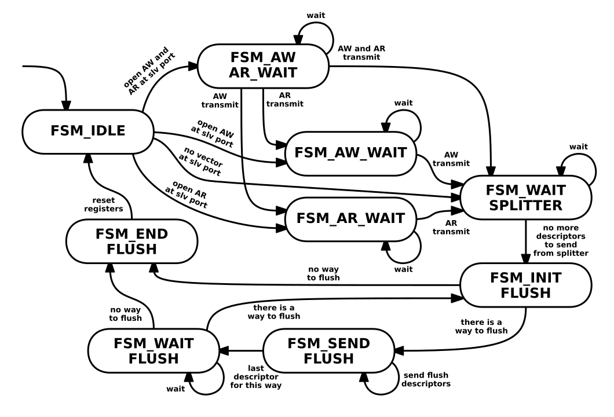

# Last Level Cache

This document describes the architecture of the AXI Last Level Cache (LLC). The design uses the AXI4 protocol for it's data transfers. An AXI4 slave port handles transactions from the CPU side, whereas a master port faces the main memory side. It is fully configurable in size and cache dimensions and features a runtime configurable scratch-pad mode (SPM) for the different sets. Meaning that individual sets (also called ways) of the cache can be disabled for hardware managed caching and  directly addressed when configured in this mode. This additional functionality reuses most of the logic.
The cache features a transaction bypass for enabling direct accesses from the slave port to the master port. This bypass can be used when all of the sets  of the cache are configured as SPM or the appropriate cache field of the AXI transfer is set. The LLC further has user activated flushing capabilities, performance counters and an automatic build in self test during initialization for the tag SRAM storage. These functionalities are controlled over a dedicated AXI4 LITE configuration port.

## Overview

The LLC has a number of fixed parameters which have to be given during instantiation. The module features three main parameters, which determine the overall size and shape of the LLC. They are all of the type `int unsigned`.

* `SetAssociativity`: The set-associativity of the LLC. This parameter determines how many ways/sets will be instantiated. The minimum value is 1. The maximum value depends on the data width of the AXI LITE configuration port and should either be 32 or 64 to stay inside the protocol specification. The reason is that the SPM configuration register matches in width the data width of the LITE configuration port.
* `NoLines`: Specifies the number of lines in each way. This value has to be higher than two. The reason is that in the address at least one bit has to be mapped onto a cache-line index. This is a limitation of the *system verilog* language, which requires at least one bit wide fields inside of a struct. Further this value has to be a power of 2. This has to do with the requirement that the address mapping from the address onto the cache-line index has to be continuous.
* `NoBlocks`: Specifies the number of blocks inside a cache line. A block is defined to have the data width of the master port. Currently this also matches the data with of the slave port. The same value limitation as with the *NoLines* parameter applies. Fixing the minimum value to 2 and the overall value to be a power of 2.

There exists an additional top level parameter which is compromised of a struct defining the AXI parameters of the different ports. The definition can be found in `axi_llc_pkg`. Following table defines the fields of this struct which are all of type `int unsigned`.

| Name        | Function |
|:------------------ |:------------------------------------------------------ |
| `SlvPortIdWidth`    | AXI ID width of the slave port, facing the CPU side. |
| `AddrWidthFull`     | AXI address width of both the slave and master port. |
| `DataWidthFull`     | AXI data width of both the slave and the master port. |
| `LitePortAddrWidth` | AXI address width of the configuration LITE port. |
| `LitePortDataWidth` | AXI data width of the configuration LITE port. Has to be ether 32 or 64 bit to adhere to the AXI4 specification. Further limits the maximum set-associativity of the cache. |

It is also required to provide the detailed AXI4 structs as parameters for the respective ports. The structs follow the naming scheme *port*\_*xx*\_chan_t. Where *port* stands for the respective port and have the values *slv*, *mst* and *lite*. In addition the respective request and response structs have to be given. The address rule struct from the `common_cells` `addr_decode` have to be specified for the FULL and LITE AXI4 ports as they are used internally to provide address mapping for the AXI transfers onto the different SPM and cache regions.

The overall size in bytes of the LLC in byte can be calculated with:

$ LlcSize = SetAssocitativity * NoLines * NoBlocks * \frac{DataWidthFull}{8} $

The AXI4 protocol issues its transfers in a bursted fashion. The idea of the LLC is to use most of the control information provided by the protocol to implement the cache control in a decentralized way. To achieve that a data-flow based control scheme is chosen.

The premise being that an AXI transfer gets translated into a number of descriptors which then flow through a pipeline. Each descriptor maps the specific operation on a cache line and basically translates long bursts onto shorter ones which exactly map onto a cache line. For example when an AXI burst wants to write on three cache-lines the control beat gets translated into three descriptors which then flow through the pipeline.

It follows a brief example what happens to a write transfer when it accesses the cache.
An AW beat is valid on the slave port of the LLC. Its address gets decoded in the configuration module, passes through the split unit and its first descriptor enters the spill register. In the next cycle a request gets issued to the tag-storage, which is compromised of one SRAM block per set of the cache. In the next cycle the hit or miss gets determined. The descriptor then goes either directly to the write unit if its a hit, or to the eviction/refill pipeline if it was a miss. This hit bypass allows AXI transaction which hit onto the cache to overtake ones that are in the miss pipeline. This has the advantage that a short write transaction for example from a CPU can overtake a long read transaction which could have been issued by a DMA for example.
On a miss the descriptor enters the miss pipeline. If the cache-line was dirty it gets evicted by issuing a write request on the master port. Next the cache refills the line from main memory. Then the descriptor gets transferred into the write unit which then sends the W beats from the CPU towards the data storage. When all W beats are transferred, the write unit issues a response back to the CPU, thus ending the transfer.

Following table defines the struct which is used to describe a cache descriptor. Part of the descriptor uses directly types defined in `axi_pkg`.
The other fields get defined when instantiating the design using the parameters from the top level.

| Name        | Type               | Function |
|:-------------- |:----------------- |:-------------------------------------- |
| `a_x_id`    | `axi_slv_id_t`     | The AXI4 ID of the burst entering through the slave port of the design. It has the same with as the slave AXI ID. |
| `a_x_addr`  | `axi_addr_t`       | The address of the descriptor. However it gets defines, so that it maps to the corresponding cache line inside the split modules. |
| `a_x_len`   | `axi_pkg::len_t`   | AXI4 burst length field. Corresponds to the number of beats which map onto this descriptor. It gets set in the splitting unit which does the mapping onto the cache line. |
| `a_x_size`  | `axi_pkg::size_t`  | The AXI4 size field. This is important for the write and read unit to find the exact block and byte offset, where a beat from the slave port should go in the data storage. |
| `a_x_burst` | `axi_pkg::burst_t` | The burst type of the AXI4 transaction. This is important for the splitter unit as well as the read and write unit, as it determines the descriptor field `a_x_addr`. |
| `a_x_lock`  | `logic`            | The AXI4 lock signal, currently only passed further in the miss pipeline when the line gets evicted or refilled. |
| `a_x_cache` | `axi_pkg::cache_t` | The AXI4 cache signal. Currently the cache only supports write back mode. |
| `a_x_prot`  | `axi_pkg::prot_t`  | The AXI4 protection signal, currently only passed further in the miss pipeline. |
| `x_resp`    | `axi_pkg::resp_t`  | The AXI4 response signal. This also tells if we try to make un-allowed accesses onto address regions which are not currently mapped to ether SPM nor cache. When this signal gets set somewhere in the pipeline, all following modules will pass the descriptor along and absorb the corresponding beats on the ports. |
| `x_last`    | `logic`            | The AXI4 last flag. Here it determines, if the read or write unit sen back the response, when the last beat of the descriptor gets transferred on the slave port. |
| `spm`       | `logic`            | This field signals that the descriptor is of type SPM. It will not make a lookup in the hit/miss detection and utilize the hit bypass. |
| `rw`        | `logic`            | This field determines if the descriptor makes a write access `1'b1` or read access `1'b0`. |
| `way_ind`   | `logic`            | The way indicator. Is a vector of width equal of the set-associativity setting of the LLC and decodes the index of the cache way where the descriptor should make an access. |
| `evict`     | `logic`            | The eviction flag. The descriptor missed and the line at the position was determined dirty by the detection. The evict unit will write back the dirty cache-line to the main memory. |
| `evict_tag` | `logic`            | The eviction tag. As the field `a_x_addr` has the new tag in it, it is used to send back the right address to the main memory during eviction. |
| `refill`    | `logic`            | The refill flag. The descriptor will trigger a read transaction to the main memory, refilling the cache-line. |
| `flush`     | `logic`            | The flush flag. This only gets set when a way should be flushed. It gets only set by descriptors coming from the configuration module. |

## Transaction Split and SPM

This section elaborates in more detail on how the LLC determines a SPM access and how an AXI transaction gets split onto the descriptors defining the cache-line operation.

The modules in `axi_llc_top` uses the address decoding module from `common_cells`. When instantiated the LLC calculates the address map for the SPM region dependent from the address port called `spm_start_addr_i`. The port has the same width as the corresponding address width of the AXI master and slave ports. One address rule per cache way gets defined. This is one of the reasons why the LLC parameters `NoLines` and `NoBlocks` have to be a power of two. It then provides a continuous address mapping for the SPM region. The SPM addressing follows the normal AXI byte addressing scheme, as a SPM access uses the same pipeline as a cached accesses.

When a transaction enters the slave port of the LLC, the address mapping for the RAM, the address mapping for the SPM region and the current SPM configuration determine the selection signal which controls the following `axi_demux` module. The module provides the functionality that transactions can bypass the cache if all of its ways are configured as SPM. The mapping also ensures that accesses onto the SPM region always go into the pipeline.
When an AXI AW or AR beat get send towards the cache pipeline it enters the respective `axi_llc_chan_splitter` module. This module has the responsibility to generate all following LLC  descriptors, mapping the whole AXI transfer onto the respective cache-lines affected.

The first descriptor gets sent towards the hit/miss spill register in a combinational way. This is to reduce the latency of the design. The spill register before the hit/miss detection is purely added to cut the longest logic path. The splitter unit then shaves off descriptors from the control AXI vector, until all required cache descriptors are sent. This is done by the submodule `axi_llc_burst_cutter`. This combinational block defines the address of the descriptor, how many data beats of the AXI transaction go onto this particular cache-line and what is left for all subsequent descriptors. The module basically defines sub-bursts which neatly fit exactly onto one cache line. From the splitter the descriptors for read and write transactions get merged together with the data path of the flush descriptors. This merging of the accesses has to be done as the tag lookup can only handle one descriptor at a time and to ensure that the tag state is unified for both read and write transactions. This merging has only marginal impact on the throughput of long bursts. The reason being that the LLC normally is the last cache before the main memory. This implies that most of its accesses are bursted. For example when a cache more closely to the CPU gets its cache line replaced. This means that the total number of AXI control vectors from the CPU side will be lower than the total amount of data beats associated with these vectors. Merging now the control vectors leads to a better utilization of the following logic in the pipeline.
Another responsibility of the `axi_llc_burst_cutter` module is to determine the final mapping of the SPM region. With the `way_ind` field of the descriptor the read, write and miss pipeline modules determine the exact data-way towards the respective accesses should be routed.

## Hit and Miss Detection

Coming from the splitter modules and the spill register the descriptor enters the `axi_llc_hit_miss` detection unit. This unit is responsible for the tag lookup and determines if a descriptor is allowed through the hit bypass or not. It has three sub components. First the `axi_llc_tag_store` module, which does the lookup of the tag. The `axi_llc_lock_box_bloom` module which ensures that only one descriptor is allowed to operate on the same cache line at a time. And lastly the `axi_llc_miss_counters` module, which is responsible of the right ordering of the descriptors. The sub-modules are handshaked to enable back pressure.

The module gets initialized each time when the LLC comes out from a reset. The tag-storage macros have to be initialized to ensure correct behavior. During this initialization phase the tag-storage module runs a build in self test (BIST) on the tag-storage SRAM macros. The BIST is run in parallel on all macros and reuses the lookup comparators, which have to be there anyway to make the tag lookup work. The BIST uses the *march X* pattern to check for eventual defects. The advantage of using this pattern is that in the end all macros are initialized to zero and no further initialization steps are required. The result of the BIST can then be read out in the respective configuration address over the AXI LITE port.

### Tag Lookup and Storage

The `axi_llctag_store` module houses the SRAM macros which are responsible for the tag management. It is fully handshaked, providing back pressure capabilities. It has multiple request modes.

* `axi_llc_pkg::BIST`: All requests during initialization have this type. All macros get accessed and the contents compared in the next cycle.
* `axi_llc_pkg::LOOKUP`: Performs a lookup on the SRAM macros which are not configured as SPM. The unit then responds either with a hit, or a miss. On a hit the way indicator is given back. On a miss the module decides with help of the `evict_box`, which way should be used for storing the line which has to be refilled.
* `axi_llc_pkg::STORE`: Performs a storage of the tag onto the SRAM macro indicated by the input way indicator. It also sets the dirty flag if it was issued from a write descriptor.
* `axi_llc_pkg::FLUSH`: Performs a lookup on only one of the macros, and determines if this cache line has to be evicted, when its dirty flag is set. Then the tag gets overwritten by all zeros.

A lookup has one cycle latency as the SRAM macros have to be pipelined for getting acceptable cycle timings. In parallel to the macros there is a register which stores the tag for which the lookup is performed. After lookup a comparator for each set compares the tag returned from the macro with the one stored in the flipflop for determining a hit. These comparators also perform the BIST at initialization of the storage.
On a miss, the valid flags get checked against the SPM configuration to determine if there is space in one of the sets for the to be refilled cache-line. Currently a small shift register as long as the set-associativity of the cache is responsible of finding the next way where the line should go. This register is advancing every clock cycle, providing a pseudo random chosen way. When there are still empty positions, the shift-register will stop at the next empty position and will wait for the output handshake to occur. If there are no empty positions left it stops at the next non SPM configured position. When there is a cache line to be replaced, the dirty flag is also returned, defining if the eviction flag in the descriptor has to be set.

### Handling of Hits and Misses

After the tag lookup all actions which have to be performed on a specific cache line are known. Its exact location, if it as to be refilled, etc. There has to be made sure that different accesses do not interfere with each other. One of the least favorable examples would be that one AXI transaction from the slave port is currently writing onto a cache line, and a subsequent reading transaction into another memory region evicts this currently in use cache-line. Then the written data could overwrite the new one, leading to memory corruption. Another concern is the preservation of the AXI ordering model, as no descriptor with the same ID is allowed to overtake another. This could happen if an AXI burst accesses multiple cache-lines, the first one misses, the second one now taking the bypass, leading to a not allowed reordering.

For first problem of accidental eviction, a cache line locking mechanism is introduced. Its function is to ensure that only one descriptor is allowed to work on a specific cache-line at time. When a descriptor leaves the hit/miss detection unit the line is locked. When the descriptor leaves the pipeline by completing its operations in the read or write unit the line gets unlocked. When a descriptor in the hit/miss unit wants to access a locked cache line, it gets stalled until the cache line is unlocked again. For the locking a counting bloom-filter is used. This data structure has the advantage that it does not change in size when the cache size increases and the lookup does not need many logic levels. Its size depends on the desired false positive rate, which itself in this case depends on the amount of currently locked cache lines. This has a maximum value as it solely depends on the number of descriptors which can be downstream from the detection unit. It is determined by the amount of units and their respective descriptor FIFO's depth which can be adapted in `axi_llc_pkg`. The key thing for using a counting bloom filter here is its property to not have false positives, ensuring that no descriptor can advance, when the line it tries to access is locked. False positives only lead to a decrease in throughput of the descriptors. It can be observed during simulation that false positives lead to no significant drop in data throughput. The reason is that when a false positive occurs, other descriptors have to be downstream as they are the cause for false positive in the first place. It then leads to the bloom filter gradually emptying, until the colliding descriptor unlocks its cache-line allowing the descriptor to advance.

The ordering is the second issue which has to be solved. The hit bypass is designed to allow descriptors to overtake each other. However the ordering properties of the AXI protocol have to be upheld. For ensuring proper ID ordering a number of ID counters are introduced. They operate by taking in account the lower bits of the ID. This property can be changed in the `axi_llc_pkg`. The counters track, how many descriptors of which ID are currently in the miss pipeline operating. There is a separate counter which tracks all write descriptors as they have to be strictly transmitted in order. When a descriptor hits, the counters get checked for its ID. If there are other descriptors with the same ID in currently in the miss pipeline, the descriptor is not allowed through the bypass and instead passed towards it. As none of its eviction or refill flags will be set, no action is performed in the pipeline, passing through the descriptor. When a descriptor leaves the pipeline its respective counter gets decreased.

## Data Read and Write

Each descriptor generated from a transaction on the slave port ultimately ends up in either the read or the write unit. They control the other tree channels on the slave port. Their responsibilities is to make the requests on the data-ways. On descriptor load, internal counters get set with the amount of requests, which have to be made to the data-ways. The request towards them are bundled in the struct outlined in following table:

| Name        | Type               | Function |
|:-------------- |:----------------- |:-------------------------------------- |
| `cache_unit`    | `llc_pkg::unit_e`     | Indicated which of the units made the request towards the data-ways. This value is used for routing back the response from an individual way. |
| `way_ind`      | `logic [SetAsso]`     | Indicates to which way the request should go. Controls the request routing inside `llc_data_ways`. |
| `line_addr`    | `logic [Index]`       | The cache line index indicating which cache line the request is for. |
| `block_offset` | `logic [BlockOffs]`   | The block offset indication to which cache block the request is for. |
| `we`           | `logic [SetAsso]`     | Is the request a write [`1'b1`] request or a read [`1'b0`] request. |
| `data`         | `logic [DataWidth]`   | On write contains the data to be written to a block. On read this signal is ignored by the way. |
| `strb`         | `logic [DataWidth/8]` | The write strobe signal associated which bytes of the block are valid for writing. |

There are four units in the LLC which can make requests to the data-ways: `axi_llc_read_unit`, `axi_llc_write_unit`, `axi_llc_refill_unit` and `axi_llc_evict_unit`. The units which make read requests get their responses back from the data-ways. It further features the needed request interconnect which makes it possible that each of the four units can make a request to a macro, if the request go towards different macros. This allows the cache to saturate each of the data channels in both read and write direction on the slave and master port.

When a request enters the LLC-ways, it gets routed towards the way indicated by its way-indicator. For the unit issuing read requests there exists a FIFO, which stores the `way_ind` of the request. This FIFO is necessary as read requests have the possibility of going from the same unit to two different ways, when the descriptor is changing. These FIFOs control the read response switching back to the modules and ensure proper ordering. Each data-way is handshaked in both request and response direction. They are designed to handle one request per cycle. When there is back pressure from the response side, subsequent request will also be stalled. For each unit exists a separate multiplexer and can forward the responses to the units in parallel.

## Eviction and Refilling

On a miss or to preserve ordering of an AXI burst, the descriptor goes from the hit miss detection unit onto the so called miss pipeline. The pipeline has two functions. The first is evicting a cache-line and the second is refilling it. A descriptor passing through gets checked for the evict or refill flag. When a flag is set the unit will do their respective operations. When no flag is set the descriptor only gets passed along.

Entering the pipeline the descriptor goes to the eviction unit. The unit has three subcomponents in it and is responsible of writing a whole cache-line towards the main memory using the master port of the LLC. The first submodule initiates an AW vector on the port if the eviction flag is set on the descriptor. The burst type is always `INCR` and the burst length is always the number of blocks inside a line, as the job of this unit is to write back the entirety of a cache line. The ID is also always the same, as the writing operation on the W channel anyways has to be done in order. It also prevents reordering of the responses on the master ports B channel. The descriptor then gets sent further into a FIFO which is there to buffer multiple requests. Then the descriptor enters the unit which is responsible of reading out the data to be evicted. The unit takes the address of the descriptor and the way-indicator and calculates the read requests which have to be made to the data-ways to read out the entire cache-line. The responses from the data-way then get sent back to the unit and first enter a FIFO, which is connected to the data field of the W channel. This FIFO ultimately also controls the handshaking of the W channel. The unit has a counter, which determines, when the unit has to send the last flag. The unit then waits for the B response and sends the descriptor further. When the descriptor has its flush flag set, instead then the descriptor gets destroyed and the control unit notified that a line was flushed.

After the evict unit the descriptor enters the refill unit. It has the reverse function of the eviction unit as it is responsible foe cache-line refills. The descriptor enters the unit which controls the AR channel and makes a read request for the whole cache-line, when the refill flag is set. The unit initiates the AXI transaction on the AR channel, again always with the same ID to prevent reordering from the read responses. The descriptor the enters a FIFO for buffering multiple descriptors to enable the cache to have multiple refill requests in flight at the same time. When the descriptor the enters a submodule which sits on the R channel of the master port. On descriptor load, internal counters get set for controlling the write requests towards the data-ways. Here no FIFO is present, the unit however connects the handshaking from the master ports R channel to the one towards the data-ways. When all data beats are transmitted the descriptor gets sent then either to the read or the write unit. When this transfer occurs the merge unit signals towards the miss counters in the hit miss detection unit that a descriptor with its respective ID has left the pipeline. There then the miss count gets decreased. On reaching zero, hits are allowed again for using the hit bypass.

## Configuration and Flush

The `axi_llc_config` module is the unit which controls the SPM configuration and the flushing of the LLC. It also feature a set of performance counters, which can be used to track the descriptor utilization of the LLC. These functionalities all can be accessed over a dedicated AXI4 LITE slave port.

There are three registers which can be written to and are located at the lower part of the address map. The map gets generated automatically from a combination of lite port data width and the start address of the configuration map. These registers are also responsible for the maximum set-associativity of the cache. As the SPM configuration is encoded as a one-hot signal each way index matches to a bit in the respective register. As the register is a wide as the LITE port data width the maximum set-associativity is in consequence also limited to that value. This mapping makes the read out of the BIST from the tag storage macros trivial. The set/way mapping is the same for SPM configuration, BIST readout and manual flush initialization, where each bit index matches the way index.

Flushing of the cache can also be initiated over this LITE configuration port. When a bit in the flush register is set, a finite state machine (FSM) gets activated. When changing the SPM configuration this state machine further gets activated automatically, writing back all affected dirty data to the memory.

The FSM is not optimized for speed, as flushing usually is not done often. Instead it is designed to ensure maximum safety of the flush operation so that there is no chance data will be corrupted. When the FSM gets activated, no new write transactions can be sent to the LITE configuration port. It is however possible to read out the values. For this, on activation the FSM goes from `IDLE` to one of three states, depending on the current state of the slave ports Ax channels. It waits in these states until all initiated requests on the slave port are transmitted, and setting the ready signal to zero, so that no new requests can be made to the cache during flushing. The FSM then waits until no new descriptors get generated in the splitter units. When they are empty the flushing gets initialized by determining which of the ways need flushing.

## Functional Verification

The design was tested using a test-bench written in *system-verilog*, which uses random stimuli generation. For this it uses one random AXI master. The master is responsible of initiating the requests towards the salve port on the cache. In addition there is a monitoring unit provided in `tb_axi_llc_pkg`, which snoops on both the slave and the master port. The monitor also acts as the main memory connected on the master port of the design. The monitor has two arrays, which are used to represent on the one hand the CPU view of the memory, on the other hand the actual contents of it.

On a AW or AR request of the random AXI master module the monitor initializes both arrays in the respective address regions, if no prior access has be made previously. It also keeps count of the amount of expected data beats which have to be transferred on the data channel. On transactions on the write data channels the respective arrays get updated with the new data. On write transaction on the master port which does the eviction the monitor cross checks the written back data with the array which represents the CPU view of the memory. On read data transactions on the slave port the monitor checks the data against the array containing the CPU view of the memory.

Accesses onto the SPM region gets ignored by the monitor as it leads to discrepancies of the two arrays. The monitor also checks that no transactions referencing the address region of the SPM are initiated on the master port. In the beginning of the simulation the test bench sets each writable configuration register, and reads out each possible one. After this initial configuration test the AXI master module randomly accesses a memory region which is four times bigger than the cache itself. This is to ensure that a sufficient hit rate gets achieved. During simulation also the SPM configuration gets changed. At the end of the last transfer of the random master, all ways get flushed by setting the flush register. In the end the two memory arrays in the monitor get compared to show if they match.
