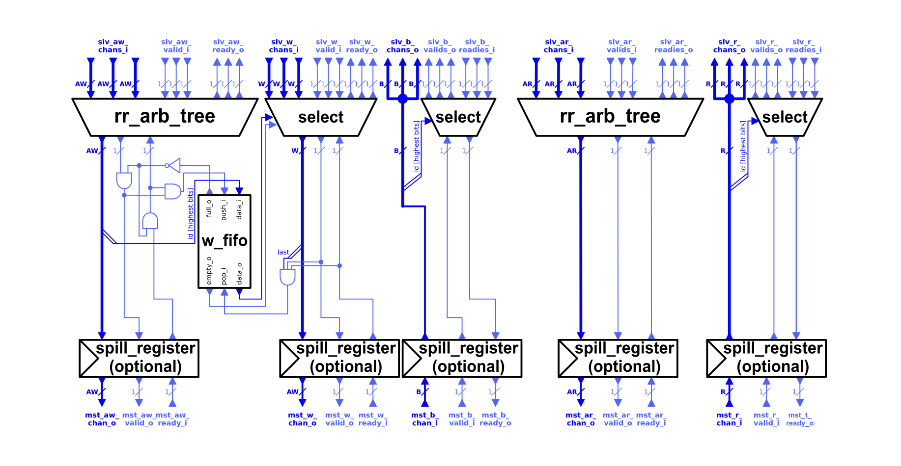

# AXI 멀티플렉서

AXI 디멀티플렉서와 반대 기능을 수행하는 것이 AXI 멀티플렉서입니다. 여러 AXI-4 연결을 하나로 병합합니다. 모듈의 여러 슬레이브 포트에서 들어오는 요청들이 인터리브되어 하나의 마스터 포트를 통해 전송됩니다.



멀티플렉서 모듈은 이전 섹션에서 소개한 디멀티플렉서보다 더 단순한 구조를 가지고 있습니다. AW 및 AR 채널의 요청들은 디멀티플렉서에서 응답을 병합할 때 사용되는 것과 동일한 라운드 로빈 중재 방식으로 병합됩니다. 그러나 한 가지 중요한 차이점은 멀티플렉서가 요청이 어느 슬레이브 포트에서 왔는지 판단하는 메커니즘입니다. 멀티플렉서는 이를 위해 요청의 `axi_id` 필드에서 상위 비트를 사용합니다. 필요한 비트 수는 다음과 같이 계산할 수 있습니다:

```systemverilog
$clog2(NoSlavePorts)
```

이로 인해 모듈의 각 슬레이브 포트를 통해 전송할 수 있는 ID의 종류가 제한됩니다. 상위 ID 비트가 포트의 인덱스와 일치하지 않으면 해당 응답이 잘못된 마스터로 전송되어 기능이 중단됩니다. 따라서 이 모듈을 사용할 때는 각 AXI ID를 해당 슬레이브 포트의 인덱스를 나타내는 필요한 비트만큼 확장한 후 이 모듈을 통해 전송할 것을 권장합니다.

쓰기 트랜잭션에서 AW 요청에 속하는 W 비트들은 순서대로 전송되어야 합니다. 이를 위해 `aw_id`의 최상위 비트가 FIFO에 푸시됩니다. FIFO가 비어 있지 않으면 해당 데이터가 어느 W 슬레이브 포트를 마스터 포트에 연결할지 결정합니다. 쓰기 트랜잭션의 마지막 비트가 전송되면 데이터가 팝됩니다.
모든 응답은 응답을 어느 슬레이브 포트로 전송해야 하는지 추적하는 동일한 방식으로 라우팅됩니다. 모듈이 마스터 포트에서 응답을 받을 준비가 되면 AXI ID가 나타내는 해당 슬레이브 포트에 연결합니다.

이러한 방식으로 스위칭을 수행하는 이유는 AXI 프로토콜의 순서 모델을 준수해야 하기 때문입니다. 확장된 ID를 사용함으로써 멀티플렉서에 연결된 서로 다른 마스터 모듈의 요청을 분리하는 데 도움이 됩니다. 각 마스터 모듈이 고유한 AXI ID 집합을 가지도록 보장하여, 서로 다른 마스터가 크게 다른 버스트 길이를 사용할 때 잠재적인 성능 향상을 가져올 수 있습니다. 이를 통해 슬레이브 모듈이 응답을 인터리브할 수 있게 됩니다.
응답 스위칭이 ID를 통해 이루어지는 또 다른 이유는 원자적 트랜잭션 지원이 필요하기 때문입니다. 프로토콜은 마스터 모듈이 원자적 트랜잭션에 이미 처리 중인 일반 트랜잭션과 다른 ID를 사용하도록 보장해야 한다고 규정합니다. 이는 원자적 트랜잭션과 일반 트랜잭션 간의 순서 요구사항을 방지하기 위한 것입니다. 또 다른 문제는 원자적 트랜잭션이 B 및 R 채널 모두에서 응답을 발생시킬 수 있어, 읽기 채널과 쓰기 채널 간의 의존성이 추가로 정의된다는 점입니다.

멀티플렉서에서 스위칭에 ID 접두사를 사용하면 이 모듈이 이러한 서로 다른 종류의 명령들 사이의 순서 요구사항을 처리하지 않아도 됩니다. 그 책임은 멀티플렉서의 슬레이브 포트에 연결된 마스터 모듈에게 위임됩니다.

다음 표는 모듈의 파라미터를 보여줍니다. 모듈은 또한 다섯 개의 AXI 채널을 설명하는 구조체를 필요로 합니다.

| Name          | Type | Function |
|:------------------ |:----------------- |:---------------------------------- |
| `AxiIdWidth`  | `int unsigned` | AXI 트랜잭션 ID의 비트 단위 너비. |
| `NoSlvPorts`  | `int unsigned` | 멀티플렉서의 슬레이브 포트 수. 이 수만큼의 마스터 모듈을 멀티플렉서에 연결할 수 있습니다. |
| `MaxWTrans` | `int unsigned` | AW 채널과 W 채널 사이에서 ID의 최상위 비트를 보관하는 FIFO의 깊이. |
| `FallThrough` | `bit` | AW 채널과 W 채널 사이의 FIFO가 폴-스루 모드인지 여부. 활성화하면 사이클 지연이 증가합니다. |
| `SpillXX` | `bit` | 해당 채널에 선택적 스필 레지스터를 활성화합니다. |


멀티플렉서 모듈의 포트는 AXI4 채널 구조체에 의해 정의됩니다. 스위칭이 AXI ID의 최상위 비트를 통해 이루어지므로, 모듈은 해당 슬레이브 포트와 마스터 포트만 포함합니다.
