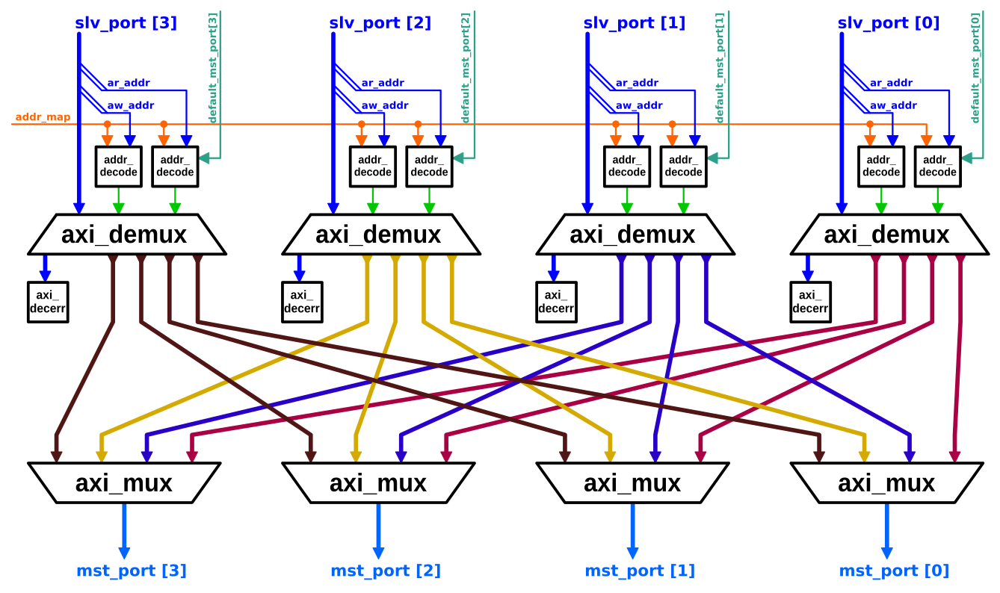

# AXI4+ATOP 완전 연결 Crossbar

`axi_xbar`는 AXI4 전체 규격과 AXI5의 원자적 연산(ATOP)을 구현한 완전 연결(fully-connected) crossbar입니다.


## 설계 개요

`axi_xbar`는 완전 연결 crossbar로, crossbar의 *slave port*에 연결된 각 마스터 모듈이 crossbar의 *master port*에 연결된 모든 슬레이브 모듈과 직접 배선으로 연결됩니다.
crossbar의 블록 다이어그램은 아래와 같습니다:



crossbar의 slave port 및 master port 수는 설정 가능합니다.

master port의 ID 폭은 slave port의 ID 폭보다 넓습니다. 추가된 ID 비트는 내부 멀티플렉서가 응답을 라우팅하는 데 사용됩니다. master port의 ID 폭은 `AxiIdWidthSlvPorts + $clog_2(NoSlvPorts)`이어야 합니다.


## 주소 맵

하나의 주소 맵이 모든 master port에 공유됩니다. *주소 맵*에는 임의 개수의 규칙(최소 1개 이상)이 포함됩니다. 각 *규칙*은 하나의 주소 범위를 하나의 master port에 매핑합니다. 여러 규칙이 동일한 master port에 매핑될 수 있습니다. 두 규칙의 주소 범위는 겹칠 수 있으며, 겹치는 경우 주소 맵에서 더 높은(더 상위) 위치의 규칙이 우선합니다.

각 주소 범위는 시작 주소를 포함하지만 끝 주소는 **포함하지 않습니다**. 즉, 주소가 주소 범위에 *매칭*되려면 다음 조건을 만족해야 합니다:
```
    addr >= start_addr && addr < end_addr
```
시작 주소는 끝 주소보다 작거나 같아야 합니다.

주소 맵은 런타임에 정의하고 변경할 수 있습니다(crossbar에 대한 입력 신호입니다). 단, 어느 slave port의 AW 또는 AR 채널이 valid한 상태에서는 주소 맵을 변경해서는 안 됩니다.


## 디코드 오류 및 기본 Slave Port

각 slave port에는 내부 *decode error slave* 모듈이 있습니다. 트랜잭션의 주소가 어떤 규칙과도 일치하지 않으면, 해당 트랜잭션은 decode error slave 모듈로 라우팅됩니다. 이 모듈은 각 트랜잭션을 흡수하고 디코드 오류로 응답합니다(적절한 수의 비트로). 각 읽기 응답 비트의 데이터는 `32'hBADCAB1E`입니다(데이터 폭에 맞게 0 패딩 또는 잘림).

각 slave port는 기본 master port를 가질 수 있습니다. 기본 master port가 활성화된 경우, 해당 slave port에서 어떤 규칙과도 일치하지 않는 주소는 decode error slave 대신 기본 master port로 라우팅됩니다. 기본 master port는 런타임에 활성화하거나 변경할 수 있으며(crossbar에 대한 입력 신호), 주소 맵과 동일한 제약이 적용됩니다.


## 설정

crossbar는 `axi_pkg::xbar_cfg_t` 구조체를 사용하는 `Cfg` 파라미터를 통해 설정됩니다. 해당 구조체의 필드는 다음과 같습니다:

| Name                 | Type               | Definition |
|:---------------------|:-------------------|:-----------|
| `NoSlvPorts`         | `int unsigned`     | crossbar의 AXI slave port 수 (즉, 연결 가능한 AXI 마스터 모듈의 수). |
| `NoMstPorts`         | `int unsigned`     | crossbar의 AXI master port 수 (즉, 연결 가능한 AXI 슬레이브 모듈의 수). |
| `MaxMstTrans`        | `int unsigned`     | 각 slave port에서 동시에 [in flight](../doc#in-flight) 상태로 허용되는 최대 트랜잭션 수. |
| `MaxSlvTrans`        | `int unsigned`     | 각 master port에서 ID별로 동시에 [in flight](../doc#in-flight) 상태로 허용되는 최대 트랜잭션 수. |
| `FallThrough`        | `bit`              | AW 채널의 라우팅 결정이 W 채널로 fall through됩니다. 이를 활성화하면 crossbar가 AW 비트와 동일한 사이클에 W 비트를 수신할 수 있지만, AW 채널의 로직이 W 채널의 조합 경로를 늘립니다. |
| `LatencyMode`        | `enum logic [9:0]` | 개별 채널의 레이턴시로, 아래 *파이프라이닝 및 레이턴시* 절에서 자세히 설명합니다. |
| `AxiIdWidthSlvPorts` | `int unsigned`     | slave port의 AXI ID 폭. |
| `AxiIdUsedSlvPorts`  | `int unsigned`     | crossbar가 AXI ID의 고유성을 판별하는 데 사용하는 slave port ID 비트 수(최하위 비트부터). 아래 *순서 및 스톨* 절을 참조하십시오. 이 값은 `AxiIdWidthSlvPorts` 이하이어야 합니다. |
| `UniqueIds`          | `bit`              | 동일 방향으로 in-flight 중인 모든 트랜잭션에서 각 트랜잭션의 ID가 항상 고유함을 보장할 수 있다면, 이 파라미터를 `1'b1`로 설정하면 crossbar가 단순화됩니다. 자세한 내용은 [`axi_demux` 문서](axi_demux#ordering-and-stalls)를 참조하십시오. |
| `AxiAddrWidth`       | `int unsigned`     | AXI 주소 폭. |
| `AxiDataWidth`       | `int unsigned`     | AXI 데이터 폭. |
| `NoAddrRules`        | `int unsigned`     | 주소 맵 규칙의 수. |

나머지 파라미터는 crossbar의 포트를 정의하는 타입입니다. `*_chan_t` 및 `*_req_t`/`*_resp_t` 타입은 `axi/typedef.svh`에 정의된 `AXI_TYPEDEF` 매크로를 사용하여 설정에 맞게 바인딩되어야 합니다. `rule_t` 타입은 설정과 동일한 주소 폭을 가진 주소 디코딩 규칙으로 바인딩되어야 하며, `axi_pkg`에는 64비트 및 32비트 주소에 대한 정의가 포함되어 있습니다.

### 파이프라이닝 및 레이턴시

`LatencyMode` 파라미터를 사용하면 각 master port(즉, 각 멀티플렉서)의 각 채널(AW, W, B, AR, R) 이후와 각 slave port(즉, 각 디멀티플렉서)의 각 채널 이전에 스필 레지스터를 삽입할 수 있습니다. 스필 레지스터는 조합 경로를 차단하므로, 이 파라미터는 crossbar의 조합 경로 길이를 줄입니다.

일반적인 설정들은 `xbar_latency_e` `enum`에 정의되어 있습니다. 권장 설정(`CUT_ALL_AX`)은 AW 및 AR 채널에 레이턴시 2를 적용하는 것입니다. 이 두 채널에 조합 로직이 가장 많기 때문입니다. 또한 `FallThrough`를 `0`으로 설정하여 AW 채널의 로직이 W 채널의 조합 경로를 늘리지 않도록 해야 합니다. 다만 `LatencyMode`를 `NO_LATENCY`로 설정하고 `FallThrough`를 `1`로 설정하면 crossbar를 완전 조합 구성으로 실행할 수도 있습니다.

두 crossbar가 양방향으로 연결되어 있는 경우, 즉 각 crossbar의 master port 하나가 다른 crossbar의 slave port에 연결된 경우, 두 crossbar의 `LatencyMode`는 모두 `CUT_SLV_PORTS`, `CUT_MST_PORTS`, 또는 `CUT_ALL_PORTS` 중 하나로 설정해야 합니다. 다른 레이턴시 모드는 두 crossbar 사이의 잘리지 않은 채널에서 타이밍 루프를 유발합니다. 두 crossbar의 레이턴시 모드가 반드시 동일할 필요는 없습니다.


## 포트

| Name                    | Description |
|:------------------------|:------------|
| `clk_i`                 | 다른 모든 신호(`rst_ni` 제외)가 동기화되는 클록. |
| `rst_ni`                | 리셋, 비동기, 액티브 로우. |
| `test_i`                | 테스트 모드 활성화 (액티브 하이). |
| `slv_ports_*`           | crossbar의 slave port 배열. 각 포트의 배열 인덱스는 slave port의 인덱스이며, 이 인덱스는 master port 중 하나에서의 모든 요청 앞에 추가됩니다. |
| `mst_ports_*`           | crossbar의 master port 배열. 각 포트의 배열 인덱스는 master port의 인덱스. |
| `addr_map_i`            | crossbar의 주소 맵 (위의 *주소 맵* 절 참조). |
| `en_default_mst_port_i` | 각 slave port별 1비트로, 해당 slave port에 기본 master port가 활성화되어 있는지 여부를 정의합니다 (위의 *디코드 오류 및 기본 Slave Port* 절 참조). |
| `default_mst_port_i`    | 각 slave port별 master port 인덱스로, 해당 slave port의 기본 master port를 정의합니다 (활성화된 경우). |


## 순서 및 스톨

하나의 slave port에서 ID와 방향이 동일한(즉, 모두 읽기 또는 모두 쓰기) 두 트랜잭션이 서로 다른 master port를 대상으로 할 때, crossbar는 첫 번째 트랜잭션이 완료될 때까지 두 번째 트랜잭션을 수신하지 않습니다. 이 시간 동안 crossbar는 해당 slave port의 AR 또는 AW 채널을 스톨합니다. 두 트랜잭션의 ID가 동일한지 판별할 때는 `AxiIdUsedSlvPorts` 최하위 비트를 비교합니다. 이 파라미터를 `AxiIdWidthSlvPorts`의 전체 값으로 설정하면 잘못된 ID 충돌을 방지할 수 있으며, 더 낮은 값으로 설정하면 더 많은 잘못된 충돌이 발생하는 대신 면적과 지연을 줄일 수 있습니다.

이러한 순서 제약의 이유는 AXI 규격에서 동일한 ID와 방향을 가진 트랜잭션은 순서가 유지되어야 하기 때문입니다. 위에서 설명한 두 트랜잭션을 모두 전달하면 두 번째 master port가 첫 번째보다 먼저 응답을 받을 수 있으며, 그러면 crossbar가 master port에서 응답을 반환하기 전에 응답 순서를 재정렬해야 합니다. 그러나 효율성을 위해 이 crossbar에는 재정렬 버퍼가 없습니다.


## 검증 방법론

이 모듈은 `test/tb_axi_xbar.sv`에 기술 및 구현된 지시적 랜덤 검증 테스트벤치로 검증되었습니다.


## Crossbar 내부 파이프라이닝 미적용에 대한 설계 근거

디멀티플렉서와 멀티플렉서 사이에 스필 레지스터를 삽입하면 crossbar의 조합 경로 길이를 더 줄일 수 있어 매력적으로 보입니다. 그러나 이는 W 채널에서 두 개의 서로 다른 master port 멀티플렉서가 두 개의 서로 다른 디멀티플렉서를 순환 대기하는 데드락을 유발할 수 있습니다(TODO). 실제로 스위칭 모듈 사이에 스필 레지스터를 삽입하면 네 가지 데드락 조건이 모두 충족됩니다. 조건은 다음과 같습니다:

1. 상호 배제(Mutual Exclusion)
2. 점유 및 대기(Hold and Wait)
3. 선점 불가(No Preemption)
4. 순환 대기(Circular Wait)

첫 번째 조건은 W 채널에서 멀티플렉서의 특성에 의해 충족됩니다. W 비트는 ID에 관계없이 슬레이브 모듈에서 AW 비트와 동일한 순서로 도착해야 합니다. 따라서 순서는 AW 채널의 중재 트리에 의해 결정되므로 멀티플렉서의 서로 다른 master port들은 상호 배제됩니다.

두 번째와 세 번째 조건은 AXI 프로토콜에 내재되어 있습니다. (2)의 경우, ready 신호가 high가 될 때까지 valid 신호를 high로 유지해야 합니다. (3)의 경우, AXI는 W 비트의 인터리빙을 허용하지 않으며 W 버스트는 AW 비트와 동일한 순서로 전송되어야 합니다.

따라서 네 번째 조건만이 데드락을 방지하기 위해 깰 수 있는 유일한 조건입니다. 그러나 디멀티플렉서의 master port와 멀티플렉서의 slave port 사이에 스필 레지스터를 삽입하면 W FIFO 내에서 순환 의존성이 발생할 수 있습니다. 이는 멀티플렉서 내 AW 채널의 라운드 로빈 중재기가 우선순위를 정의하는 특정 방식에서 비롯됩니다. 중재기는 각 slave port에 증가하는 우선순위를 부여하고 쌍별로 비교하여 승자를 선택하는 방식으로 구성됩니다. 승자가 전달되면 우선순위 상태가 한 위치 앞으로 이동하여 기아 상태를 방지합니다.

이 문제는 예시로 설명할 수 있습니다. 입력이 10개인 중재 트리를 가정합니다. 두 요청이 동일한 클록 사이클에 처리되려 합니다. 우선순위가 높은 요청이 승리하고 우선순위 상태가 이동합니다. 다음 사이클에도 동일한 두 입력에 요청이 대기 중입니다. 우선순위가 한 위치만 이동했으므로 이번에도 이전과 동일한 포트가 승리할 수 있습니다. 이는 crossbar의 다른 멀티플렉서 중재 트리들과 결합하여 FIFO 내에서 순환 의존성을 유발할 수 있습니다. 디멀티플렉서와 멀티플렉서 사이의 스필 레지스터를 제거하면 동일한 클록 사이클에 W FIFO로의 스위칭 결정이 강제됩니다. 이는 스위칭 결정의 엄격한 순서를 유발하여 순환 대기를 방지합니다.
