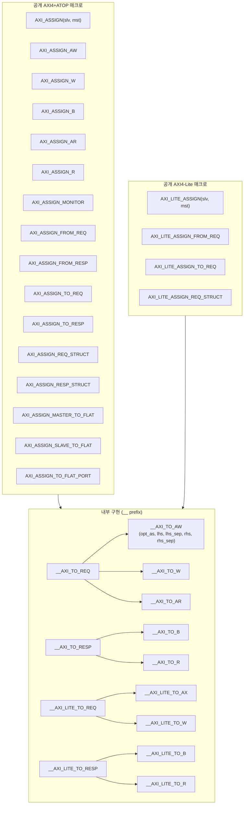
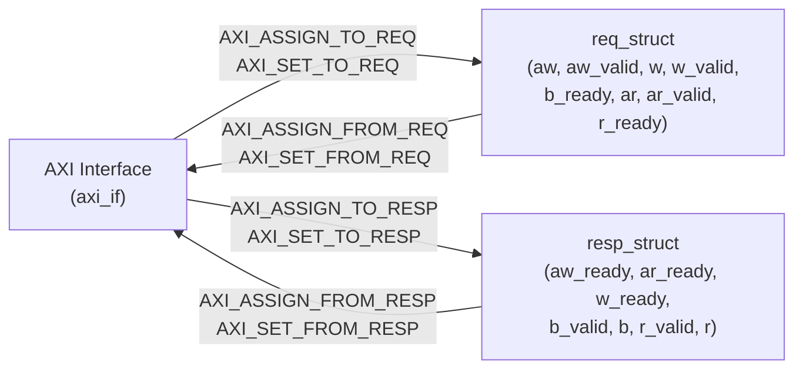

# assign.svh — AXI/AXI-Lite 인터페이스 및 구조체 할당 매크로

## 파일 개요 및 목적

`assign.svh`는 AXI4+ATOP 및 AXI4-Lite 버스의 인터페이스(interface)와 구조체(struct) 사이의 신호 할당을 위한 SystemVerilog 프리프로세서 매크로 모음이다. ETH Zurich / University of Bologna(IIS)가 개발한 `pulp-platform/axi` 라이브러리의 핵심 헤더 파일이며, 아래 두 가지 목적을 충족한다.

1. **반복적인 신호 열거 제거** — AXI 채널별 신호(id, addr, len, size, burst, lock, cache, prot, qos, region, atop, user 등)를 한 줄 매크로 호출로 일괄 할당.
2. **문맥 독립성** — `assign` 문(모듈 수준, 프로세스 외부)과 절차적 대입(프로세스 내부)을 `__opt_as` 인자로 통일된 내부 구현에서 처리.

헤더 가드: `` `ifndef AXI_ASSIGN_SVH_ ``

---

## Mermaid 다이어그램

### 매크로 계층 구조



### 인터페이스 ↔ 구조체 변환 방향



---

## 정의된 매크로 상세 설명

### 1. 내부 구현 매크로 (이름 앞에 `__`)

이 매크로들은 직접 사용하지 않는다. `__opt_as` 인자로 `assign` 또는 빈 문자열(절차적)을 받아 코드를 생성한다.

| 매크로 | 담당 채널 | 전달되는 신호 |
|--------|-----------|--------------|
| `` `__AXI_TO_AW `` | AW | id, addr, len, size, burst, lock, cache, prot, qos, region, atop, user |
| `` `__AXI_TO_W `` | W | data, strb, last, user |
| `` `__AXI_TO_B `` | B | id, resp, user |
| `` `__AXI_TO_AR `` | AR | id, addr, len, size, burst, lock, cache, prot, qos, region, user |
| `` `__AXI_TO_R `` | R | id, data, resp, last, user |
| `` `__AXI_TO_REQ `` | REQ | AW+W+AR 페이로드 + aw_valid, w_valid, b_ready, ar_valid, r_ready |
| `` `__AXI_TO_RESP `` | RESP | B+R 페이로드 + aw_ready, ar_ready, w_ready, b_valid, r_valid |

AXI-Lite용 내부 매크로:

| 매크로 | 담당 채널 | 전달되는 신호 |
|--------|-----------|--------------|
| `` `__AXI_LITE_TO_AX `` | AW/AR | addr, prot |
| `` `__AXI_LITE_TO_W `` | W | data, strb |
| `` `__AXI_LITE_TO_B `` | B | resp |
| `` `__AXI_LITE_TO_R `` | R | data, resp |
| `` `__AXI_LITE_TO_REQ `` | REQ | AW+W+AR + aw_valid, w_valid, b_ready, ar_valid, r_ready |
| `` `__AXI_LITE_TO_RESP `` | RESP | B+R + aw_ready, ar_ready, w_ready, b_valid, r_valid |

---

### 2. 인터페이스 ↔ 인터페이스 할당 (AXI4+ATOP)

#### `AXI_ASSIGN(slv, mst)`
마스터 포트 `mst`를 슬레이브 포트 `slv`에 전체 연결 (`assign slv = mst` 동등).
- AW, W, AR 채널 페이로드 + valid: `mst` → `slv`
- B, R 채널 페이로드 + valid: `slv` → `mst`
- AW, W, AR ready: `slv` → `mst`
- B, R ready: `mst` → `slv`

#### `AXI_ASSIGN_AW(dst, src)` / `AXI_ASSIGN_W` / `AXI_ASSIGN_B` / `AXI_ASSIGN_AR` / `AXI_ASSIGN_R`
채널 단위 할당. 각 채널의 페이로드 + valid/ready를 양방향으로 연결.

#### `AXI_ASSIGN_MONITOR(mon_dv, axi_if)`
모니터 modport용. 모든 신호(valid와 ready 포함)를 `axi_if`에서 `mon_dv`로 단방향 할당.

---

### 3. 인터페이스 ↔ 구조체 할당 (assign / set 구분)

`assign` 계열: 모듈 수준(프로세스 외부)에서 사용  
`set` 계열: `always_comb`, `always_ff` 등 절차적 블록 내부에서 사용

#### 구조체 → 인터페이스

| 매크로 | 컨텍스트 | 방향 |
|--------|----------|------|
| `` `AXI_ASSIGN_FROM_AW(axi_if, aw_struct) `` | 모듈 수준 | struct → if |
| `` `AXI_SET_FROM_AW(axi_if, aw_struct) `` | 프로세스 내부 | struct → if |
| `` `AXI_ASSIGN_FROM_REQ(axi_if, req_struct) `` | 모듈 수준 | req struct → if |
| `` `AXI_SET_FROM_REQ(axi_if, req_struct) `` | 프로세스 내부 | req struct → if |
| `` `AXI_ASSIGN_FROM_RESP(axi_if, resp_struct) `` | 모듈 수준 | resp struct → if |
| `` `AXI_SET_FROM_RESP(axi_if, resp_struct) `` | 프로세스 내부 | resp struct → if |

(W, B, AR, R 채널 단위 변형도 동일 패턴으로 제공)

#### 인터페이스 → 구조체

| 매크로 | 컨텍스트 |
|--------|----------|
| `` `AXI_ASSIGN_TO_REQ(req_struct, axi_if) `` | 모듈 수준 |
| `` `AXI_SET_TO_REQ(req_struct, axi_if) `` | 프로세스 내부 |
| `` `AXI_ASSIGN_TO_RESP(resp_struct, axi_if) `` | 모듈 수준 |
| `` `AXI_SET_TO_RESP(resp_struct, axi_if) `` | 프로세스 내부 |

---

### 4. 구조체 ↔ 구조체 할당

| 매크로 | 컨텍스트 |
|--------|----------|
| `` `AXI_ASSIGN_REQ_STRUCT(lhs, rhs) `` | 모듈 수준 |
| `` `AXI_SET_REQ_STRUCT(lhs, rhs) `` | 프로세스 내부 |
| `` `AXI_ASSIGN_RESP_STRUCT(lhs, rhs) `` | 모듈 수준 |
| `` `AXI_SET_RESP_STRUCT(lhs, rhs) `` | 프로세스 내부 |

채널 단위(AW, W, B, AR, R)도 동일 패턴 제공.

---

### 5. Vivado IP Integrator용 Flat 포트 매크로

Vivado IP Integrator는 번들 인터페이스를 지원하지 않으므로, req/resp 구조체에서 개별 신호로 분해하는 매크로가 필요하다.

#### `AXI_ASSIGN_MASTER_TO_FLAT(pat, req, rsp)`
- 패턴 `pat`으로 이름 지어진 `m_axi_<pat>_*` 포트를 `req`/`rsp` 구조체 필드에 연결.
- 출력: awvalid, awid, awaddr, awlen, awsize, awburst, awlock, awcache, awprot, awqos, awregion, awuser, wvalid, wdata, wstrb, wlast, wuser, bready, arvalid, arid, araddr, arlen, arsize, arburst, arlock, arcache, arprot, arqos, arregion, aruser, rready
- 입력: awready, arready, wready, bvalid, bid, bresp, buser, rvalid, rid, rdata, rresp, rlast, ruser

#### `AXI_ASSIGN_SLAVE_TO_FLAT(pat, req, rsp)`
슬레이브 방향(s_axi_*). 방향이 반전된다.

#### `AXI_ASSIGN_TO_FLAT_PORT(pat, req, rsp)`
모듈 인스턴스화 포트 연결 목록에서 사용. `m_axi_` / `s_axi_` 없이 순수 패턴명만 사용.

#### `AXI_ASSIGN_MASTER_TO_FLAT_PORT(name, req, rsp)` / `AXI_ASSIGN_SLAVE_TO_FLAT_PORT(name, req, rsp)`
위의 단축 버전.

---

### 6. Signal Highlighter 인스턴스화 (검증용)

#### `AXI_HIGHLIGHT(__name, __aw_t, __w_t, __b_t, __ar_t, __r_t, __req, __resp)`
`signal_highlighter` 모듈(common_verification 라이브러리)을 AW, W, B, AR, R 채널 각각에 하나씩, 총 5개 인스턴스화. 시뮬레이션에서 유효한 핸드셰이크를 시각적으로 강조하기 위한 용도.

---

### 7. AXI4-Lite 공개 매크로 (AXI4+ATOP와 동일 패턴)

`AXI_LITE_ASSIGN_*`, `AXI_LITE_SET_FROM_*`, `AXI_LITE_SET_TO_*`, `AXI_LITE_ASSIGN_FROM_*`, `AXI_LITE_ASSIGN_TO_*`, `AXI_LITE_ASSIGN_*_STRUCT`, `AXI_LITE_SET_*_STRUCT` 계열.

AXI4-Lite는 id, lock, len, size, burst, region, atop, user 필드가 없으므로 신호 수가 적다.

---

## 사용 예시

### 예시 1: 인터페이스 간 직접 연결

```systemverilog
// 마스터 포트 mst를 슬레이브 포트 slv에 연결
`AXI_ASSIGN(slv, mst)

// AW 채널만 연결
`AXI_ASSIGN_AW(dst_if, src_if)
```

### 예시 2: 구조체 → 인터페이스 (모듈 수준)

```systemverilog
// req_struct의 모든 요청 채널 신호를 axi_if에 assign
`AXI_ASSIGN_FROM_REQ(my_if, my_req_struct)
`AXI_ASSIGN_FROM_RESP(my_if, my_resp_struct)
```

### 예시 3: 인터페이스 → 구조체 (프로세스 내부)

```systemverilog
always_comb begin
  `AXI_SET_TO_REQ(my_req_struct, my_if)
  `AXI_SET_TO_RESP(my_resp_struct, my_if)
end
```

### 예시 4: 구조체 복사

```systemverilog
// 모듈 수준
`AXI_ASSIGN_REQ_STRUCT(dst_req, src_req)

// 프로세스 내부
always_comb begin
  `AXI_SET_REQ_STRUCT(dst_req, src_req)
end
```

### 예시 5: Vivado Flat 포트 (마스터)

```systemverilog
`AXI_ASSIGN_MASTER_TO_FLAT("my_bus", my_req, my_rsp)
// → m_axi_my_bus_awvalid = my_req.aw_valid 등을 생성
```

### 예시 6: 모니터 연결

```systemverilog
`AXI_ASSIGN_MONITOR(mon_dv, axi_if)
```

### 예시 7: Signal Highlighter (검증)

```systemverilog
`AXI_HIGHLIGHT(my_bus, axi_aw_t, axi_w_t, axi_b_t, axi_ar_t, axi_r_t, req, resp)
```

---

## 의존성

| 항목 | 설명 |
|------|------|
| `axi_pkg` (axi_pkg.sv) | 내부적으로 사용되지 않으나, 이 매크로로 생성된 코드의 신호 타입(`axi_pkg::len_t` 등)은 `axi_pkg`에 정의됨 |
| `typedef.svh` | `AXI_TYPEDEF_*` 매크로로 생성된 구조체 타입이 req/resp struct로 사용됨 |
| `axi_intf.sv` | AXI_BUS, AXI_LITE 인터페이스 정의. 매크로의 첫 번째/두 번째 인자가 이 인터페이스의 인스턴스 |
| `signal_highlighter` | `AXI_HIGHLIGHT` 매크로 사용 시 common_verification 라이브러리 필요 |
| 헤더 가드 | `` `AXI_ASSIGN_SVH_ `` |

---

## 매크로 전체 목록 요약

### AXI4+ATOP 공개 매크로

| 분류 | 매크로명 |
|------|---------|
| IF↔IF | `AXI_ASSIGN`, `AXI_ASSIGN_AW/W/B/AR/R`, `AXI_ASSIGN_MONITOR` |
| IF←struct (assign) | `AXI_ASSIGN_FROM_AW/W/B/AR/R`, `AXI_ASSIGN_FROM_REQ`, `AXI_ASSIGN_FROM_RESP` |
| IF←struct (set) | `AXI_SET_FROM_AW/W/B/AR/R`, `AXI_SET_FROM_REQ`, `AXI_SET_FROM_RESP` |
| struct←IF (assign) | `AXI_ASSIGN_TO_AW/W/B/AR/R`, `AXI_ASSIGN_TO_REQ`, `AXI_ASSIGN_TO_RESP` |
| struct←IF (set) | `AXI_SET_TO_AW/W/B/AR/R`, `AXI_SET_TO_REQ`, `AXI_SET_TO_RESP` |
| struct←struct (assign) | `AXI_ASSIGN_AW/W/B/AR/R_STRUCT`, `AXI_ASSIGN_REQ_STRUCT`, `AXI_ASSIGN_RESP_STRUCT` |
| struct←struct (set) | `AXI_SET_AW/W/B/AR/R_STRUCT`, `AXI_SET_REQ_STRUCT`, `AXI_SET_RESP_STRUCT` |
| Vivado flat | `AXI_ASSIGN_MASTER_TO_FLAT`, `AXI_ASSIGN_SLAVE_TO_FLAT`, `AXI_ASSIGN_TO_FLAT_PORT`, `AXI_ASSIGN_MASTER_TO_FLAT_PORT`, `AXI_ASSIGN_SLAVE_TO_FLAT_PORT` |
| 검증 | `AXI_HIGHLIGHT` |

### AXI4-Lite 공개 매크로

`AXI_ASSIGN_*` → `AXI_LITE_ASSIGN_*` 으로 이름 치환. 동일 패턴.
