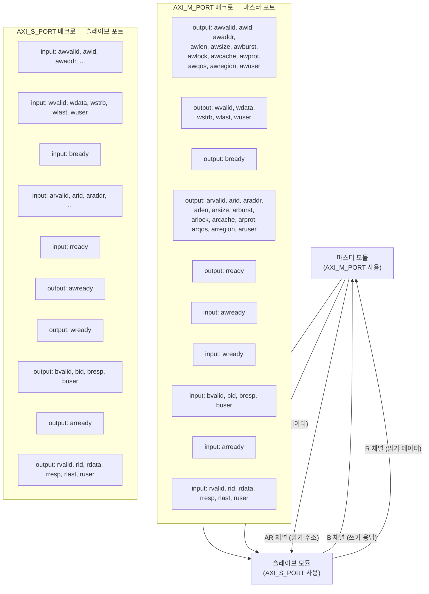

# port.svh — AXI 평탄화 포트 매크로

## 파일 목적 및 개요

`port.svh`는 AXI4 버스 인터페이스를 **평탄화된(flattened) 포트 신호 목록**으로 모듈 경계에 선언할 때 사용하는 SystemVerilog 헤더 파일입니다. AXI 인터페이스를 SystemVerilog `interface` 타입 없이 개별 `input`/`output` 포트로 펼쳐야 하는 상황(예: IP 래퍼, FPGA 탑레벨 포트 연결 등)에서 반복적인 코드 작성을 줄여 줍니다.

ETH Zurich / University of Bologna의 pulp-platform 프로젝트의 일부이며 Solderpad Hardware License v0.51 하에 배포됩니다.

---

## 주요 매크로 및 파라미터

### `AXI_M_PORT` — AXI 마스터 포트 선언 매크로

```systemverilog
`AXI_M_PORT(__name, __addr_t, __data_t, __strb_t, __id_t,
             __aw_user_t, __w_user_t, __b_user_t, __ar_user_t, __r_user_t)
```

| 파라미터 | 설명 |
|---|---|
| `__name` | 포트 이름 접미사 (예: `main` → `m_axi_main_awvalid`) |
| `__addr_t` | 주소 타입 (예: `logic [31:0]`) |
| `__data_t` | 데이터 타입 (예: `logic [63:0]`) |
| `__strb_t` | 바이트 스트로브 타입 (예: `logic [7:0]`) |
| `__id_t` | 트랜잭션 ID 타입 |
| `__aw_user_t` | AW 채널 사용자 사이드밴드 타입 |
| `__w_user_t` | W 채널 사용자 사이드밴드 타입 |
| `__b_user_t` | B 채널 사용자 사이드밴드 타입 |
| `__ar_user_t` | AR 채널 사용자 사이드밴드 타입 |
| `__r_user_t` | R 채널 사용자 사이드밴드 타입 |

생성되는 포트 방향 (마스터 관점):

| 채널 | output 신호 | input 신호 |
|---|---|---|
| **AW** (쓰기 주소) | awvalid, awid, awaddr, awlen, awsize, awburst, awlock, awcache, awprot, awqos, awregion, awuser | awready |
| **W** (쓰기 데이터) | wvalid, wdata, wstrb, wlast, wuser | wready |
| **B** (쓰기 응답) | bready | bvalid, bid, bresp, buser |
| **AR** (읽기 주소) | arvalid, arid, araddr, arlen, arsize, arburst, arlock, arcache, arprot, arqos, arregion, aruser | arready |
| **R** (읽기 데이터) | rready | rvalid, rid, rdata, rresp, rlast, ruser |

---

### `AXI_S_PORT` — AXI 슬레이브 포트 선언 매크로

```systemverilog
`AXI_S_PORT(__name, __addr_t, __data_t, __strb_t, __id_t,
             __aw_user_t, __w_user_t, __b_user_t, __ar_user_t, __r_user_t)
```

파라미터 목록은 `AXI_M_PORT`와 동일합니다. 포트 방향이 반전됩니다:

| 채널 | input 신호 | output 신호 |
|---|---|---|
| **AW** | awvalid, awid, awaddr, awlen, awsize, awburst, awlock, awcache, awprot, awqos, awregion, awuser | awready |
| **W** | wvalid, wdata, wstrb, wlast, wuser | wready |
| **B** | bready | bvalid, bid, bresp, buser |
| **AR** | arvalid, arid, araddr, arlen, arsize, arburst, arlock, arcache, arprot, arqos, arregion, aruser | arready |
| **R** | rready | rvalid, rid, rdata, rresp, rlast, ruser |

---

## 내부 로직 설명

- 파일 전체가 `ifndef/define/endif` 가드(`AXI_PORT_SVH_`)로 보호되어 중복 포함을 방지합니다.
- 두 매크로는 각각 **AXI5 채널 5개(AW, W, B, AR, R)** 에 해당하는 평탄화 포트를 한 번에 선언합니다.
- 채널 폭 타입들(`axi_pkg::len_t`, `axi_pkg::size_t`, `axi_pkg::burst_t` 등)은 `axi_pkg` 패키지에서 가져오므로, 컴파일 전에 해당 패키지가 먼저 로드되어야 합니다.
- 매크로 인자에서 `__name` 토큰은 백틱 연결 연산자(``` `` ```)를 통해 포트 이름에 삽입됩니다.
- 각 매크로 정의의 마지막 줄은 **후행 쉼표(`,`)**로 끝나므로, 모듈 포트 목록 내부에 삽입하는 용도로 설계되어 있습니다.

---

## Mermaid 구조 다이어그램



---

## 의존성 및 사용 방법

### 의존성

| 항목 | 설명 |
|---|---|
| `axi_pkg` | `len_t`, `size_t`, `burst_t`, `cache_t`, `prot_t`, `qos_t`, `region_t`, `resp_t` 타입 정의 제공 |
| `axi_pkg.sv` | `src/axi_pkg.sv`에서 컴파일 — `port.svh` 보다 먼저 로드되어야 함 |

### 사용 예시

```systemverilog
// 탑레벨 래퍼 모듈 예시
module my_top_wrapper (
  input  logic clk,
  input  logic rst_n,
  // AXI 마스터 포트 (이름: dma)
  `AXI_M_PORT(dma, logic [31:0], logic [63:0], logic [7:0],
              logic [3:0], logic, logic, logic, logic, logic),
  // AXI 슬레이브 포트 (이름: cfg)
  `AXI_S_PORT(cfg, logic [31:0], logic [32:0], logic [3:0],
              logic [3:0], logic, logic, logic, logic, logic)
);
  // ...
endmodule
```

### 포함 방법

```systemverilog
`include "axi/port.svh"
```

인클루드 경로에 `include/` 디렉터리가 포함되어 있어야 합니다 (`src_files.yml`의 `incdirs` 참고).
