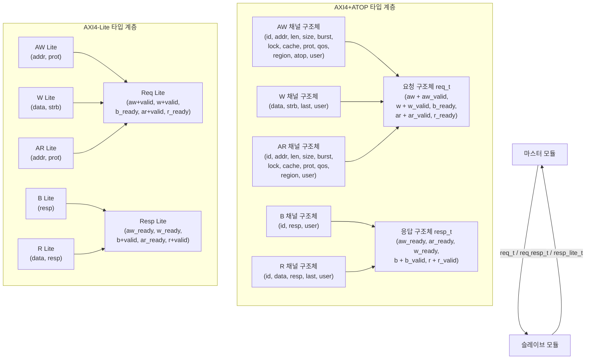

# typedef.svh — AXI 채널 및 요청/응답 구조체 타입 정의 매크로

## 파일 목적 및 개요

`typedef.svh`는 AXI4+ATOP 및 AXI4-Lite 버스 인터페이스에 사용되는 **채널(Channel) 구조체**와 **요청(Request)/응답(Response) 구조체**를 SystemVerilog `typedef`로 정의하는 매크로 모음입니다.

파라미터화된 타입을 프리프로세서 매크로로 제공함으로써, 다양한 데이터 폭 및 ID 폭에 대응하는 AXI 타입을 재사용 가능하게 생성합니다. ETH Zurich / University of Bologna의 pulp-platform 프로젝트의 일부이며 Solderpad Hardware License v0.51 하에 배포됩니다.

---

## 매크로 목록 및 파라미터 설명

### AXI4+ATOP 채널별 매크로

#### `AXI_TYPEDEF_AW_CHAN_T` — 쓰기 주소(AW) 채널 구조체

```systemverilog
`AXI_TYPEDEF_AW_CHAN_T(aw_chan_t, addr_t, id_t, user_t)
```

| 필드 | 타입 | 설명 |
|---|---|---|
| `id` | `id_t` | 트랜잭션 ID |
| `addr` | `addr_t` | 목적지 주소 |
| `len` | `axi_pkg::len_t` | 버스트 길이 (전송 횟수 - 1) |
| `size` | `axi_pkg::size_t` | 전송 크기 (바이트 수의 로그) |
| `burst` | `axi_pkg::burst_t` | 버스트 유형 (FIXED/INCR/WRAP) |
| `lock` | `logic` | 잠금 접근 여부 |
| `cache` | `axi_pkg::cache_t` | 캐시 속성 |
| `prot` | `axi_pkg::prot_t` | 보호 속성 |
| `qos` | `axi_pkg::qos_t` | QoS 식별자 |
| `region` | `axi_pkg::region_t` | 리전 식별자 |
| `atop` | `axi_pkg::atop_t` | 원자적 연산 타입 (ATOP 확장) |
| `user` | `user_t` | 사이드밴드 사용자 신호 |

---

#### `AXI_TYPEDEF_W_CHAN_T` — 쓰기 데이터(W) 채널 구조체

```systemverilog
`AXI_TYPEDEF_W_CHAN_T(w_chan_t, data_t, strb_t, user_t)
```

| 필드 | 타입 | 설명 |
|---|---|---|
| `data` | `data_t` | 쓰기 데이터 |
| `strb` | `strb_t` | 바이트 스트로브 (유효 바이트 마스크) |
| `last` | `logic` | 버스트의 마지막 전송 여부 |
| `user` | `user_t` | 사이드밴드 사용자 신호 |

---

#### `AXI_TYPEDEF_B_CHAN_T` — 쓰기 응답(B) 채널 구조체

```systemverilog
`AXI_TYPEDEF_B_CHAN_T(b_chan_t, id_t, user_t)
```

| 필드 | 타입 | 설명 |
|---|---|---|
| `id` | `id_t` | 대응하는 쓰기 트랜잭션 ID |
| `resp` | `axi_pkg::resp_t` | 응답 코드 (OKAY/EXOKAY/SLVERR/DECERR) |
| `user` | `user_t` | 사이드밴드 사용자 신호 |

---

#### `AXI_TYPEDEF_AR_CHAN_T` — 읽기 주소(AR) 채널 구조체

```systemverilog
`AXI_TYPEDEF_AR_CHAN_T(ar_chan_t, addr_t, id_t, user_t)
```

AW 채널과 동일한 필드 구성이지만 `atop` 필드가 없습니다.

| 필드 | 타입 | 설명 |
|---|---|---|
| `id` | `id_t` | 트랜잭션 ID |
| `addr` | `addr_t` | 읽기 주소 |
| `len` | `axi_pkg::len_t` | 버스트 길이 |
| `size` | `axi_pkg::size_t` | 전송 크기 |
| `burst` | `axi_pkg::burst_t` | 버스트 유형 |
| `lock` | `logic` | 잠금 접근 여부 |
| `cache` | `axi_pkg::cache_t` | 캐시 속성 |
| `prot` | `axi_pkg::prot_t` | 보호 속성 |
| `qos` | `axi_pkg::qos_t` | QoS 식별자 |
| `region` | `axi_pkg::region_t` | 리전 식별자 |
| `user` | `user_t` | 사이드밴드 사용자 신호 |

---

#### `AXI_TYPEDEF_R_CHAN_T` — 읽기 데이터(R) 채널 구조체

```systemverilog
`AXI_TYPEDEF_R_CHAN_T(r_chan_t, data_t, id_t, user_t)
```

| 필드 | 타입 | 설명 |
|---|---|---|
| `id` | `id_t` | 대응하는 읽기 트랜잭션 ID |
| `data` | `data_t` | 읽기 데이터 |
| `resp` | `axi_pkg::resp_t` | 응답 코드 |
| `last` | `logic` | 버스트의 마지막 전송 여부 |
| `user` | `user_t` | 사이드밴드 사용자 신호 |

---

#### `AXI_TYPEDEF_REQ_T` — 요청(Request) 구조체

```systemverilog
`AXI_TYPEDEF_REQ_T(req_t, aw_chan_t, w_chan_t, ar_chan_t)
```

마스터에서 슬레이브 방향으로 전달되는 모든 신호를 하나의 구조체로 묶습니다.

| 필드 | 타입 | 설명 |
|---|---|---|
| `aw` | `aw_chan_t` | AW 채널 페이로드 |
| `aw_valid` | `logic` | AW 채널 valid 신호 |
| `w` | `w_chan_t` | W 채널 페이로드 |
| `w_valid` | `logic` | W 채널 valid 신호 |
| `b_ready` | `logic` | B 채널 ready 신호 (마스터 수신 준비) |
| `ar` | `ar_chan_t` | AR 채널 페이로드 |
| `ar_valid` | `logic` | AR 채널 valid 신호 |
| `r_ready` | `logic` | R 채널 ready 신호 (마스터 수신 준비) |

---

#### `AXI_TYPEDEF_RESP_T` — 응답(Response) 구조체

```systemverilog
`AXI_TYPEDEF_RESP_T(resp_t, b_chan_t, r_chan_t)
```

슬레이브에서 마스터 방향으로 전달되는 모든 신호를 하나의 구조체로 묶습니다.

| 필드 | 타입 | 설명 |
|---|---|---|
| `aw_ready` | `logic` | AW 채널 ready 신호 (슬레이브 수신 준비) |
| `ar_ready` | `logic` | AR 채널 ready 신호 |
| `w_ready` | `logic` | W 채널 ready 신호 |
| `b_valid` | `logic` | B 채널 valid 신호 |
| `b` | `b_chan_t` | B 채널 페이로드 |
| `r_valid` | `logic` | R 채널 valid 신호 |
| `r` | `r_chan_t` | R 채널 페이로드 |

---

### 편의 매크로 (All-in-One)

#### `AXI_TYPEDEF_ALL_CT` — 커스텀 타입명 버전

```systemverilog
`AXI_TYPEDEF_ALL_CT(__name, __req, __rsp, __addr_t, __id_t, __data_t, __strb_t, __user_t)
```

5개 채널 구조체 + req/resp 구조체를 한 번에 생성합니다. 생성되는 타입: `__name_aw_chan_t`, `__name_w_chan_t`, `__name_b_chan_t`, `__name_ar_chan_t`, `__name_r_chan_t`, `__req`, `__rsp`.

#### `AXI_TYPEDEF_ALL` — 표준 타입명 버전

```systemverilog
`AXI_TYPEDEF_ALL(__name, __addr_t, __id_t, __data_t, __strb_t, __user_t)
```

`AXI_TYPEDEF_ALL_CT`를 내부 호출하며, req/resp 타입명을 자동으로 `__name_req_t`, `__name_resp_t`로 지정합니다.

---

### AXI4-Lite 매크로

AXI4-Lite는 ID, atop, len, size, burst, lock, cache, qos, region, user 등의 필드가 없는 경량 버전입니다.

| 매크로 | 생성 타입 | 주요 필드 |
|---|---|---|
| `AXI_LITE_TYPEDEF_AW_CHAN_T(t, addr_t)` | AW 채널 | addr, prot |
| `AXI_LITE_TYPEDEF_W_CHAN_T(t, data_t, strb_t)` | W 채널 | data, strb |
| `AXI_LITE_TYPEDEF_B_CHAN_T(t)` | B 채널 | resp |
| `AXI_LITE_TYPEDEF_AR_CHAN_T(t, addr_t)` | AR 채널 | addr, prot |
| `AXI_LITE_TYPEDEF_R_CHAN_T(t, data_t)` | R 채널 | data, resp |
| `AXI_LITE_TYPEDEF_REQ_T(t, aw_t, w_t, ar_t)` | 요청 구조체 | aw+valid, w+valid, b_ready, ar+valid, r_ready |
| `AXI_LITE_TYPEDEF_RESP_T(t, b_t, r_t)` | 응답 구조체 | aw_ready, w_ready, b+valid, ar_ready, r+valid |
| `AXI_LITE_TYPEDEF_ALL_CT(name, req, rsp, addr, data, strb)` | 전체 (커스텀명) | 위 7개 통합 |
| `AXI_LITE_TYPEDEF_ALL(name, addr, data, strb)` | 전체 (표준명) | 위 All_CT 래퍼 |

---

## 내부 로직 설명

- 파일은 `ifndef/define/endif` 가드(`AXI_TYPEDEF_SVH_`)로 보호되어 중복 포함을 방지합니다.
- 모든 구조체는 `typedef struct packed { ... }` 형태로 비트 연속적(packed)으로 정의되어, 포트 연결 및 배열 인덱싱이 용이합니다.
- `AXI_TYPEDEF_ALL_CT`와 `AXI_TYPEDEF_ALL`은 개별 채널 매크로 7개를 순서대로 호출하는 합성 매크로입니다.
- `AXI_LITE_TYPEDEF_ALL`은 `AXI_LITE_TYPEDEF_ALL_CT`의 래퍼로, req/resp 타입명을 `__name_req_t`, `__name_resp_t`로 자동 완성합니다.

---

## Mermaid 구조 다이어그램



---

## 의존성 및 사용 방법

### 의존성

| 항목 | 설명 |
|---|---|
| `axi_pkg` | `len_t`, `size_t`, `burst_t`, `cache_t`, `prot_t`, `qos_t`, `region_t`, `resp_t`, `atop_t` 타입 제공 |
| `src/axi_pkg.sv` | `typedef.svh` 사용 전 먼저 컴파일되어야 함 |

### 사용 예시

```systemverilog
// 개별 채널 매크로 사용
`AXI_TYPEDEF_AW_CHAN_T(axi_aw_t, axi_addr_t, axi_id_t, axi_user_t)
`AXI_TYPEDEF_W_CHAN_T(axi_w_t, axi_data_t, axi_strb_t, axi_user_t)
`AXI_TYPEDEF_B_CHAN_T(axi_b_t, axi_id_t, axi_user_t)
`AXI_TYPEDEF_AR_CHAN_T(axi_ar_t, axi_addr_t, axi_id_t, axi_user_t)
`AXI_TYPEDEF_R_CHAN_T(axi_r_t, axi_data_t, axi_id_t, axi_user_t)
`AXI_TYPEDEF_REQ_T(axi_req_t, axi_aw_t, axi_w_t, axi_ar_t)
`AXI_TYPEDEF_RESP_T(axi_resp_t, axi_b_t, axi_r_t)

// 편의 매크로 사용 (표준 타입명)
`AXI_TYPEDEF_ALL(axi, addr_t, id_t, data_t, strb_t, user_t)
// → axi_req_t, axi_resp_t, axi_aw_chan_t, ... 자동 생성

// AXI-Lite 편의 매크로
`AXI_LITE_TYPEDEF_ALL(axi_lite, addr_t, data_t, strb_t)
// → axi_lite_req_t, axi_lite_resp_t, axi_lite_aw_chan_t, ... 자동 생성
```

### 포함 방법

```systemverilog
`include "axi/typedef.svh"
```

인클루드 경로에 `include/` 디렉터리가 포함되어 있어야 합니다 (`src_files.yml`의 `incdirs` 참고).
