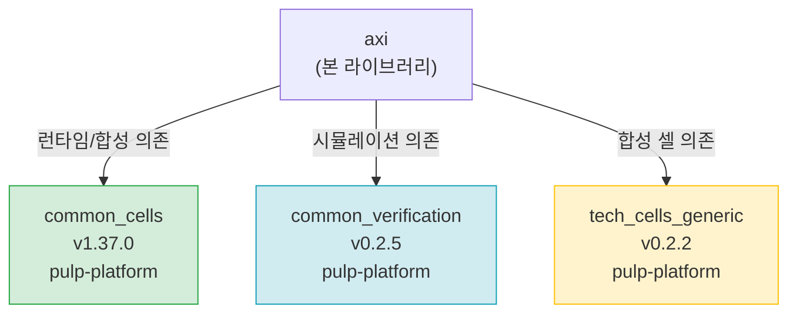

# ips_list.yml — 외부 IP 의존성 목록

## 파일 목적 및 개요

`ips_list.yml`은 AXI IP 라이브러리가 의존하는 **외부 IP(서브모듈/패키지) 목록**을 YAML 형식으로 정의합니다. 빌드 시스템(예: `bender`, `IPApproX` 등)이 이 파일을 읽어 필요한 외부 저장소를 특정 버전으로 가져오는 데 사용합니다.

---

## 항목 설명

| IP 이름 | 그룹 | 버전(커밋 태그) | 설명 |
|---|---|---|---|
| `common_cells` | `pulp-platform` | `v1.37.0` | 공통 셀 라이브러리 — FIFO, 카운터, 동기화 플립플롭 등 기본 하드웨어 프리미티브 제공 |
| `common_verification` | `pulp-platform` | `v0.2.5` | 공통 검증(시뮬레이션) 유틸리티 — 클럭 생성기, 랜덤 지연 모델 등 테스트벤치 지원 |
| `tech_cells_generic` | `pulp-platform` | `v0.2.2` | 공정 독립적(generic) 기술 셀 — 래치, 클럭 게이팅 셀 등의 합성 가능한 제네릭 모델 |

---

## 내부 로직 설명

각 항목은 다음 두 필드를 가집니다:

- `commit`: 의존 버전을 지정하는 Git 태그 또는 커밋 해시. 재현 가능한(reproducible) 빌드를 보장하기 위해 특정 버전을 고정합니다.
- `group`: IP가 속한 GitHub 조직(organization) 또는 그룹 이름. 저장소 URL 구성에 사용됩니다 (예: `https://github.com/pulp-platform/common_cells`).

---

## Mermaid 의존성 다이어그램



---

## 의존성 및 사용 방법

### 빌드 도구 지원

이 파일은 pulp-platform 생태계의 IP 관리 도구와 함께 사용됩니다:

| 도구 | 설명 |
|---|---|
| [bender](https://github.com/pulp-platform/bender) | Rust 기반 IP 의존성 관리 도구 (`Bender.yml`과 연동) |
| [IPApproX](https://github.com/pulp-platform/IPApproX) | Python 기반 IP 관리 도구 (`ips_list.yml` 직접 소비) |

### 사용 방법 (IPApproX 기준)

```bash
# 의존성 목록에 정의된 IP를 로컬로 체크아웃
update-ips ips_list.yml
```

### 외부 IP 저장소 URL 패턴

```
https://github.com/<group>/<ip_name>
```

예시:
- `https://github.com/pulp-platform/common_cells` (태그: `v1.37.0`)
- `https://github.com/pulp-platform/common_verification` (태그: `v0.2.5`)
- `https://github.com/pulp-platform/tech_cells_generic` (태그: `v0.2.2`)
