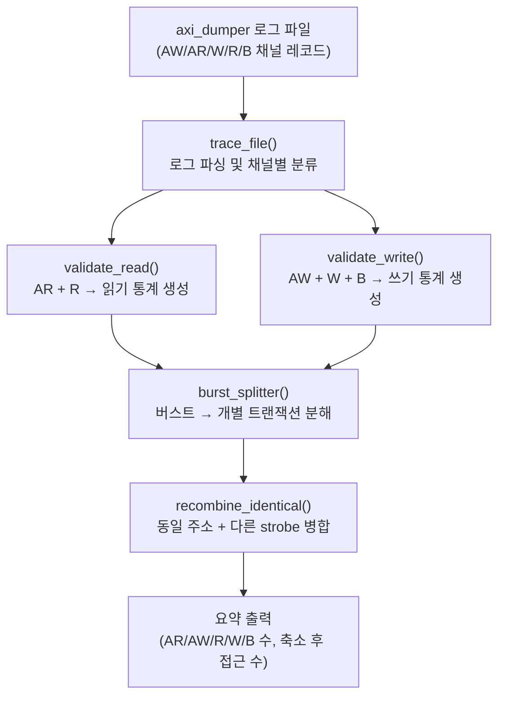

# axi_dumper_interpret.py

## 개요

`axi_dumper` 모듈이 출력한 로그 파일을 분석하는 Python 스크립트입니다. AXI 버스 트레이스를 파싱하여 읽기/쓰기 트랜잭션을 재구성하고, 누락된 비트 없이 올바르게 전달되었는지 검증합니다.

## 처리 흐름



## 주요 함수

| 함수 | 설명 |
|------|------|
| `trace_file(filename, num_bytes)` | 로그 파일 전체 파싱 및 처리 진입점 |
| `validate_read(ar_list, r_list)` | AR/R 쌍으로 읽기 트랜잭션 재구성 |
| `validate_write(aw_list, w_list, b_list)` | AW/W/B로 쓰기 트랜잭션 재구성 |
| `burst_splitter(stat_list)` | 버스트 트랜잭션을 단일 비트 단위로 분해 |
| `recombine_identical(stat_list, num_bytes)` | 동일 주소의 연속 트랜잭션을 strobe 기반으로 병합 |
| `expand_strb(strb, num_bytes)` | 바이트 단위 strobe를 비트 마스크로 확장 |

## 채널 타입 식별

| 타입 코드 | ASCII | 설명 |
|----------|-------|------|
| `0x4157` | `AW` | 쓰기 주소 채널 |
| `0x4152` | `AR` | 읽기 주소 채널 |
| `0x57`   | `W`  | 쓰기 데이터 채널 |
| `0x52`   | `R`  | 읽기 데이터 채널 |
| `0x42`   | `B`  | 쓰기 응답 채널 |

## 사용법

```bash
python3 axi_dumper_interpret.py <axi_trace_log> <num_bytes>
```

| 인자 | 설명 |
|------|------|
| `axi_trace_log` | `axi_dumper`가 출력한 로그 파일 경로 |
| `num_bytes` | 데이터 워드의 바이트 수 (기본 8) |

## 검증 대상

`axi_dumper.sv`가 생성한 시뮬레이션 트레이스 로그

## 의존성

- Python 표준 라이브러리: `ast`, `argparse`
