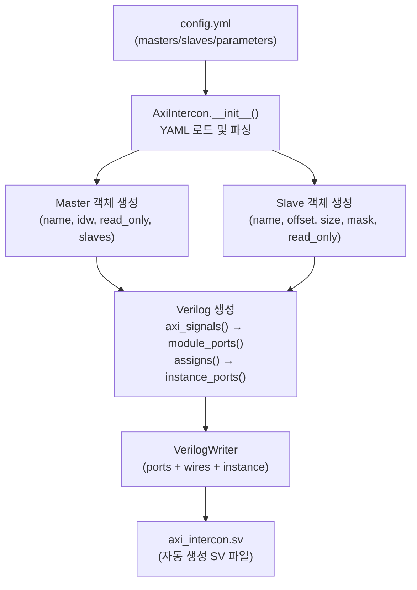
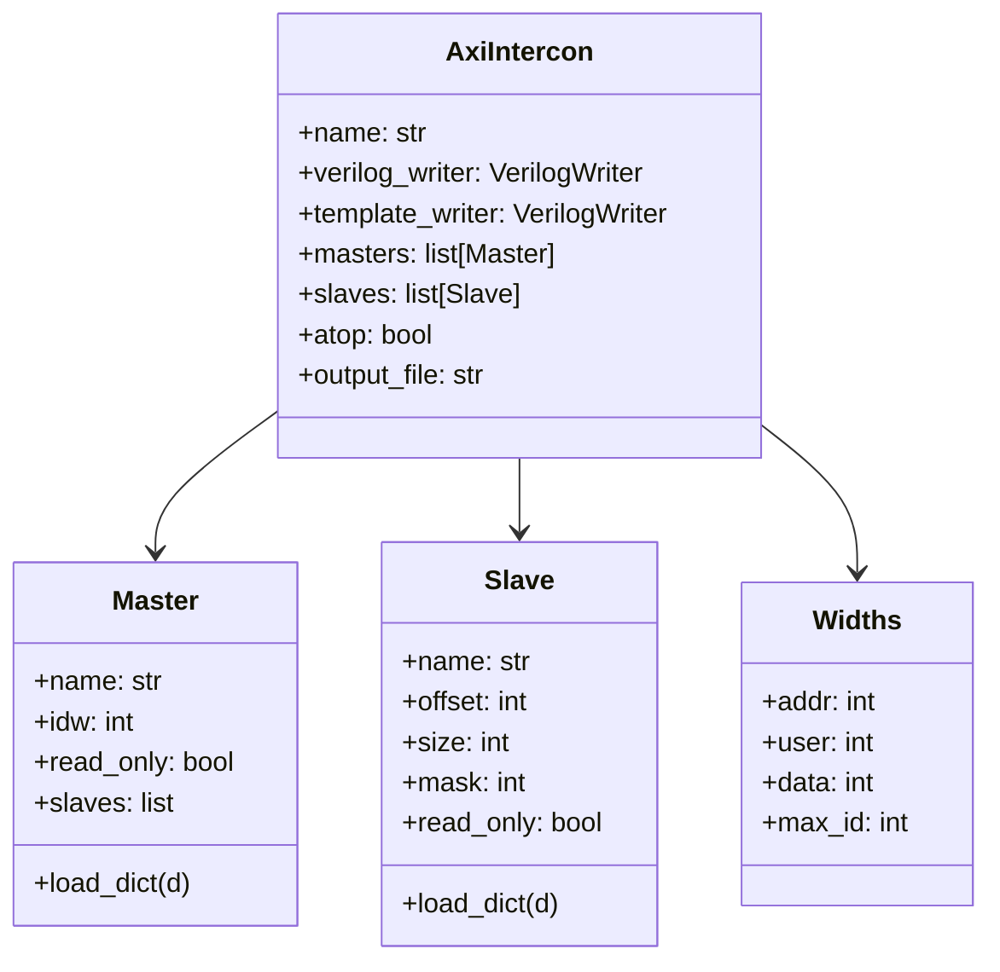

# axi_intercon_gen.py

## 개요

YAML 설정 파일을 입력받아 `axi_xbar` 기반의 AXI 인터커넥트 SystemVerilog 모듈을 자동 생성하는 Python 스크립트입니다. 마스터/슬레이브 포트 수, ID 폭, 주소 맵을 YAML로 정의하면 인스턴스화 코드를 출력합니다.

## 처리 흐름



## 클래스 구조



## 주요 함수

| 함수 | 설명 |
|------|------|
| `axi_signals(w, id_width)` | AXI 5채널(AW/AR/W/B/R) 신호 목록 생성 |
| `module_ports(w, intf, id_width, is_input)` | 모듈 포트 선언 생성 |
| `assigns(w, max_idw, masters, slaves)` | 마스터/슬레이브 assign 문 생성 |
| `instance_ports(w, id_width, masters, slaves)` | `axi_xbar` 인스턴스 포트 연결 생성 |
| `template_ports(w, intf, id_width, is_input)` | 템플릿용 포트 목록 생성 |
| `template_wires(w, intf, id_width)` | 템플릿용 내부 wire 목록 생성 |

## YAML 설정 예시

```yaml
vlnv: mycompany:mylib:axi_intercon:1.0
parameters:
  output_file: axi_intercon.sv
  atop: false
  masters:
    cpu0:
      id_width: 4
      slaves: [mem, uart]
    cpu1:
      id_width: 2
      read_only: true
  slaves:
    mem:
      offset: 0x00000000
      size:   0x10000000
    uart:
      offset: 0x40000000
      size:   0x00001000
```

## ID 폭 처리

- 마스터별로 `id_width` 설정 가능
- 내부적으로 최대 ID 폭(`max_idw`)으로 zero-extend
- 슬레이브 응답 시 원래 ID 폭으로 truncate

## 의존성

- `verilogwriter.py` (동일 디렉토리)
- Python 패키지: `yaml`, `collections`, `math`
