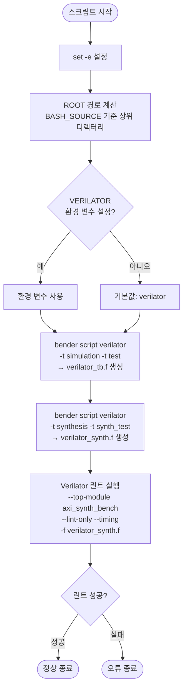

# compile_verilator.sh

## 파일 목적 및 개요

`compile_verilator.sh`는 AXI IP 프로젝트의 SystemVerilog 소스를 **Verilator**를 사용하여 컴파일하고 린트(lint) 검사를 수행하는 스크립트입니다. ETH Zurich / University of Bologna가 개발한 스크립트로 Solderpad Hardware License v0.51 하에 배포됩니다.

두 가지 타겟(시뮬레이션용 테스트벤치 파일 리스트, 합성 검증용 파일 리스트)을 생성한 뒤, 합성 타겟(`axi_synth_bench`)에 대해 Verilator 린트 검사를 실행합니다. 테스트벤치 인프라 없이 합성 경로만 빠르게 검증하는 것이 주된 목적입니다.

---

## 주요 파라미터 / 변수 설명

| 변수 / 옵션 | 기본값 | 설명 |
|---|---|---|
| `VERILATOR` | `verilator` | 사용할 Verilator 실행 파일 경로. 환경 변수로 재정의 가능. |
| `ROOT` | 스크립트 위치 기준 상위 디렉터리 | 프로젝트 루트 경로. `${BASH_SOURCE[0]}`를 기준으로 자동 계산. |
| `VERILATOR_FLAGS` | `-Wno-fatal` | Verilator에 전달되는 공통 플래그. 경고를 치명적 오류로 처리하지 않음. |
| `verilator_tb.f` | (생성 파일) | 시뮬레이션 + 테스트 타겟 파일 리스트. `-t simulation -t test` 조건으로 생성. |
| `verilator_synth.f` | (생성 파일) | 합성 + 합성 테스트 타겟 파일 리스트. `-t synthesis -t synth_test` 조건으로 생성. |
| `--top-module` | `axi_synth_bench` | Verilator 린트 검사의 최상위 모듈 이름. |
| `--lint-only` | (플래그) | 실제 바이너리를 생성하지 않고 린트 검사만 수행. |
| `--timing` | (플래그) | 타이밍 관련 구문을 처리하도록 설정. |

---

## 내부 로직 / 단계 설명

1. **오류 즉시 종료 설정** (`set -e`): 어떤 명령이 실패해도 스크립트를 즉시 중단.
2. **루트 경로 계산**: `BASH_SOURCE[0]`을 기준으로 프로젝트 루트(`ROOT`)를 절대 경로로 설정.
3. **Verilator 실행 파일 확인**: 환경 변수 `VERILATOR`가 설정되어 있지 않으면 `verilator`를 기본값으로 사용.
4. **파일 리스트 생성**:
   - `bender script verilator -t simulation -t test` → `verilator_tb.f` (시뮬레이션/테스트 파일 목록)
   - `bender script verilator -t synthesis -t synth_test` → `verilator_synth.f` (합성 파일 목록)
5. **Verilator 린트 실행**: `verilator_synth.f`를 입력으로 `axi_synth_bench` 최상위 모듈에 대해 `--lint-only --timing` 옵션으로 린트 검사 수행.

---

## Mermaid 블록 다이어그램 (흐름도)



---

## 사용 방법 및 예시

### 기본 실행

```bash
cd /home/user/axi
bash scripts/compile_verilator.sh
```

### 특정 Verilator 실행 파일 지정

```bash
VERILATOR=/opt/verilator/bin/verilator bash scripts/compile_verilator.sh
```

### CI/CD 환경에서의 사용

```bash
# bender와 verilator가 PATH에 있어야 합니다
export VERILATOR=verilator
bash scripts/compile_verilator.sh
```

### 사전 요구 사항

- **bender**: PULP Platform의 하드웨어 의존성 관리 도구 (`scripts/install_tools.sh`로 설치 가능)
- **verilator**: SystemVerilog 린트/시뮬레이션 도구 (`scripts/install_tools.sh`로 설치 가능)
- 프로젝트 루트에 `Bender.yml` 및 관련 소스 파일이 존재해야 함

### 생성 파일

| 파일명 | 내용 |
|---|---|
| `verilator_tb.f` | 시뮬레이션 및 테스트 타겟 파일 리스트 |
| `verilator_synth.f` | 합성 및 합성 테스트 타겟 파일 리스트 |
