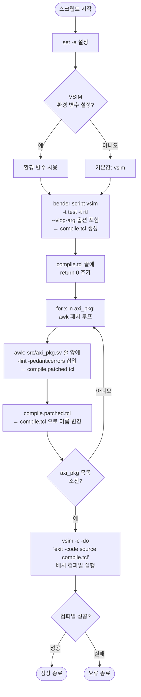

# compile_vsim.sh

## 파일 목적 및 개요

`compile_vsim.sh`는 AXI IP 프로젝트의 SystemVerilog 소스를 **ModelSim/QuestaSim (`vsim`)** 환경에 맞게 컴파일하는 스크립트입니다. ETH Zurich / University of Bologna가 개발하였으며 Solderpad Hardware License v0.51 하에 배포됩니다.

주요 동작:
1. `bender`를 사용하여 `compile.tcl` 컴파일 스크립트를 자동 생성합니다.
2. 특정 파일(`axi_pkg.sv`)에 대해 추가적인 린트 플래그(`-lint -pedanticerrors`)를 패치합니다.
3. 최종 `compile.tcl`을 `vsim`으로 실행하여 소스를 컴파일합니다.

---

## 주요 파라미터 / 변수 설명

| 변수 / 옵션 | 기본값 | 설명 |
|---|---|---|
| `VSIM` | `vsim` | 사용할 vsim 실행 파일 경로. 환경 변수로 재정의 가능. |
| `compile.tcl` | (생성 파일) | bender가 생성하는 기본 컴파일 Tcl 스크립트. |
| `compile.patched.tcl` | (임시 파일) | awk 패치 적용 중 생성되는 임시 파일. 패치 후 `compile.tcl`로 이름 변경. |
| `-svinputport=compat` | vlog 인자 | SystemVerilog input port 호환 모드. |
| `-override_timescale 1ns/1ps` | vlog 인자 | 타임스케일을 1ns/1ps로 통일. |
| `-suppress 2583` | vlog 인자 | 특정 경고 메시지(2583) 억제. |
| `-lint -pedanticerrors` | 패치 추가 인자 | `axi_pkg.sv` 컴파일 시 엄격한 린트 및 경고를 오류로 처리. |
| `return 0` | tcl 마지막 줄 | vsim에서 종료 코드를 올바르게 반환하기 위해 스크립트 끝에 추가. |

---

## 내부 로직 / 단계 설명

1. **오류 즉시 종료 설정** (`set -e`): 명령 실패 시 즉시 중단.
2. **vsim 실행 파일 확인**: 환경 변수 `VSIM`가 설정되어 있지 않으면 `vsim`을 기본값으로 사용.
3. **bender로 compile.tcl 생성**:
   - `bender script vsim -t test -t rtl` 실행
   - `--vlog-arg` 옵션으로 vlog 컴파일 플래그 전달
   - 결과를 `compile.tcl`로 저장
4. **return 0 추가**: `compile.tcl` 마지막에 `return 0` 삽입 (vsim 종료 코드 처리용).
5. **axi_pkg.sv 린트 패치 (awk)**:
   - `axi_pkg.sv`를 포함하는 vlog 호출 줄의 바로 앞 줄에 `-lint -pedanticerrors \\` 삽입
   - awk 슬라이딩 윈도우(N=6)를 사용하여 전후 컨텍스트 내에서 패턴 매칭
   - 패치된 파일을 원본 `compile.tcl`로 덮어씀
6. **vsim 실행**: `vsim -c -do 'exit -code [source compile.tcl]'`로 배치 모드에서 컴파일 실행.

---

## Mermaid 블록 다이어그램 (흐름도)



---

## 사용 방법 및 예시

### 기본 실행

```bash
cd /home/user/axi
bash scripts/compile_vsim.sh
```

### 특정 vsim 실행 파일 지정

```bash
VSIM=/opt/questasim/bin/vsim bash scripts/compile_vsim.sh
```

### 사전 요구 사항

- **bender**: PULP Platform의 하드웨어 의존성 관리 도구 (`scripts/install_tools.sh`로 설치 가능)
- **vsim (ModelSim / QuestaSim)**: Mentor Graphics/Siemens EDA의 HDL 시뮬레이터
- `VSIM` 환경 변수 또는 PATH에 `vsim`이 존재해야 함

### 생성 파일

| 파일명 | 내용 |
|---|---|
| `compile.tcl` | bender 생성 + awk 패치가 적용된 최종 컴파일 Tcl 스크립트 |

### 주의 사항

- awk 패치 방식은 스크립트 자체적으로 "다소 번거로운(ugly)" 방법임을 주석에서 언급합니다. 향후 bender에 타겟별 인자 추가 기능이 지원되면 개선될 수 있습니다.
- 스크립트 실행 디렉터리에 `compile.tcl` 파일이 생성되므로, 반드시 쓰기 권한이 있는 디렉터리에서 실행해야 합니다.
