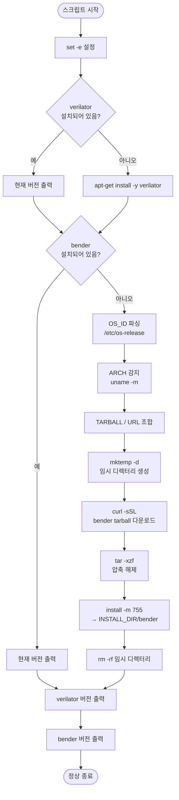

# install_tools.sh

## 파일 목적 및 개요

`install_tools.sh`는 AXI 프로젝트에서 사용하는 두 가지 핵심 도구인 **verilator**와 **bender**를 설치하는 스크립트입니다.

- **verilator**: SystemVerilog 린트/시뮬레이터 (apt를 통해 설치)
- **bender**: PULP Platform의 하드웨어 의존성 관리 도구 (GitHub Releases에서 바이너리를 직접 다운로드하여 설치)

각 도구에 대해 이미 설치되어 있는지 먼저 확인하고, 미설치 시에만 설치를 진행합니다.

---

## 주요 파라미터 / 변수 설명

| 변수 | 기본값 | 설명 |
|---|---|---|
| `BENDER_VERSION` | `0.31.0` | 설치할 bender 버전. 스크립트 내 하드코딩. |
| `INSTALL_DIR` | `/usr/local/bin` | bender 바이너리를 설치할 디렉터리. 환경 변수로 재정의 가능. |
| `OS_ID` | (자동 감지) | `/etc/os-release`에서 읽은 OS 식별자 (`${ID}-${VERSION_ID}` 형식, 예: `ubuntu-22.04`). |
| `ARCH` | (자동 감지) | `uname -m`으로 감지한 CPU 아키텍처 (예: `x86_64`, `aarch64`). |
| `TARBALL` | (자동 조합) | 다운로드할 bender 아카이브 파일명. `bender-{버전}-{아키텍처}-linux-gnu-{OS_ID}.tar.gz` 형식. |
| `URL` | (자동 조합) | bender GitHub Releases의 다운로드 URL. |
| `TMP` | (임시 디렉터리) | `mktemp -d`로 생성되는 임시 작업 디렉터리. 설치 완료 후 삭제. |

---

## 내부 로직 / 단계 설명

1. **오류 즉시 종료 설정** (`set -e`): 어떤 명령이 실패해도 스크립트를 즉시 중단.
2. **verilator 설치 여부 확인**:
   - `command -v verilator`로 이미 설치된 경우 버전 출력 후 건너뜀.
   - 미설치 시 `apt-get install -y verilator`로 설치.
3. **bender 설치 여부 확인**:
   - `command -v bender`로 이미 설치된 경우 버전 출력 후 건너뜀.
   - 미설치 시:
     a. `/etc/os-release`에서 `OS_ID` 파싱
     b. `uname -m`으로 `ARCH` 감지
     c. 해당 플랫폼에 맞는 `TARBALL` 파일명 및 `URL` 조합
     d. `mktemp -d`로 임시 디렉터리 생성
     e. `curl -sSL`로 tarball 다운로드
     f. `tar -xzf`로 압축 해제
     g. `install -m 755`로 `$INSTALL_DIR/bender`에 설치
     h. 임시 디렉터리 삭제 (`rm -rf`)
4. **설치 결과 출력**: verilator와 bender의 버전 정보를 각각 출력.

---

## Mermaid 블록 다이어그램 (흐름도)



---

## 사용 방법 및 예시

### 기본 실행 (루트 권한 필요)

```bash
sudo bash scripts/install_tools.sh
```

### 설치 디렉터리 변경

```bash
INSTALL_DIR=$HOME/.local/bin bash scripts/install_tools.sh
```

### 사전 요구 사항

- **apt-get**: Ubuntu/Debian 계열 Linux 환경 (verilator 설치 시 필요)
- **curl**: bender 다운로드에 사용
- `/usr/local/bin` (또는 `INSTALL_DIR`) 에 대한 쓰기 권한
- 인터넷 접속: bender 바이너리를 GitHub Releases에서 다운로드

### 설치 확인

```bash
verilator --version
bender --version
```

### 지원 플랫폼

bender는 GitHub Releases의 플랫폼별 바이너리를 사용합니다. 지원 형식: `bender-{버전}-{arch}-linux-gnu-{OS_ID}.tar.gz`

예시:
- `bender-0.31.0-x86_64-linux-gnu-ubuntu-22.04.tar.gz`
- `bender-0.31.0-aarch64-linux-gnu-ubuntu-20.04.tar.gz`
