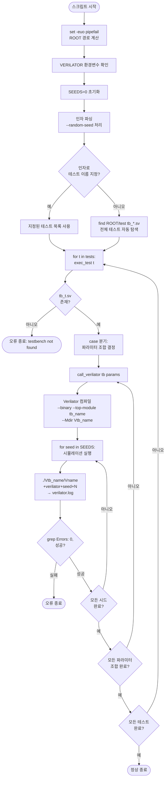

# run_verilator.sh

## 파일 목적 및 개요

`run_verilator.sh`는 AXI IP 프로젝트의 각 테스트벤치를 **Verilator**로 컴파일하고 실행하는 회귀 테스트 스크립트입니다. ETH Zurich / University of Bologna가 개발하였으며 Solderpad Hardware License v0.51 하에 배포됩니다.

`test/` 디렉터리에 있는 `tb_*.sv` 파일들을 자동으로 탐색하거나, 인자로 지정한 테스트만 선택적으로 실행할 수 있습니다. 각 테스트벤치는 다양한 파라미터 조합으로 컴파일·실행되며, 시드(seed) 값을 이용한 랜덤 회귀 테스트도 지원합니다.

---

## 주요 파라미터 / 변수 설명

### 환경 변수

| 변수 | 기본값 | 설명 |
|---|---|---|
| `VERILATOR` | `verilator` | 사용할 Verilator 실행 파일 경로. 환경 변수로 재정의 가능. |
| `ROOT` | 스크립트 위치 기준 상위 디렉터리 | 프로젝트 루트 경로. 자동 계산. |

### 스크립트 내부 변수

| 변수 | 기본값 | 설명 |
|---|---|---|
| `SEEDS` | `(0)` | 랜덤화 시드 배열. 기본값 0은 항상 포함(회귀 일관성 보장). `--random-seed` 플래그로 `random` 추가 가능. |

### Verilator 플래그 (`VERILATOR_FLAGS`)

| 플래그 | 설명 |
|---|---|
| `--binary` | 실행 가능한 바이너리 생성 |
| `--timing` | 타이밍 구문 처리 활성화 |
| `-Wno-fatal` | 경고를 치명적 오류로 처리하지 않음 |
| `-Wno-WIDTHTRUNC` | 비트폭 축소 경고 억제 |
| `-Wno-WIDTHEXPAND` | 비트폭 확장 경고 억제 |
| `-Wno-ASCRANGE` | 오름차순 범위 경고 억제 |
| `-Wno-PINMISSING` | 포트 누락 경고 억제 |
| `-Wno-IMPLICIT` | 암시적 선언 경고 억제 |

### 명령줄 플래그

| 플래그 | 설명 |
|---|---|
| `--random-seed` | SEEDS 배열에 `random` 추가. 실행 시마다 `$RANDOM`으로 무작위 시드 사용. |
| `[테스트명 ...]` | 실행할 DUT 이름 목록. 생략 시 `test/tb_*.sv` 전체를 자동 탐색. |

---

## 내부 로직 / 단계 설명

### 핵심 함수: `call_verilator <tb_name> [<-GParam=val> ...]`

1. 테스트벤치 이름과 파라미터 플래그를 인자로 받음.
2. 출력 디렉터리 이름을 `Vtb_{tb_name}`으로 설정.
3. Verilator로 테스트벤치 컴파일 (`--top-module tb_{tb_name}`, `--Mdir {outdir}`).
4. `SEEDS` 배열의 각 시드에 대해:
   - `random` 이면 `$RANDOM`으로 실제 시드값 결정.
   - 컴파일된 바이너리(`./{outdir}/V{tb_name}`)를 `+verilator+seed+{seed}` 옵션으로 실행.
   - 실행 로그를 `verilator.log`에 저장.
   - `grep "Errors: 0,"` 으로 오류 없음 확인 (실패 시 스크립트 종료).

### 핵심 함수: `exec_test <dut_name>`

- `test/tb_{dut_name}.sv` 파일 존재 여부 확인.
- DUT 이름에 따라 `case` 분기로 파라미터 조합을 설정하고 `call_verilator` 호출.

### 지원 테스트 및 파라미터 조합

| 테스트 | 파라미터 조합 |
|---|---|
| `axi_atop_filter` | `TB_AXI_MAX_WRITE_TXNS` = 1, 3, 12 |
| `axi_cdc`, `axi_delayer` | 파라미터 없음 |
| `axi_dw_downsizer` | Slv/Mst 데이터폭 다중 조합 + InitialBStallCycles/InitialRStallCycles 스트레스 케이스 |
| `axi_dw_upsizer` | Slv/Mst 데이터폭 다중 조합 (8~1024 비트) |
| `axi_fifo` | Depth (0,1,16) × FallThrough (0,1) |
| `axi_iw_converter` | SlvPortIdWidth, MstPortIdWidth, MaxUniqIds, Exclusive 다중 조합 |
| `axi_lite_regs` | PrivProtOnly, SecuProtOnly, RegNumBytes 다중 조합 + 추가 시드 (10, 42) |
| `axi_lite_to_apb` | PipelineRequest × PipelineResponse |
| `axi_lite_to_axi` | 데이터폭 (8~1024) |
| `axi_sim_mem` | AddrWidth (16,32,64) × DataWidth (32~1024) |
| `axi_xbar` | NumMasters, NumSlaves, EnAtop, EnExcl, UniqueIds 다중 조합 |
| `axi_to_mem_banked` | MemLatency, BankFactor, NumBanks, AXI_DATA_WIDTH 다중 조합 |
| `axi_lite_dw_converter` | SlvDataWidth × MstDataWidth |
| 기타 | 파라미터 없음 기본 실행 |

---

## Mermaid 블록 다이어그램 (흐름도)



---

## 사용 방법 및 예시

### 모든 테스트 실행

```bash
cd /home/user/axi
bash scripts/run_verilator.sh
```

### 특정 테스트만 실행

```bash
bash scripts/run_verilator.sh axi_fifo
bash scripts/run_verilator.sh axi_xbar axi_cdc
```

### 랜덤 시드 추가 실행

```bash
bash scripts/run_verilator.sh --random-seed axi_fifo
```

### 특정 Verilator 실행 파일 지정

```bash
VERILATOR=/opt/verilator/bin/verilator bash scripts/run_verilator.sh
```

### 사전 요구 사항

- `scripts/compile_verilator.sh` 실행 후 `build/verilator_tb.f` 파일이 존재해야 합니다.
- **verilator**: PATH에 존재하거나 `VERILATOR` 환경 변수로 지정.
- `test/tb_*.sv` 테스트벤치 파일이 존재해야 합니다.

### 생성 파일

| 파일/디렉터리 | 내용 |
|---|---|
| `Vtb_{tb_name}/` | Verilator가 생성하는 C++ 소스 및 컴파일된 바이너리 디렉터리 |
| `verilator.log` | 마지막으로 실행된 시뮬레이션 로그 |
