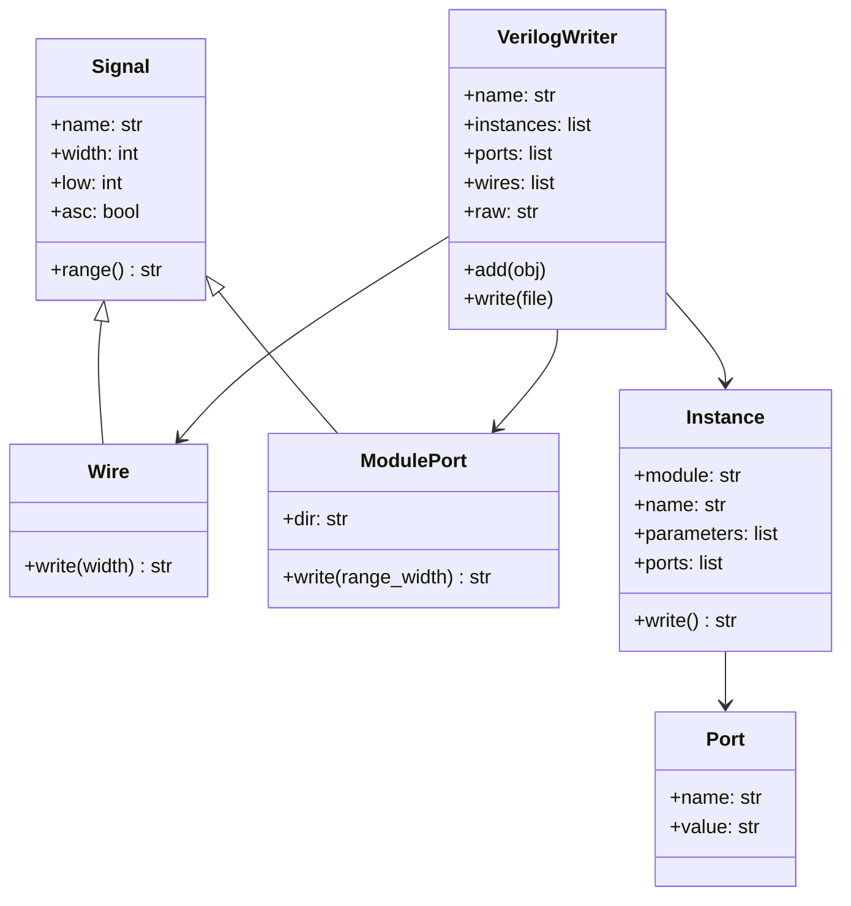

# verilogwriter.py

## 개요

SystemVerilog 모듈을 프로그래매틱하게 생성하기 위한 Python 유틸리티 라이브러리입니다. `axi_intercon_gen.py`에서 사용하며, 신호/와이어/포트/인스턴스를 객체로 표현하고 올바른 Verilog 문법으로 직렬화합니다.

## 클래스 구조



## 클래스 설명

| 클래스 | 역할 |
|--------|------|
| `Signal` | 이름/폭/오프셋/방향을 가진 기본 신호. `range()` 반환 |
| `Wire` | `wire [W:0] name;` 형태의 선언 생성 |
| `ModulePort` | `input/output wire [W:0] name` 형태의 포트 선언 생성 |
| `Port` | 인스턴스 포트 연결 `.name(value)` |
| `Instance` | 모듈 인스턴스화 (`#(.PARAM(val)) name (.port(sig))`) |
| `VerilogWriter` | 전체 모듈 파일 조립 및 출력 |

## 출력 예시

```systemverilog
// THIS FILE IS AUTOGENERATED BY axi_intercon_gen
// ANY MANUAL CHANGES WILL BE LOST
module my_module (
  output wire [31:0] o_mst_awaddr,
  input  wire [31:0] i_slv_araddr
);
  wire [31:0] mst_awaddr;

  axi_xbar #(
    .NoPorts (4)
  ) i_xbar (
    .slv_ports_req_i (masters_req),
    .mst_ports_req_o (slaves_req)
  );
endmodule
```

## 사용 대상

- `scripts/axi_intercon_gen.py`

## 의존성

- Python 표준 라이브러리만 사용
