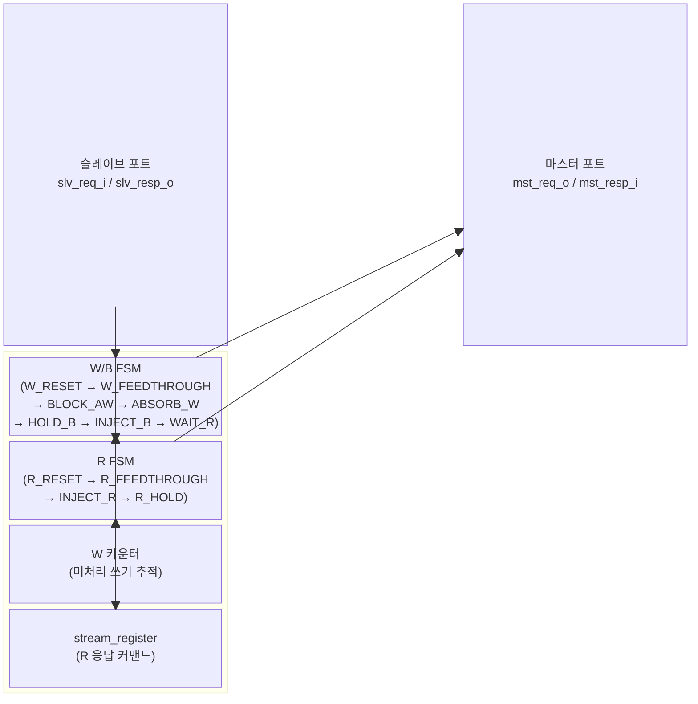

# `axi_atop_filter` — AXI 원자 연산(ATOP) 필터

## 모듈 개요 및 기능

`axi_atop_filter`는 AXI4 버스에서 **원자 연산(Atomic Operations, ATOPs)** 트랜잭션을 필터링하는 모듈입니다. `aw_atop` 필드가 0이 아닌 쓰기 트랜잭션을 슬레이브 포트에서 흡수하고, AXI 표준에 부합하는 오류 응답(B 채널 및 필요 시 R 채널)을 생성합니다.

### 주요 보장 사항

1. 마스터 포트의 `aw_atop`은 **항상 0** (ATOP 제거)
2. 슬레이브에서 ATOP 쓰기가 수신되면 **SLVERR** 응답으로 로컬 처리
3. ATOP을 지원하지 않는 슬레이브 앞에 배치하여 시스템 프로토콜 일관성 보장

---

## Mermaid 블록 다이어그램

---

## 파라미터 테이블

| 이름 | 타입 | 기본값 | 설명 |
|---|---|---|---|
| `AxiIdWidth` | `int unsigned` | `0` | AXI ID 폭 |
| `AxiMaxWriteTxns` | `int unsigned` | `0` | 최대 동시 쓰기 트랜잭션 수 |
| `axi_req_t` | `type` | `logic` | AXI 요청 구조체 타입 |
| `axi_resp_t` | `type` | `logic` | AXI 응답 구조체 타입 |

---

## 포트 테이블

| 포트 이름 | 방향 | 폭 | 설명 |
|---|---|---|---|
| `clk_i` | input | 1 | 클록 (상승 에지) |
| `rst_ni` | input | 1 | 비동기 리셋 (active-low) |
| `slv_req_i` | input | `axi_req_t` | 슬레이브 포트 요청 입력 |
| `slv_resp_o` | output | `axi_resp_t` | 슬레이브 포트 응답 출력 |
| `mst_req_o` | output | `axi_req_t` | 마스터 포트 요청 출력 |
| `mst_resp_i` | input | `axi_resp_t` | 마스터 포트 응답 입력 |

---

## 내부 아키텍처

### W/B 채널 FSM 상태

| 상태 | 설명 |
|---|---|
| `W_RESET` | 초기화 상태 → `W_FEEDTHROUGH`로 전이 |
| `W_FEEDTHROUGH` | 정상 AW/W/B 피드스루, ATOP 감지 |
| `BLOCK_AW` | 다운스트림 W 버스트 완료 대기 |
| `ABSORB_W` | ATOP에 속하는 W 비트 흡수 |
| `HOLD_B` | 이미 진행 중인 B 응답 완료 대기 |
| `INJECT_B` | SLVERR B 응답 주입 |
| `WAIT_R` | R 응답 주입 완료 대기 |

### R 채널 FSM 상태

| 상태 | 설명 |
|---|---|
| `R_RESET` | 초기화 → `R_FEEDTHROUGH` |
| `R_FEEDTHROUGH` | 정상 R 피드스루 |
| `INJECT_R` | SLVERR R 응답 주입 (ATOP_R_RESP 비트 있을 때) |
| `R_HOLD` | R 핸드셰이크 완료 대기 |

### W 카운터 (`w_cnt_q`)

다운스트림의 미처리 쓰기 AW-W 버스트 쌍을 추적합니다:
- AW 핸드셰이크 시 증가
- W.last 핸드셰이크 시 감소
- 언더플로우 비트(`underflow`)로 W가 AW보다 먼저 도착한 상황 처리

### R 응답 커맨드 레지스터

`stream_register`로 구현된 1-슬롯 큐로, R 응답이 필요한 ATOP의 `len` 값을 저장합니다.

---

## 인스턴스화하는 서브모듈

| 인스턴스 이름 | 모듈 | 역할 |
|---|---|---|
| `r_resp_cmd` | `stream_register` | R 응답 커맨드 1개 버퍼링 |

---

## 타이밍/레이턴시 특성

- **비-ATOP 트랜잭션**: 레이턴시 없음 (피드스루)
- **ATOP 트랜잭션**: 필터링되어 로컬 처리, B 응답은 W 버스트 완료 후 1~몇 사이클
- **최대 동시 쓰기**: `AxiMaxWriteTxns` (카운터 폭 결정)

---

## 특수 동작 및 AXI 표준 준수

- **AXI 사양 E2.1.4**: ATOP 버스트는 다른 버스트와 동시에 같은 ID를 가질 수 없으므로, 순서 규칙 없이 바로 B/R 응답 주입 가능
- **ATOP_R_RESP 비트**: `aw.atop[axi_pkg::ATOP_R_RESP]`가 설정된 ATOP은 B 응답 외에 R 채널 응답도 생성
- **atop 제로화**: 마스터로 전달되는 AW는 `aw.atop = 0`으로 강제 변환

---

## 인터페이스 래퍼 모듈

### `axi_atop_filter_intf`

AXI4 전용 인터페이스 래퍼. 추가 파라미터: `AXI_ID_WIDTH`, `AXI_ADDR_WIDTH`, `AXI_DATA_WIDTH`, `AXI_USER_WIDTH`, `AXI_MAX_WRITE_TXNS`.
