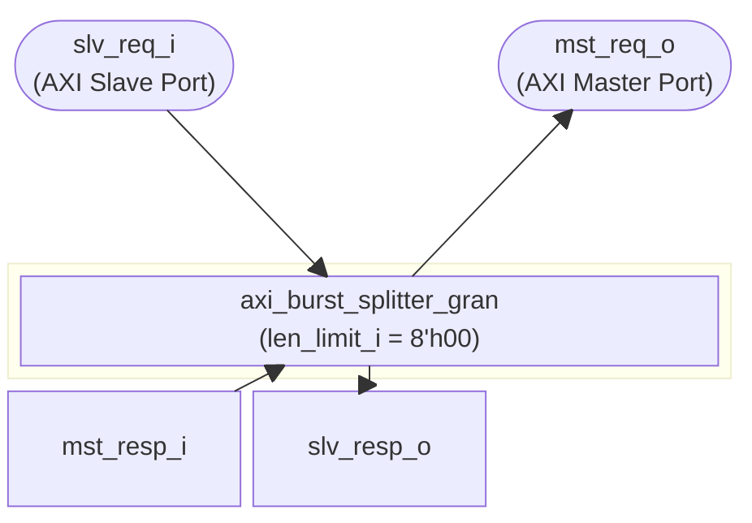
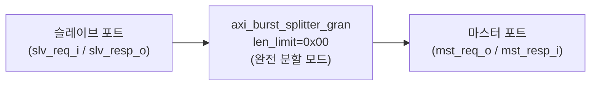

# axi_burst_splitter

## 모듈 개요 및 기능

`axi_burst_splitter`는 AXI4 버스트 트랜잭션을 단일 비트(single-beat) 트랜잭션으로 분할하는 모듈이다. 업스트림에서 멀티 비트 버스트가 들어오면 이를 단일 비트 트랜잭션으로 쪼개어 다운스트림으로 전달한다.

### 제한 사항
- `axi_pkg::BURST_WRAP` 타입의 버스트는 지원하지 않으며, 해당 트랜잭션에는 슬레이브 에러(SLVERR)로 응답한다.
- 원자 연산(ATOPs)을 지원하지 않으며 에러로 응답한다. ATOPs가 필요한 경우 `axi_atop_filter`를 앞단에 배치해야 한다.

이 모듈은 `axi_burst_splitter_gran`의 얇은 래퍼(wrapper)이며, `len_limit_i`를 `8'h00`으로 고정하여 완전 분할(every burst → single beat) 동작을 수행한다.

---

## Mermaid 블록 다이어그램

---

## 파라미터 테이블

| 파라미터 이름    | 타입               | 기본값     | 설명                                        |
|------------|------------------|---------|-------------------------------------------|
| MaxReadTxns  | int unsigned     | 32'd0   | 동시에 허용되는 최대 AXI 읽기 버스트 수                 |
| MaxWriteTxns | int unsigned     | 32'd0   | 동시에 허용되는 최대 AXI 쓰기 버스트 수                 |
| FullBW       | bit              | 0       | 내부 ID 큐 고대역폭 모드 활성화 (id_queue.sv 참고)      |
| AddrWidth    | int unsigned     | 32'd0   | AXI 주소 버스 폭 (비트)                          |
| DataWidth    | int unsigned     | 32'd0   | AXI 데이터 버스 폭 (비트)                         |
| IdWidth      | int unsigned     | 32'd0   | AXI ID 필드 폭 (비트)                          |
| UserWidth    | int unsigned     | 32'd0   | AXI 사용자 신호 폭 (비트)                         |
| axi_req_t    | type             | logic   | AXI 요청 구조체 타입                             |
| axi_resp_t   | type             | logic   | AXI 응답 구조체 타입                             |

---

## 포트 테이블

| 포트 이름      | 방향     | 폭            | 설명                     |
|------------|--------|--------------|------------------------|
| clk_i      | input  | 1            | 클럭 신호                  |
| rst_ni     | input  | 1            | 비동기 리셋 (Active Low)     |
| slv_req_i  | input  | axi_req_t    | 슬레이브 포트 AXI 요청 입력       |
| slv_resp_o | output | axi_resp_t   | 슬레이브 포트 AXI 응답 출력       |
| mst_req_o  | output | axi_req_t    | 마스터 포트 AXI 요청 출력        |
| mst_resp_i | input  | axi_resp_t   | 마스터 포트 AXI 응답 입력        |

---

## 내부 아키텍처 설명

이 모듈은 내부적으로 AXI 채널 타입 정의(`AXI_TYPEDEF_*` 매크로)를 수행한 후 `axi_burst_splitter_gran` 인스턴스를 생성하여 모든 로직을 위임한다.

- `len_limit_i = 8'h00`: 모든 버스트를 단일 비트(길이 1)으로 분할하도록 고정
- `CutPath = 1'b0`: 경로 레지스터 없음
- `DisableChecks = 1'b0`: 지원 확인 로직 활성화

실제 버스트 분할, 에러 응답, 카운터 관리 등의 복잡한 로직은 모두 `axi_burst_splitter_gran` 내부에 구현되어 있다.

---

## 인스턴스화하는 서브모듈 목록

| 인스턴스 이름                       | 모듈 이름                      | 설명                                        |
|-------------------------------|----------------------------|-------------------------------------------|
| i_axi_burst_splitter_gran     | axi_burst_splitter_gran    | 실제 버스트 분할 로직 (len_limit=0x00으로 완전 분할 동작) |
