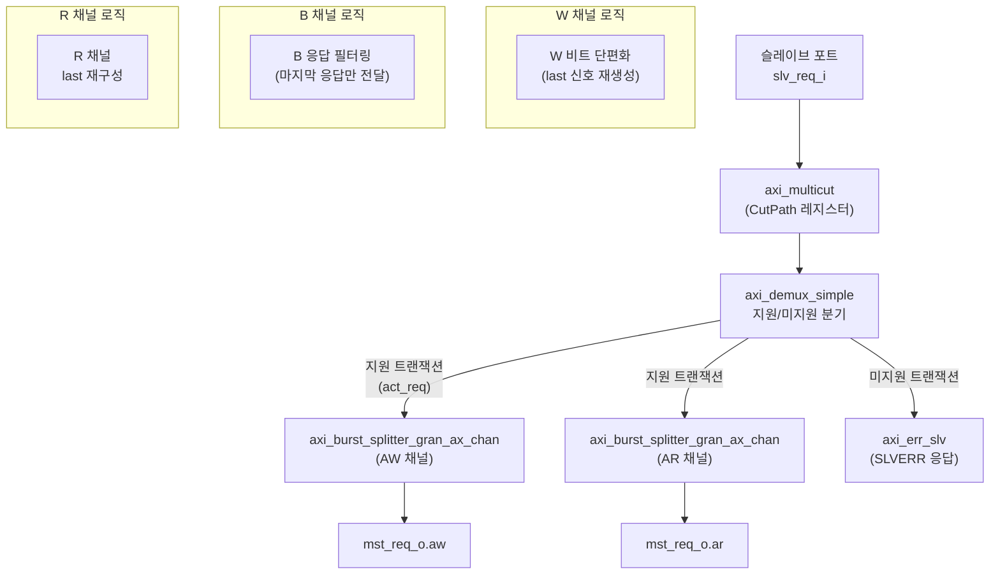
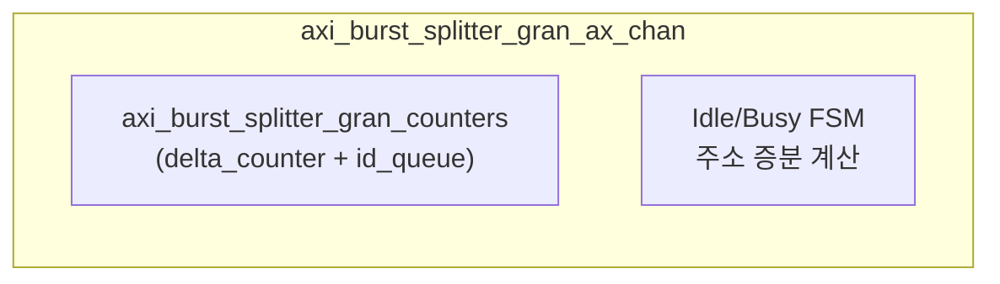

# axi_burst_splitter_gran

## 모듈 개요 및 기능

`axi_burst_splitter_gran`은 AXI4 버스트 트랜잭션을 `len_limit_i`로 지정된 길이 이하의 서브 버스트로 분할하는 핵심 모듈이다. `axi_burst_splitter`의 실제 구현체이며, 분할 단위(granularity)를 런타임에 설정 가능하다.

### 핵심 기능
- `len_limit_i = 0`이면 모든 버스트를 단일 비트(single-beat)로 분할
- 지원되지 않는 트랜잭션(`BURST_WRAP`, ATOPs, 비수정 가능 버스트 등)을 검출하여 `axi_err_slv`로 슬레이브 에러 응답
- `CutPath` 파라미터로 경로에 레지스터 슬라이스 삽입 가능
- `DisableChecks`로 지원 확인을 건너뛰고 모든 트랜잭션을 바이패스 처리 가능

이 파일에는 3개의 모듈이 정의되어 있다:
1. `axi_burst_splitter_gran` - 최상위 모듈
2. `axi_burst_splitter_gran_ax_chan` - AW/AR 채널 제어 내부 모듈
3. `axi_burst_splitter_gran_counters` - 트랜잭션 순서 관리 카운터 내부 모듈

---

## Mermaid 블록 다이어그램

---

## 파라미터 테이블 (axi_burst_splitter_gran)

| 파라미터 이름       | 타입           | 기본값    | 설명                                              |
|---------------|--------------|--------|------------------------------------------------|
| MaxReadTxns   | int unsigned | 32'd0  | 동시 허용 AXI 읽기 버스트 수                             |
| MaxWriteTxns  | int unsigned | 32'd0  | 동시 허용 AXI 쓰기 버스트 수                             |
| FullBW        | bit          | 1'b0   | ID 큐 고대역폭 모드                                   |
| CutPath       | bit          | 1'b0   | 입력 경로에 레지스터 슬라이스 삽입 (axi_multicut)             |
| DisableChecks | bit          | 1'b0   | 미지원 트랜잭션 검사 비활성화 (모두 바이패스 처리)                  |
| AddrWidth     | int unsigned | 32'd0  | AXI 주소 버스 폭                                    |
| DataWidth     | int unsigned | 32'd0  | AXI 데이터 버스 폭                                   |
| IdWidth       | int unsigned | 32'd0  | AXI ID 필드 폭                                    |
| UserWidth     | int unsigned | 32'd0  | AXI 사용자 신호 폭                                   |
| axi_req_t     | type         | logic  | AXI 요청 구조체 타입                                  |
| axi_resp_t    | type         | logic  | AXI 응답 구조체 타입                                  |
| axi_aw_chan_t | type         | logic  | AW 채널 구조체 타입                                   |
| axi_w_chan_t  | type         | logic  | W 채널 구조체 타입                                    |
| axi_b_chan_t  | type         | logic  | B 채널 구조체 타입                                    |
| axi_ar_chan_t | type         | logic  | AR 채널 구조체 타입                                   |
| axi_r_chan_t  | type         | logic  | R 채널 구조체 타입                                    |

---

## 포트 테이블

| 포트 이름        | 방향     | 폭                    | 설명                              |
|--------------|--------|----------------------|---------------------------------|
| clk_i        | input  | 1                    | 클럭                              |
| rst_ni       | input  | 1                    | 비동기 리셋 (Active Low)             |
| len_limit_i  | input  | axi_pkg::len_t (8)   | 출력 버스트 최대 길이 (0=단일 비트)          |
| slv_req_i    | input  | axi_req_t            | 슬레이브 포트 요청                      |
| slv_resp_o   | output | axi_resp_t           | 슬레이브 포트 응답                      |
| mst_req_o    | output | axi_req_t            | 마스터 포트 요청                       |
| mst_resp_i   | input  | axi_resp_t           | 마스터 포트 응답                       |

---

## 내부 아키텍처 설명

### 트랜잭션 지원 판별 (`txn_supported` 함수)
- `len <= len_limit_i`이면 분할 불필요 → 허용
- `BURST_WRAP` 타입 → 불허
- ATOPs (len > 0) → 불허
- 비수정 가능(non-modifiable) 캐시 속성이고 `BURST_INCR`이 아니거나 16비트 이하 → 불허

### AW/AR 채널 처리 (`axi_burst_splitter_gran_ax_chan`)
- **Idle 상태**: 새 트랜잭션 수신 시 분할 필요 여부 판단
  - 불필요: 그대로 패스스루
  - 필요: 첫 서브 버스트 발송 후 Busy 상태로 전환
- **Busy 상태**: 나머지 서브 버스트 순차 발송, `BURST_INCR`은 주소 자동 증분

### W 채널 처리
- `len_limit_i = 0`(레거시 모드): 모든 W 비트에 `last=1` 강제
- `len_limit_i > 0`: W 비트 카운터로 서브 버스트 경계에서 `last` 재생성

### B 채널 처리 (2-state FSM: BReady/BWait)
- 중간 서브 버스트의 B 응답은 삼킴(absorbed)
- 마지막 서브 버스트의 B 응답만 업스트림으로 전달
- 에러가 하나라도 발생하면 SLVERR로 표시

### R 채널 처리 (2-state FSM: RFeedthrough/RWait)
- `last` 신호를 카운터 기반으로 재구성하여 업스트림으로 전달

### 카운터 서브시스템 (`axi_burst_splitter_gran_counters`)
- `MaxTxns`개의 `delta_counter` 인스턴스로 잔여 비트 수 추적
- `id_queue`로 ID-카운터 인덱스 매핑 관리 (응답 재정렬 허용)
- LZC(Leading Zero Counter)로 빈 카운터 슬롯 빠르게 탐색

---

## 인스턴스화하는 서브모듈 목록

### axi_burst_splitter_gran

| 인스턴스 이름                                   | 모듈 이름                               | 설명                              |
|-------------------------------------------|------------------------------------|-----------------------------------|
| i_axi_multicut                            | axi_multicut                       | 입력 경로 레지스터 슬라이스 (CutPath)       |
| i_demux_supported_vs_unsupported          | axi_demux_simple                   | 지원/미지원 트랜잭션 분기                  |
| i_err_slv                                 | axi_err_slv                        | 미지원 트랜잭션 SLVERR 응답              |
| i_axi_burst_splitter_gran_aw_chan         | axi_burst_splitter_gran_ax_chan    | AW 채널 버스트 분할 제어                  |
| i_axi_burst_splitter_gran_ar_chan         | axi_burst_splitter_gran_ax_chan    | AR 채널 버스트 분할 제어                  |

### axi_burst_splitter_gran_ax_chan

| 인스턴스 이름                                   | 모듈 이름                               | 설명                                        |
|-------------------------------------------|------------------------------------|-------------------------------------------|
| i_axi_burst_splitter_gran_counters        | axi_burst_splitter_gran_counters   | ID 기반 잔여 비트 카운터                           |

### axi_burst_splitter_gran_counters

| 인스턴스 이름         | 모듈 이름          | 설명                          |
|-----------------|----------------|-------------------------------|
| gen_cnt[i].i_cnt | delta_counter  | 잔여 비트 수 카운터 (MaxTxns개)       |
| i_lzc           | lzc            | 빈 카운터 슬롯 탐색용 Leading Zero Counter |
| i_idq           | id_queue       | ID-카운터 인덱스 매핑 큐              |
