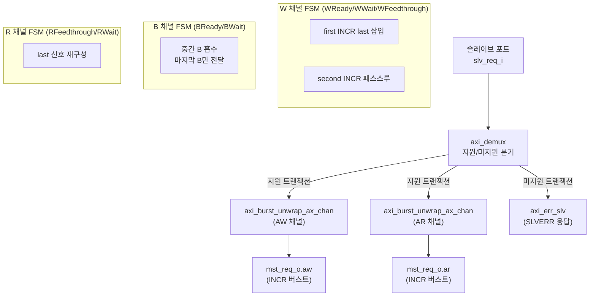
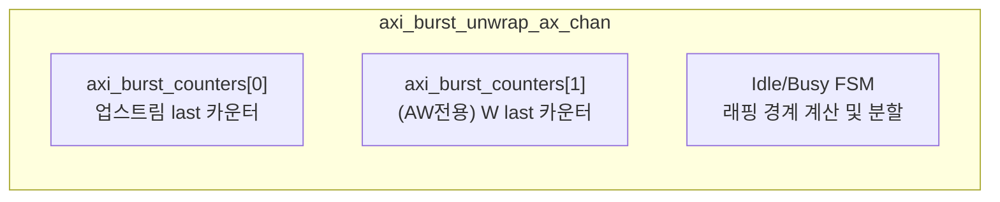

# axi_burst_unwrap

## 모듈 개요 및 기능

`axi_burst_unwrap`은 AXI4 래핑(wrapping) 버스트(`BURST_WRAP`)를 인크리멘탈(incremental) 버스트(`BURST_INCR`)로 변환하는 모듈이다. 다운스트림이 `BURST_WRAP`을 지원하지 않는 경우 이 모듈을 통해 변환할 수 있다.

### 핵심 기능
- 래핑 버스트를 최대 2개의 `BURST_INCR` 버스트로 분할하여 전달
- 래핑 버스트가 래핑 경계(wrap boundary)에서 시작하는 경우 단순히 `BURST_INCR`로 타입 변경
- 래핑 경계를 지나는 경우: 첫 번째 INCR 버스트(addr → 경계 끝) + 두 번째 INCR 버스트(경계 시작 → addr)
- ATOPs 미지원 (슬레이브 에러 응답)
- 비수정 가능(non-modifiable) 캐시 속성의 WRAP 버스트 미지원

이 파일에는 3개의 모듈이 정의되어 있다:
1. `axi_burst_unwrap` - 최상위 모듈
2. `axi_burst_unwrap_ax_chan` - AW/AR 채널 제어 내부 모듈
3. `axi_burst_counters` - 트랜잭션 카운터 내부 모듈

---

## Mermaid 블록 다이어그램





---

## 파라미터 테이블

| 파라미터 이름     | 타입           | 기본값   | 설명                          |
|-------------|--------------|-------|-----------------------------|
| MaxReadTxns | int unsigned | 32'd0 | 동시 허용 AXI 읽기 버스트 수          |
| MaxWriteTxns | int unsigned | 32'd0 | 동시 허용 AXI 쓰기 버스트 수          |
| AddrWidth   | int unsigned | 32'd0 | AXI 주소 버스 폭                 |
| DataWidth   | int unsigned | 32'd0 | AXI 데이터 버스 폭                |
| IdWidth     | int unsigned | 32'd0 | AXI ID 필드 폭                 |
| UserWidth   | int unsigned | 32'd0 | AXI 사용자 신호 폭                |
| axi_req_t   | type         | logic | AXI 요청 구조체 타입               |
| axi_resp_t  | type         | logic | AXI 응답 구조체 타입               |

---

## 포트 테이블

| 포트 이름      | 방향     | 폭          | 설명                    |
|------------|--------|------------|-----------------------|
| clk_i      | input  | 1          | 클럭                    |
| rst_ni     | input  | 1          | 비동기 리셋 (Active Low)   |
| slv_req_i  | input  | axi_req_t  | 슬레이브 포트 요청             |
| slv_resp_o | output | axi_resp_t | 슬레이브 포트 응답             |
| mst_req_o  | output | axi_req_t  | 마스터 포트 요청 (INCR 버스트만)  |
| mst_resp_i | input  | axi_resp_t | 마스터 포트 응답              |

---

## 내부 아키텍처 설명

### 래핑 경계 계산
```
container_size = (len + 1) << size
wrap_boundary  = addr & ~(container_size - 1)
```
- 래핑 버스트 스펙에 따라 container size는 2의 거듭제곱

### 분할 로직 (axi_burst_unwrap_ax_chan)
- **경계에서 시작**: WRAP → INCR으로 타입만 변경, 분할 없음
- **경계 중간에서 시작**: 두 INCR 버스트로 분할
  - 첫 번째: addr → (wrap_boundary + container_size), 길이 = `(container_size + wrap_boundary - addr) / size - 1`
  - 두 번째: wrap_boundary → addr, 길이 = `(addr - wrap_boundary) / size - 1`

### W 채널 FSM (3-state: WReady/WWait/WFeedthrough)
- **WReady**: W 비트 수신 대기, 첫 INCR 버스트의 `last` 삽입
- **WWait**: 다운스트림 준비 대기
- **WFeedthrough**: 두 번째 INCR 버스트 패스스루

### B/R 채널 처리
- B 채널: 중간 B 응답 흡수, 마지막만 업스트림 전달 (에러 누적)
- R 채널: 카운터 기반 `last` 재구성

### 카운터 서브시스템 (axi_burst_counters)
- `counter` 인스턴스로 잔여 비트 수 추적
- `id_queue`로 ID-카운터 인덱스 매핑

---

## 인스턴스화하는 서브모듈 목록

### axi_burst_unwrap

| 인스턴스 이름                               | 모듈 이름                        | 설명                        |
|---------------------------------------|------------------------------|---------------------------|
| i_demux_supported_vs_unsupported      | axi_demux                    | 지원/미지원 트랜잭션 분기             |
| i_err_slv                             | axi_err_slv                  | 미지원 트랜잭션 SLVERR 응답        |
| i_axi_burst_unwrap_aw_chan            | axi_burst_unwrap_ax_chan     | AW 채널 래핑 버스트 언랩           |
| i_axi_burst_unwrap_ar_chan            | axi_burst_unwrap_ax_chan     | AR 채널 래핑 버스트 언랩           |

### axi_burst_unwrap_ax_chan

| 인스턴스 이름                 | 모듈 이름               | 설명                          |
|-------------------------|---------------------|-------------------------------|
| i_axi_burst_counters0   | axi_burst_counters  | 업스트림 last 신호 카운터              |
| i_axi_burst_counters1   | axi_burst_counters  | AW 전용 W last 카운터 (FIFO 방식)  |

### axi_burst_counters

| 인스턴스 이름         | 모듈 이름      | 설명                          |
|-----------------|------------|-------------------------------|
| gen_cnt[i].i_cnt | counter    | 잔여 비트 수 카운터 (MaxTxns개)       |
| i_lzc           | lzc        | 빈 카운터 슬롯 탐색 Leading Zero Counter |
| i_idq           | id_queue   | ID-카운터 인덱스 매핑 큐              |
