# axi_bus_compare

## 모듈 개요 및 기능

`axi_bus_compare`는 두 개의 AXI4+ATOP 버스(채널 A, 채널 B)를 실시간으로 비교하는 합성 가능한(synthesizable) 검증 모듈이다. FPGA 기반 검증 환경에서 사용되며, 두 버스 간의 트랜잭션 데이터를 AXI ID별로 분류된 FIFO에 저장한 후 동일한 ID를 가진 비트가 양쪽에 모두 준비되었을 때 비교를 수행한다. AW, W, B, AR, R 채널 각각에 대해 불일치 여부를 독립적으로 출력한다.

---

## Mermaid 블록 다이어그램

```mermaid
block-beta
    columns 3

    slvA["AXI A\n(slv 입력)"]
    block:center:1
        fork_aw_a["stream_fork\nAW-A"]
        fork_w_a["stream_fork\nW-A"]
        fork_b_a["stream_fork\nB-A"]
        fork_ar_a["stream_fork\nAR-A"]
        fork_r_a["stream_fork\nR-A"]
        fifos_a["ID별 FIFO 뱅크\n(gen_fifos_a)\n채널: AW/B/AR/R per ID\nW: 공통"]
        fifos_b["ID별 FIFO 뱅크\n(gen_fifos_b)\n채널: AW/B/AR/R per ID\nW: 공통"]
        fork_aw_b["stream_fork\nAW-B"]
        fork_w_b["stream_fork\nW-B"]
        fork_b_b["stream_fork\nB-B"]
        fork_ar_b["stream_fork\nAR-B"]
        fork_r_b["stream_fork\nR-B"]
        cmp["비교 로직\n(gen_cmp)\n양쪽 FIFO 동시 valid 시 비교"]
    end
    slvB["AXI B\n(slv 입력)"]

    slvA --> fork_aw_a
    slvA --> fork_w_a
    slvA --> fork_b_a
    slvA --> fork_ar_a
    slvA --> fork_r_a
    fork_aw_a --> fifos_a
    fork_w_a --> fifos_a
    fork_b_a --> fifos_a
    fork_ar_a --> fifos_a
    fork_r_a --> fifos_a
    slvB --> fork_aw_b
    slvB --> fork_w_b
    slvB --> fork_b_b
    slvB --> fork_ar_b
    slvB --> fork_r_b
    fork_aw_b --> fifos_b
    fork_w_b --> fifos_b
    fork_b_b --> fifos_b
    fork_ar_b --> fifos_b
    fork_r_b --> fifos_b
    fifos_a --> cmp
    fifos_b --> cmp
```

> 클록 도메인: 단일 클록 `clk_i`. 비동기 리셋 `rst_ni`.

---

## 파라미터 테이블

| 이름 | 타입 | 기본값 | 설명 |
|------|------|--------|------|
| `AxiIdWidth` | `int unsigned` | `0` | AXI ID 비트 폭. FIFO 인스턴스 수 = 2^AxiIdWidth |
| `FifoDepth` | `int unsigned` | `0` | 각 채널 FIFO의 깊이 |
| `UseSize` | `bit` | `0` | 유효 바이트 비교 시 size 필드 고려 여부 |
| `DataWidth` | `int unsigned` | `8` | AXI 데이터 폭 (비트). W/R 채널 부분 비교에 사용 |
| `axi_aw_chan_t` | `type` | `logic` | AW 채널 구조체 타입 |
| `axi_w_chan_t` | `type` | `logic` | W 채널 구조체 타입 |
| `axi_b_chan_t` | `type` | `logic` | B 채널 구조체 타입 |
| `axi_ar_chan_t` | `type` | `logic` | AR 채널 구조체 타입 |
| `axi_r_chan_t` | `type` | `logic` | R 채널 구조체 타입 |
| `axi_req_t` | `type` | `logic` | AXI 요청 구조체 타입 |
| `axi_rsp_t` | `type` | `logic` | AXI 응답 구조체 타입 |
| `id_t` | `type` | `logic [2**AxiIdWidth-1:0]` | ID 비트맵 타입 (DO NOT OVERRIDE) |

---

## 포트 테이블

| 이름 | 방향 | 폭 | 설명 |
|------|------|-----|------|
| `clk_i` | input | 1 | 클록 |
| `rst_ni` | input | 1 | 비동기 리셋 (active low) |
| `testmode_i` | input | 1 | 테스트 모드 (FIFO에 전달) |
| `axi_a_req_i` | input | `axi_req_t` | 채널 A AXI 요청 입력 |
| `axi_a_rsp_o` | output | `axi_rsp_t` | 채널 A AXI 응답 출력 |
| `axi_a_req_o` | output | `axi_req_t` | 채널 A AXI 요청 패스스루 출력 |
| `axi_a_rsp_i` | input | `axi_rsp_t` | 채널 A AXI 응답 입력 (다운스트림) |
| `axi_b_req_i` | input | `axi_req_t` | 채널 B AXI 요청 입력 |
| `axi_b_rsp_o` | output | `axi_rsp_t` | 채널 B AXI 응답 출력 |
| `axi_b_req_o` | output | `axi_req_t` | 채널 B AXI 요청 패스스루 출력 |
| `axi_b_rsp_i` | input | `axi_rsp_t` | 채널 B AXI 응답 입력 (다운스트림) |
| `aw_mismatch_o` | output | `id_t` | ID별 AW 채널 불일치 비트 |
| `w_mismatch_o` | output | 1 | W 채널 불일치 |
| `b_mismatch_o` | output | `id_t` | ID별 B 채널 불일치 비트 |
| `ar_mismatch_o` | output | `id_t` | ID별 AR 채널 불일치 비트 |
| `r_mismatch_o` | output | `id_t` | ID별 R 채널 불일치 비트 |
| `mismatch_o` | output | 1 | 전체 불일치 OR 합산 |
| `busy_o` | output | 1 | FIFO에 데이터가 남아있을 때 high |

---

## 내부 아키텍처 설명

### 스트림 포크 (stream_fork)

각 채널(AW, W, B, AR, R)에 대해 `stream_fork` 인스턴스가 A/B 양쪽에 각각 존재한다. 각 포크는 입력 스트림을 두 갈래로 분기한다:
- 하나는 패스스루 출력 (`axi_x_req_o`)
- 나머지 하나는 비교용 FIFO 입력

### ID 기반 FIFO 뱅크

`genvar id` 루프로 `2**AxiIdWidth` 개의 FIFO 인스턴스가 생성된다. 각 FIFO는 특정 AXI ID에 해당하는 비트만 수신한다 (`gen_handshaking_a/b` always_comb 블록에서 ID 인덱싱). W 채널은 ID가 없으므로 채널당 FIFO 하나만 존재한다.

- FIFO ready 조건: 양쪽(A와 B) FIFO가 모두 valid일 때 동시에 pop하여 비교 진행

### UseSize 모드

`UseSize = 1` 시, AW/AR beat에서 `addr`의 하위 비트와 `size` 필드를 별도 FIFO에 저장한다. 비교 시 W/R 데이터의 유효한 바이트 범위만 검사한다:
- W: `w_offset + w_increment` 기준으로 `2**w_size` 바이트 범위
- R: 동일 방식으로 응답 데이터 바이트 범위 계산

`r_increment`/`w_increment` 레지스터는 버스트 내에서 beat마다 자동 증가한다.

### 비교 로직

두 FIFO 출력이 모두 valid인 경우에만 비교를 수행한다:
- AW: 구조체 전체 동등 비교
- W: data, strb (UseSize 시 범위 내 바이트만), last, user
- B: 구조체 전체 동등 비교
- AR: 구조체 전체 동등 비교
- R: id, data (UseSize 시 범위 내 바이트만), resp, last, user

---

## 인스턴스화하는 서브모듈 목록

| 모듈 | 인스턴스 수 | 설명 |
|------|------------|------|
| `stream_fork` | 10개 (A/B 각 5채널) | 스트림 2-way 분기 |
| `stream_fifo` | 8\*2^AxiIdWidth + 2 + (UseSize 시 추가) | 채널별 ID별 FIFO |

---

## 타이밍/레이턴시 특성

- FIFO는 `FALL_THROUGH = 0`이므로 최소 1 사이클 레이턴시 발생
- 비교는 양쪽 FIFO에 데이터가 도달한 이후 즉시(조합 논리) 수행
- 패스스루 경로(`axi_x_req_o`, `axi_x_rsp_o`)의 레이턴시는 `stream_fork` 고유의 레이턴시 (0 사이클, 순수 조합 논리)

---

## 특수 동작

- **합성 가능**: 시뮬레이션 전용인 `axi_chan_compare`와 달리, 이 모듈은 FPGA 합성을 지원한다.
- **busy 신호**: FIFO에 데이터가 남아 있으면 `busy_o`가 high가 되어 비교가 진행 중임을 나타낸다.
- **UseSize 비활성화 시**: 데이터 전체 폭을 비교하며 바이트 범위 필터링을 수행하지 않는다.
- **AXI ID 인덱싱**: `always_comb` 블록에서 현재 beat의 ID 값으로 해당 FIFO를 선택하여 이전 ID의 트랜잭션과 혼용되지 않도록 보장한다.
- **리셋**: 비동기 액티브 로우 리셋 (`rst_ni`)으로 모든 FIFO 및 레지스터 초기화.
