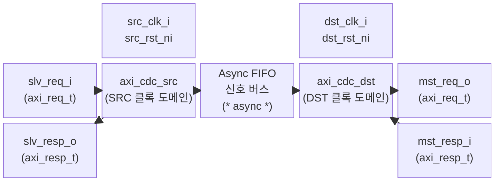

# axi_cdc.sv

## 모듈 개요 및 기능

`axi_cdc`는 AXI 인터페이스에 대한 클록 도메인 크로싱(Clock Domain Crossing, CDC)을 수행하는 최상위 래퍼 모듈입니다. AXI4의 5개 채널(AW, W, B, AR, R) 각각에 대해 그레이 코드 포인터 기반의 CDC FIFO를 인스턴스화하여 두 클록 도메인 간에 AXI 트랜잭션을 안전하게 전달합니다.

이 파일에는 세 가지 모듈이 정의되어 있습니다.
- `axi_cdc`: 파라미터화된 구조체 타입 기반 핵심 모듈
- `axi_cdc_intf`: `AXI_BUS` 인터페이스 기반 래퍼 (AXI4 Full)
- `axi_lite_cdc_intf`: `AXI_LITE` 인터페이스 기반 래퍼 (AXI4-Lite)

> **중요**: 각 AXI 채널에 대해 CDC FIFO를 통과하는 세 가지 경로(데이터 배열, 쓰기 포인터, 읽기 포인터)를 반드시 타이밍 제약(false path 또는 max delay)으로 올바르게 설정해야 합니다.

---

## Mermaid 블록 다이어그램

### 비동기 신호 버스 상세 (채널별 × 5)

| 채널 | 방향 | 신호 |
|------|------|------|
| AW | SRC → DST | `async_data_aw_data`, `async_data_aw_wptr` |
| AW | DST → SRC | `async_data_aw_rptr` |
| W | SRC → DST | `async_data_w_data`, `async_data_w_wptr` |
| W | DST → SRC | `async_data_w_rptr` |
| B | DST → SRC | `async_data_b_data`, `async_data_b_wptr` |
| B | SRC → DST | `async_data_b_rptr` |
| AR | SRC → DST | `async_data_ar_data`, `async_data_ar_wptr` |
| AR | DST → SRC | `async_data_ar_rptr` |
| R | DST → SRC | `async_data_r_data`, `async_data_r_wptr` |
| R | SRC → DST | `async_data_r_rptr` |

---

## 파라미터 테이블

| 이름 | 타입 | 기본값 | 설명 |
|------|------|--------|------|
| `aw_chan_t` | type | `logic` | AW 채널 구조체 타입 |
| `w_chan_t` | type | `logic` | W 채널 구조체 타입 |
| `b_chan_t` | type | `logic` | B 채널 구조체 타입 |
| `ar_chan_t` | type | `logic` | AR 채널 구조체 타입 |
| `r_chan_t` | type | `logic` | R 채널 구조체 타입 |
| `axi_req_t` | type | `logic` | AXI 요청 묶음 타입 |
| `axi_resp_t` | type | `logic` | AXI 응답 묶음 타입 |
| `LogDepth` | `int unsigned` | `1` | CDC FIFO 깊이 (실제 깊이 = 2^LogDepth) |
| `SyncStages` | `int unsigned` | `2` | 비동기 포인터용 동기화 레지스터 단수 |

### axi_cdc_intf 추가 파라미터

| 이름 | 타입 | 기본값 | 설명 |
|------|------|--------|------|
| `AXI_ID_WIDTH` | `int unsigned` | `0` | AXI ID 폭 |
| `AXI_ADDR_WIDTH` | `int unsigned` | `0` | AXI 주소 폭 |
| `AXI_DATA_WIDTH` | `int unsigned` | `0` | AXI 데이터 폭 |
| `AXI_USER_WIDTH` | `int unsigned` | `0` | AXI 사용자 신호 폭 |
| `LOG_DEPTH` | `int unsigned` | `1` | FIFO 깊이 로그값 |
| `SYNC_STAGES` | `int unsigned` | `2` | 동기화 단수 |

---

## 포트 테이블

### axi_cdc (구조체 기반)

| 이름 | 방향 | 폭 | 설명 |
|------|------|-----|------|
| `src_clk_i` | input | 1 | 소스 클록 도메인 클록 |
| `src_rst_ni` | input | 1 | 소스 도메인 비동기 리셋 (active low) |
| `src_req_i` | input | axi_req_t | 소스 도메인 AXI 요청 |
| `src_resp_o` | output | axi_resp_t | 소스 도메인 AXI 응답 |
| `dst_clk_i` | input | 1 | 목적지 클록 도메인 클록 |
| `dst_rst_ni` | input | 1 | 목적지 도메인 비동기 리셋 (active low) |
| `dst_req_o` | output | axi_req_t | 목적지 도메인 AXI 요청 |
| `dst_resp_i` | input | axi_resp_t | 목적지 도메인 AXI 응답 |

### axi_cdc_intf (인터페이스 기반)

| 이름 | 방향 | 설명 |
|------|------|------|
| `src_clk_i` | input | 소스 클록 |
| `src_rst_ni` | input | 소스 리셋 |
| `src` | AXI_BUS.Slave | 소스 도메인 AXI 슬레이브 포트 |
| `dst_clk_i` | input | 목적지 클록 |
| `dst_rst_ni` | input | 목적지 리셋 |
| `dst` | AXI_BUS.Master | 목적지 도메인 AXI 마스터 포트 |

---

## 내부 아키텍처 설명

### 비동기 내부 신호

`axi_cdc` 내부에는 5개 채널에 대한 비동기 공유 버스가 선언됩니다.

- **데이터 배열**: `async_data_XX_data [2**LogDepth-1:0]` — 채널 구조체 배열
- **쓰기 포인터**: `async_data_XX_wptr [LogDepth:0]` — 그레이 코드 포인터
- **읽기 포인터**: `async_data_XX_rptr [LogDepth:0]` — 그레이 코드 포인터

이 신호들은 `(* async *)` 속성으로 마킹되어 합성 도구가 CDC 경계임을 인식하도록 합니다.

### 채널별 흐름 방향

| 채널 | 데이터 흐름 | FIFO 소스 | FIFO 목적지 |
|------|------------|-----------|------------|
| AW | SRC → DST | axi_cdc_src | axi_cdc_dst |
| W | SRC → DST | axi_cdc_src | axi_cdc_dst |
| B | DST → SRC | axi_cdc_dst | axi_cdc_src |
| AR | SRC → DST | axi_cdc_src | axi_cdc_dst |
| R | DST → SRC | axi_cdc_dst | axi_cdc_src |

---

## 인스턴스화하는 서브모듈

| 인스턴스 이름 | 모듈 이름 | 설명 |
|---------------|-----------|------|
| `i_axi_cdc_src` | `axi_cdc_src` | 소스 클록 도메인 반쪽 (AW/W/AR 송신, B/R 수신) |
| `i_axi_cdc_dst` | `axi_cdc_dst` | 목적지 클록 도메인 반쪽 (AW/W/AR 수신, B/R 송신) |

---

## 타이밍/레이턴시 특성

- **FIFO 깊이**: 2^`LogDepth` (기본값 2 슬롯)
- **동기화 레이턴시**: `SyncStages` 클록 사이클 (기본값 2단 동기화)
- **최소 크로싱 레이턴시**: 약 `SyncStages` + 1 사이클 (포인터 전파 시간)
- **최대 처리량**: FIFO 깊이와 두 클록 도메인 속도의 최솟값에 의해 제한

---

## 특수 동작 및 CDC 안전성

- **그레이 코드 포인터**: `cdc_fifo_gray` 기반으로 메타스태빌리티를 방지합니다. 포인터는 한 번에 1비트만 변하는 그레이 코드 인코딩을 사용합니다.
- **타이밍 제약 필수**: 각 AXI 채널에 대해 다음 세 경로에 false path 또는 max delay 제약이 필요합니다.
  1. 데이터 배열 경로 (멀티사이클)
  2. 쓰기 포인터 경로 (CDC)
  3. 읽기 포인터 경로 (CDC)
- **AXI4-Lite 지원**: `axi_lite_cdc_intf`를 통해 AXI4-Lite 인터페이스도 지원합니다.
- **Questa 시뮬레이터 호환**: `axi_cdc_src`/`axi_cdc_dst` 내부에서 `QUESTA` 매크로를 이용한 타입 파라미터 우회 처리가 포함되어 있습니다.
