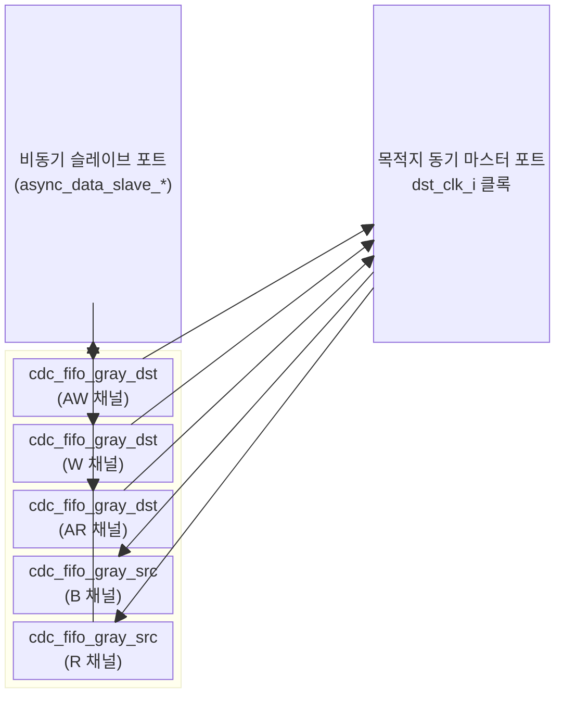

# `axi_cdc_dst` — AXI CDC 목적지(Destination) 클록 도메인 하프

## 모듈 개요 및 기능

`axi_cdc_dst`는 AXI CDC(Clock Domain Crossing) 브리지의 **목적지 클록 도메인 절반**입니다. `axi_cdc_src`와 쌍을 이루어 완전한 AXI CDC 크로싱을 형성합니다.

AXI 5개 채널 각각에 대해 그레이 코드 포인터 기반 CDC FIFO(`cdc_fifo_gray_dst` 또는 `cdc_fifo_gray_src`)를 인스턴스화합니다:
- **AW, W, AR 채널**: `cdc_fifo_gray_dst` — 소스 도메인에서 목적지 도메인으로 데이터 이동
- **B, R 채널**: `cdc_fifo_gray_src` — 목적지 도메인에서 소스 도메인으로 응답 이동

> **중요**: 각 AXI 채널에 대해 CDC FIFO를 통과하는 세 경로를 STA(Static Timing Analysis)에서 반드시 올바르게 제약해야 합니다. `cdc_fifo_gray` 헤더 참조.

---

## Mermaid 블록 다이어그램

### 클록 도메인

| 신호 그룹 | 클록 도메인 |
|---|---|
| `async_data_slave_*` 포트 | 비동기 (소스 도메인에서 구동) |
| `dst_clk_i`, `dst_rst_ni`, `dst_req_o`, `dst_resp_i` | 목적지(dst) 클록 도메인 |

---

## 파라미터 테이블

| 이름 | 타입 | 기본값 | 설명 |
|---|---|---|---|
| `LogDepth` | `int unsigned` | `1` | FIFO 깊이 = 2^LogDepth |
| `SyncStages` | `int unsigned` | `2` | 비동기 포인터 동기화 레지스터 수 |
| `aw_chan_t` | `type` | `logic` | AW 채널 페이로드 타입 |
| `w_chan_t` | `type` | `logic` | W 채널 페이로드 타입 |
| `b_chan_t` | `type` | `logic` | B 채널 페이로드 타입 |
| `ar_chan_t` | `type` | `logic` | AR 채널 페이로드 타입 |
| `r_chan_t` | `type` | `logic` | R 채널 페이로드 타입 |
| `axi_req_t` | `type` | `logic` | AXI 요청 구조체 타입 |
| `axi_resp_t` | `type` | `logic` | AXI 응답 구조체 타입 |

---

## 포트 테이블

### 비동기 슬레이브 포트 (소스 도메인에서 구동)

| 포트 이름 | 방향 | 폭 | 설명 |
|---|---|---|---|
| `async_data_slave_aw_data_i` | input | `[2**LogDepth-1:0]` | AW 채널 데이터 배열 |
| `async_data_slave_aw_wptr_i` | input | `[LogDepth:0]` | AW 채널 쓰기 포인터 |
| `async_data_slave_aw_rptr_o` | output | `[LogDepth:0]` | AW 채널 읽기 포인터 |
| `async_data_slave_w_data_i` | input | `[2**LogDepth-1:0]` | W 채널 데이터 배열 |
| `async_data_slave_w_wptr_i` | input | `[LogDepth:0]` | W 채널 쓰기 포인터 |
| `async_data_slave_w_rptr_o` | output | `[LogDepth:0]` | W 채널 읽기 포인터 |
| `async_data_slave_b_data_o` | output | `[2**LogDepth-1:0]` | B 채널 데이터 배열 |
| `async_data_slave_b_wptr_o` | output | `[LogDepth:0]` | B 채널 쓰기 포인터 |
| `async_data_slave_b_rptr_i` | input | `[LogDepth:0]` | B 채널 읽기 포인터 |
| `async_data_slave_ar_data_i` | input | `[2**LogDepth-1:0]` | AR 채널 데이터 배열 |
| `async_data_slave_ar_wptr_i` | input | `[LogDepth:0]` | AR 채널 쓰기 포인터 |
| `async_data_slave_ar_rptr_o` | output | `[LogDepth:0]` | AR 채널 읽기 포인터 |
| `async_data_slave_r_data_o` | output | `[2**LogDepth-1:0]` | R 채널 데이터 배열 |
| `async_data_slave_r_wptr_o` | output | `[LogDepth:0]` | R 채널 쓰기 포인터 |
| `async_data_slave_r_rptr_i` | input | `[LogDepth:0]` | R 채널 읽기 포인터 |

### 동기 마스터 포트 (dst_clk_i 도메인)

| 포트 이름 | 방향 | 폭 | 설명 |
|---|---|---|---|
| `dst_clk_i` | input | 1 | 목적지 도메인 클록 |
| `dst_rst_ni` | input | 1 | 비동기 리셋 (active-low) |
| `dst_req_o` | output | `axi_req_t` | AXI 요청 출력 |
| `dst_resp_i` | input | `axi_resp_t` | AXI 응답 입력 |

---

## 내부 아키텍처

### 채널별 CDC FIFO 방향

| AXI 채널 | FIFO 타입 | 전송 방향 |
|---|---|---|
| AW | `cdc_fifo_gray_dst` | src → dst |
| W | `cdc_fifo_gray_dst` | src → dst |
| AR | `cdc_fifo_gray_dst` | src → dst |
| B | `cdc_fifo_gray_src` | dst → src |
| R | `cdc_fifo_gray_src` | dst → src |

B와 R 채널은 응답이므로 `cdc_fifo_gray_src`를 사용하여 목적지 도메인에서 소스 도메인으로 반환합니다.

### Questa 컴파일러 우회 처리
`cdc_fifo_gray_*`의 `T` 타입 파라미터에 대해 Questa 툴 버그 우회를 위해 `logic [$bits(chan_t)-1:0]` 형태로 플랫 벡터를 전달하는 조건부 컴파일(`ifdef QUESTA`)을 포함합니다.

---

## 인스턴스화하는 서브모듈

| 인스턴스 이름 | 모듈 | 역할 |
|---|---|---|
| `i_cdc_fifo_gray_dst_aw` | `cdc_fifo_gray_dst` | AW 채널 CDC |
| `i_cdc_fifo_gray_dst_w` | `cdc_fifo_gray_dst` | W 채널 CDC |
| `i_cdc_fifo_gray_src_b` | `cdc_fifo_gray_src` | B 채널 CDC |
| `i_cdc_fifo_gray_dst_ar` | `cdc_fifo_gray_dst` | AR 채널 CDC |
| `i_cdc_fifo_gray_src_r` | `cdc_fifo_gray_src` | R 채널 CDC |

---

## 타이밍/레이턴시 특성

- FIFO 깊이: `2^LogDepth` 엔트리 (기본값 2)
- 크로싱 레이턴시: `SyncStages` 사이클 (기본값 2) + FIFO 전파 지연
- 처리량: 최대 `2^LogDepth - 1` 미처리 트랜잭션 버퍼링 가능

---

## 특수 동작 및 CDC 안전성

- 그레이 코드 포인터 기반으로 메타스태빌리티 없이 도메인 교차
- 완전한 핸드셰이크(valid/ready)와 비동기 포인터를 통해 흐름 제어
- `SyncStages` 파라미터로 클록 도메인 간 동기화 단계 조정 가능 (느린 클록 비율일수록 더 많은 단계 필요)
- 래치 없음, 완전한 플립플롭 기반 구현

---

## 인터페이스 래퍼 모듈

| 모듈 이름 | 설명 |
|---|---|
| `axi_cdc_dst_intf` | `AXI_BUS_ASYNC_GRAY.Slave` + `AXI_BUS.Master` 인터페이스 래퍼 |
| `axi_lite_cdc_dst_intf` | `AXI_LITE_ASYNC_GRAY.Slave` + `AXI_LITE.Master` 인터페이스 래퍼 |
