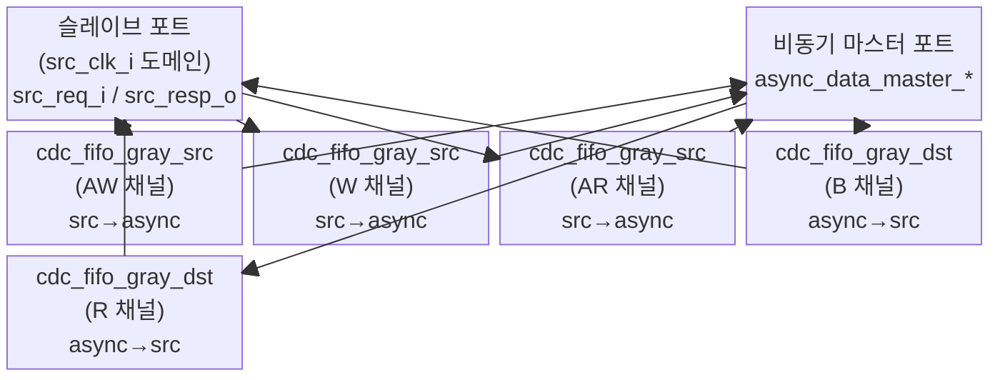

# axi_cdc_src.sv

## 모듈 개요 및 기능

`axi_cdc_src`는 AXI CDC 크로싱의 소스 클록 도메인 반쪽 모듈입니다. 소스 측에서 동기적으로 AXI 요청을 받아 비동기 CDC FIFO를 통해 목적지 도메인으로 전달하고, 반대로 목적지에서 돌아오는 응답 채널(B, R)을 소스 도메인에서 수신합니다.

이 파일에는 세 가지 모듈이 포함됩니다.
- `axi_cdc_src`: 구조체 타입 기반 핵심 모듈
- `axi_cdc_src_intf`: `AXI_BUS`/`AXI_BUS_ASYNC_GRAY` 인터페이스 래퍼
- `axi_lite_cdc_src_intf`: `AXI_BUS`/`AXI_LITE_ASYNC_GRAY` 인터페이스 래퍼

> **중요**: 각 AXI 채널에 대해 CDC FIFO를 통과하는 세 가지 경로를 반드시 타이밍 제약으로 올바르게 설정해야 합니다.

---

## Mermaid 블록 다이어그램

---

## 파라미터 테이블

| 이름 | 타입 | 기본값 | 설명 |
|------|------|--------|------|
| `LogDepth` | `int unsigned` | `1` | CDC FIFO 깊이 (실제 깊이 = 2^LogDepth) |
| `SyncStages` | `int unsigned` | `2` | 비동기 포인터 동기화 레지스터 단수 |
| `aw_chan_t` | type | `logic` | AW 채널 구조체 타입 |
| `w_chan_t` | type | `logic` | W 채널 구조체 타입 |
| `b_chan_t` | type | `logic` | B 채널 구조체 타입 |
| `ar_chan_t` | type | `logic` | AR 채널 구조체 타입 |
| `r_chan_t` | type | `logic` | R 채널 구조체 타입 |
| `axi_req_t` | type | `logic` | AXI 요청 묶음 타입 |
| `axi_resp_t` | type | `logic` | AXI 응답 묶음 타입 |

---

## 포트 테이블

### 동기 슬레이브 포트 (src_clk_i 도메인)

| 이름 | 방향 | 폭 | 설명 |
|------|------|-----|------|
| `src_clk_i` | input | 1 | 소스 클록 |
| `src_rst_ni` | input | 1 | 소스 비동기 리셋 (active low) |
| `src_req_i` | input | axi_req_t | AXI 요청 입력 |
| `src_resp_o` | output | axi_resp_t | AXI 응답 출력 |

### 비동기 마스터 포트 (클록 없음)

| 이름 | 방향 | 폭 | 설명 |
|------|------|-----|------|
| `async_data_master_aw_data_o` | output | aw_chan_t[2^LogDepth] | AW 채널 데이터 배열 |
| `async_data_master_aw_wptr_o` | output | LogDepth+1 | AW 채널 쓰기 포인터 (그레이 코드) |
| `async_data_master_aw_rptr_i` | input | LogDepth+1 | AW 채널 읽기 포인터 (그레이 코드) |
| `async_data_master_w_data_o` | output | w_chan_t[2^LogDepth] | W 채널 데이터 배열 |
| `async_data_master_w_wptr_o` | output | LogDepth+1 | W 채널 쓰기 포인터 |
| `async_data_master_w_rptr_i` | input | LogDepth+1 | W 채널 읽기 포인터 |
| `async_data_master_b_data_i` | input | b_chan_t[2^LogDepth] | B 채널 데이터 배열 (수신) |
| `async_data_master_b_wptr_i` | input | LogDepth+1 | B 채널 쓰기 포인터 (수신) |
| `async_data_master_b_rptr_o` | output | LogDepth+1 | B 채널 읽기 포인터 (송신) |
| `async_data_master_ar_data_o` | output | ar_chan_t[2^LogDepth] | AR 채널 데이터 배열 |
| `async_data_master_ar_wptr_o` | output | LogDepth+1 | AR 채널 쓰기 포인터 |
| `async_data_master_ar_rptr_i` | input | LogDepth+1 | AR 채널 읽기 포인터 |
| `async_data_master_r_data_i` | input | r_chan_t[2^LogDepth] | R 채널 데이터 배열 (수신) |
| `async_data_master_r_wptr_i` | input | LogDepth+1 | R 채널 쓰기 포인터 (수신) |
| `async_data_master_r_rptr_o` | output | LogDepth+1 | R 채널 읽기 포인터 (송신) |

---

## 내부 아키텍처 설명

### 채널별 FIFO 역할

`axi_cdc_src` 내부에서는 5개 채널 각각에 대해 CDC FIFO의 한쪽 반만 인스턴스화합니다.

| 채널 | FIFO 종류 | 역할 |
|------|-----------|------|
| AW | `cdc_fifo_gray_src` | 소스 도메인에서 AW 비트스트림 송신 |
| W | `cdc_fifo_gray_src` | 소스 도메인에서 W 비트스트림 송신 |
| B | `cdc_fifo_gray_dst` | 소스 도메인에서 B 응답 수신 (dst_clk_i = src_clk_i 연결) |
| AR | `cdc_fifo_gray_src` | 소스 도메인에서 AR 비트스트림 송신 |
| R | `cdc_fifo_gray_dst` | 소스 도메인에서 R 응답 수신 (dst_clk_i = src_clk_i 연결) |

### B/R 채널의 특수 처리

B 채널과 R 채널은 목적지 도메인에서 소스 도메인으로 역방향으로 흐릅니다. 따라서 `axi_cdc_src`에서는 이 두 채널에 대해 `cdc_fifo_gray_dst`를 인스턴스화하되, `dst_clk_i`/`dst_rst_ni` 포트에 `src_clk_i`/`src_rst_ni`를 연결합니다. 즉, 소스 도메인이 B/R FIFO의 "목적지(pop)" 측이 됩니다.

### Questa 시뮬레이터 우회

`ifdef QUESTA` 조건부로 타입 파라미터를 `logic [$bits(chan_t)-1:0]` 평탄화 벡터로 전달합니다. 이는 Questa의 파라미터 타입 처리 버그를 우회하기 위한 조치입니다.

---

## 인스턴스화하는 서브모듈

| 인스턴스 이름 | 모듈 이름 | 채널 | 방향 |
|---------------|-----------|------|------|
| `i_cdc_fifo_gray_src_aw` | `cdc_fifo_gray_src` | AW | src → async |
| `i_cdc_fifo_gray_src_w` | `cdc_fifo_gray_src` | W | src → async |
| `i_cdc_fifo_gray_dst_b` | `cdc_fifo_gray_dst` | B | async → src |
| `i_cdc_fifo_gray_src_ar` | `cdc_fifo_gray_src` | AR | src → async |
| `i_cdc_fifo_gray_dst_r` | `cdc_fifo_gray_dst` | R | async → src |

---

## 타이밍/레이턴시 특성

- **송신 레이턴시 (AW/W/AR)**: FIFO에 데이터를 쓴 후 목적지 도메인에서 보이기까지 `SyncStages` + 1 목적지 클록 사이클
- **수신 레이턴시 (B/R)**: 목적지 도메인에서 응답을 쓴 후 소스 도메인에서 보이기까지 `SyncStages` + 1 소스 클록 사이클
- **역압(back-pressure)**: FIFO가 가득 차면 `aw_ready`/`w_ready`/`ar_ready`가 0으로 되어 소스 측 마스터를 정지시킴

---

## 특수 동작 및 CDC 안전성

- 비동기 포트의 모든 신호는 `(* async *)` 속성으로 표시되어 합성 도구가 CDC 경계를 인식합니다.
- 그레이 코드 포인터를 사용하므로 포인터 전환 시 단 1비트만 변하여 메타스태빌리티 위험이 최소화됩니다.
- 데이터 배열은 포인터 동기화 완료 후에만 읽히므로 데이터 무결성이 보장됩니다.
