# axi_chan_compare

## 모듈 개요 및 기능

`axi_chan_compare`는 두 개의 AXI 버스(A, B)를 비교하는 **시뮬레이션 전용** 비합성(non-synthesizable) 검증 모듈이다. 독립적인 두 클록을 지원하며, 시스템 큐(SystemVerilog dynamic queues)를 사용하여 A 버스에서 발생한 요청을 저장하고, B 버스에서 동일한 순서의 요청이 도착하면 비교를 수행한다. 불일치 시 `$error`와 함께 상세 내용을 출력한다.

`AllowReordering` 파라미터를 통해 ID별 독립 큐를 지원하며, `IgnoreId`를 통해 ID가 리맵된 경우에도 검증이 가능하다.

---

## Mermaid 블록 다이어그램

```mermaid
block-beta
    columns 3

    A["AXI A\n(clk_a_i)"]
    block:core:1
        enqA["proc_enqueue_a\n@posedge clk_a_i\nAW, W → 큐에 push"]
        queues["큐 (동적 배열)\naw_queue[NumIds][$]\nw_queue[$]\nar_queue[NumIds][$]\nb_queue[NumIds][$]\nr_queue[NumIds][$]"]
        enqB["proc_enqueue_b\n@posedge clk_b_i\nB, R → 큐에 push"]
        deqB["proc_dequeue_and_check_b\n@posedge clk_b_i\nAW, W, AR → 큐에서 pop 후 비교"]
        deqA["proc_dequeue_and_check_a\n@posedge clk_a_i\nB, R → 큐에서 pop 후 비교"]
    end
    B["AXI B\n(clk_b_i)"]

    A --> enqA
    enqA --> queues
    B --> enqB
    enqB --> queues
    queues --> deqB
    B --> deqB
    queues --> deqA
    A --> deqA
```



> 클록 도메인: `clk_a_i` (A 버스), `clk_b_i` (B 버스). 두 클록은 독립적일 수 있다.

---

## 파라미터 테이블

| 이름 | 타입 | 기본값 | 설명 |
|------|------|--------|------|
| `IgnoreId` | `bit` | `0` | ID 필드를 비교에서 제외 (ID 리맵 후 검증 시 사용) |
| `AllowReordering` | `bit` | `0` | ID별 독립 큐 사용. ID가 다른 응답의 순서 변경 허용 |
| `IdWidth` | `int unsigned` | `1` | AXI ID 폭. `AllowReordering` 시 `NumIds = 2^IdWidth` |
| `aw_chan_t` | `type` | `logic` | AW 채널 구조체 타입 |
| `w_chan_t` | `type` | `logic` | W 채널 구조체 타입 |
| `b_chan_t` | `type` | `logic` | B 채널 구조체 타입 |
| `ar_chan_t` | `type` | `logic` | AR 채널 구조체 타입 |
| `r_chan_t` | `type` | `logic` | R 채널 구조체 타입 |
| `req_t` | `type` | `logic` | AXI 요청 구조체 타입 |
| `resp_t` | `type` | `logic` | AXI 응답 구조체 타입 |

---

## 포트 테이블

| 이름 | 방향 | 폭 | 설명 |
|------|------|-----|------|
| `clk_a_i` | input | 1 | A 버스 클록 |
| `clk_b_i` | input | 1 | B 버스 클록 |
| `axi_a_req` | input | `req_t` | A 버스 요청 신호 |
| `axi_a_res` | input | `resp_t` | A 버스 응답 신호 |
| `axi_b_req` | input | `req_t` | B 버스 요청 신호 |
| `axi_b_res` | input | `resp_t` | B 버스 응답 신호 |

---

## 내부 아키텍처 설명

### 큐 구조

```
aw_queue [NumIds-1:0][$]  // NumIds = AllowReordering ? 2^IdWidth : 1
w_queue              [$]  // W 채널은 ID 없음, 단일 큐
b_queue  [NumIds-1:0][$]
ar_queue [NumIds-1:0][$]
r_queue  [NumIds-1:0][$]
```

`AllowReordering = 0`이면 모든 트랜잭션은 `index 0` 큐에 순서대로 들어간다.

### 동작 흐름

1. **A 버스 요청 enqueue** (`proc_enqueue_a`, `@posedge clk_a_i`):  
   AW, W, AR 채널의 handshake 완료 시 해당 채널의 구조체를 큐에 push한다.

2. **B 버스 응답 enqueue** (`proc_enqueue_b`, `@posedge clk_b_i`):  
   B, R 채널 handshake 완료 시 해당 구조체를 큐에 push한다.

3. **B 버스 요청 dequeue 및 비교** (`proc_dequeue_and_check_b`, `@posedge clk_b_i`):  
   B 버스에서 AW, W, AR 채널 handshake 완료 시 큐의 front를 pop하여 비교한다. 큐가 비어 있으면 `$error("AW/W/AR queue is empty!")`.

4. **A 버스 응답 dequeue 및 비교** (`proc_dequeue_and_check_a`, `@posedge clk_a_i`):  
   A 버스에서 B, R 채널 handshake 완료 시 큐의 front를 pop하여 비교한다.

### IgnoreId 동작

비교 전 `expected.id = 'X; received.id = 'X;` 처리하여 ID 필드를 don't-care로 만든다.

### 디버그 출력 함수

불일치 발생 시 채널별 `print_aw`, `print_ar`, `print_w`, `print_b`, `print_r` 함수로 expected/received 값을 테이블 형태로 출력한다.

---

## 인스턴스화하는 서브모듈 목록

없음 (순수 시뮬레이션 로직만 포함).

---

## 타이밍/레이턴시 특성

- 시뮬레이션 전용 모듈로 합성 레이턴시 개념이 없다.
- 비교는 `@posedge clk_b_i` 또는 `@posedge clk_a_i` 에서 handshake 완료와 동시에 수행된다.
- 큐 기반이므로 A 버스와 B 버스 사이의 가변 레이턴시를 허용한다.

---

## 특수 동작

- **비합성**: 이 모듈은 `$display`, `$error`, SystemVerilog dynamic queue 등 시뮬레이션 전용 구문을 사용한다.
- **듀얼 클록**: A 버스와 B 버스가 서로 다른 클록을 가질 수 있어 CDC 환경에서도 사용 가능하다.
- **AllowReordering**: ID별로 독립적인 큐가 생성되어, 서로 다른 ID를 가진 응답의 순서가 변경되어도 올바르게 검증할 수 있다. 단, `IgnoreId`와 동시 사용 불가.
- **빈 큐 에러**: 예상하지 못한 응답이 도착하면 큐가 비어 있게 되고 `$error`가 발생하여 프로토콜 위반을 즉시 감지한다.
