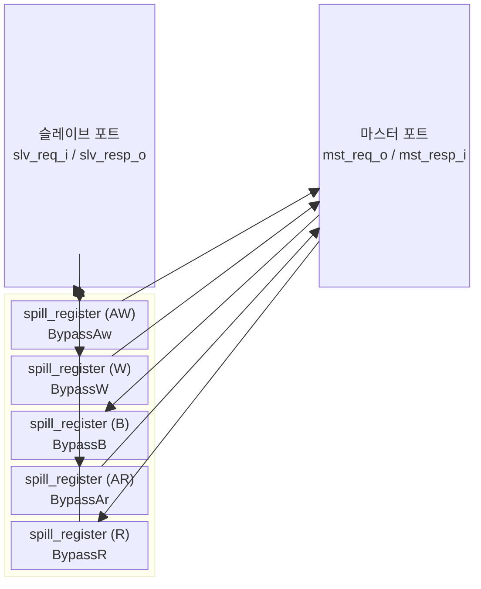

# `axi_cut` — AXI4 타이밍 컷 (Timing Cut)

## 모듈 개요 및 기능

`axi_cut`은 AXI4 버스의 **모든 조합 논리 경로를 차단**하는 타이밍 컷 모듈입니다. 슬레이브 포트와 마스터 포트 사이에 각 채널마다 `spill_register`를 삽입하여 타이밍 클로저를 돕습니다.

각 채널별로 독립적인 바이패스(Bypass) 파라미터를 지원하므로, 특정 채널만 선택적으로 레지스터 단계를 삽입할 수 있습니다.

---

## Mermaid 블록 다이어그램

---

## 파라미터 테이블

| 이름 | 타입 | 기본값 | 설명 |
|---|---|---|---|
| `Bypass` | `bit` | `1'b0` | 전체 채널 바이패스 기본값 |
| `BypassAw` | `bit` | `Bypass` | AW 채널 바이패스 |
| `BypassW` | `bit` | `Bypass` | W 채널 바이패스 |
| `BypassB` | `bit` | `Bypass` | B 채널 바이패스 |
| `BypassAr` | `bit` | `Bypass` | AR 채널 바이패스 |
| `BypassR` | `bit` | `Bypass` | R 채널 바이패스 |
| `aw_chan_t` | `type` | `logic` | AW 채널 페이로드 타입 |
| `w_chan_t` | `type` | `logic` | W 채널 페이로드 타입 |
| `b_chan_t` | `type` | `logic` | B 채널 페이로드 타입 |
| `ar_chan_t` | `type` | `logic` | AR 채널 페이로드 타입 |
| `r_chan_t` | `type` | `logic` | R 채널 페이로드 타입 |
| `axi_req_t` | `type` | `logic` | AXI 요청 구조체 타입 |
| `axi_resp_t` | `type` | `logic` | AXI 응답 구조체 타입 |

---

## 포트 테이블

| 포트 이름 | 방향 | 폭 | 설명 |
|---|---|---|---|
| `clk_i` | input | 1 | 클록 |
| `rst_ni` | input | 1 | 비동기 리셋 (active-low) |
| `slv_req_i` | input | `axi_req_t` | 슬레이브 포트 요청 입력 |
| `slv_resp_o` | output | `axi_resp_t` | 슬레이브 포트 응답 출력 |
| `mst_req_o` | output | `axi_req_t` | 마스터 포트 요청 출력 |
| `mst_resp_i` | input | `axi_resp_t` | 마스터 포트 응답 입력 |

---

## 내부 아키텍처

각 AXI 채널에 독립적인 `spill_register`를 인스턴스화합니다. `spill_register`는 다음 두 모드로 동작합니다:

- **`Bypass=0` (기본값)**: 레지스터 삽입 — 1 사이클 레이턴시, 조합 경로 완전 차단
- **`Bypass=1`**: 직결(wire-through) — 레지스터 없음, 순수 조합 연결

### 채널별 방향

| 채널 | 데이터 흐름 |
|---|---|
| AW | slv → mst (요청) |
| W | slv → mst (요청) |
| B | mst → slv (응답) |
| AR | slv → mst (요청) |
| R | mst → slv (응답) |

---

## 인스턴스화하는 서브모듈

| 인스턴스 이름 | 모듈 | 채널 |
|---|---|---|
| `i_reg_aw` | `spill_register` | AW |
| `i_reg_w` | `spill_register` | W |
| `i_reg_b` | `spill_register` | B |
| `i_reg_ar` | `spill_register` | AR |
| `i_reg_r` | `spill_register` | R |

---

## 타이밍/레이턴시 특성

- `Bypass=0`일 때 각 채널 레이턴시: **1 사이클**
- 모든 채널 `Bypass=0`이면 AW→W→B 경로 총 레이턴시: **2 사이클** (AW/W 1사이클 + B 1사이클)
- `Bypass=1`이면 조합 논리 직결, 추가 레이턴시 없음

---

## 인터페이스 래퍼 모듈

### `axi_cut_intf`

AXI4 전용 인터페이스 래퍼. 추가 파라미터:

| 이름 | 설명 |
|---|---|
| `ADDR_WIDTH` | 주소 폭 |
| `DATA_WIDTH` | 데이터 폭 |
| `ID_WIDTH` | ID 폭 |
| `USER_WIDTH` | 사용자 신호 폭 |

시뮬레이션 전용 파라미터 범위 검사 포함 (`initial begin assert ...`).

### `axi_lite_cut_intf`

AXI-Lite 전용 인터페이스 래퍼. ID/USER 없이 `ADDR_WIDTH`, `DATA_WIDTH`만 사용.
