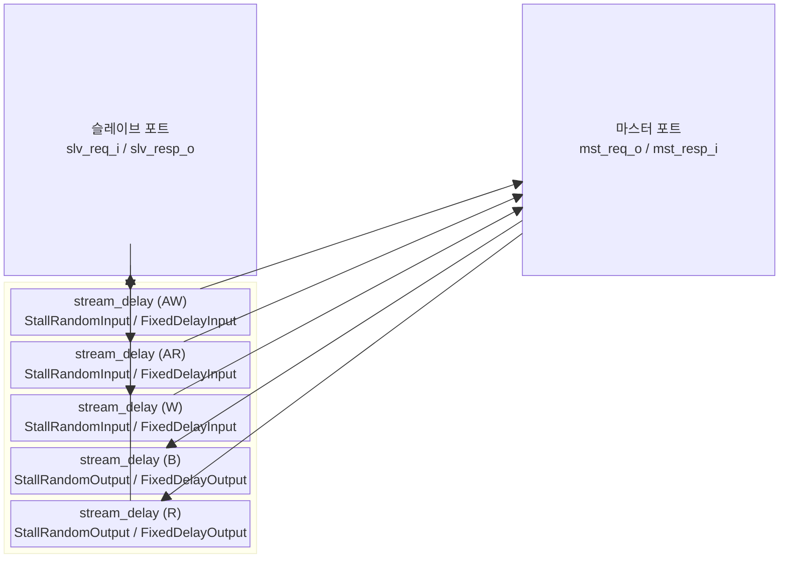

# `axi_delayer` — AXI 채널 지연 모듈

## 모듈 개요 및 기능

`axi_delayer`는 AXI4 버스의 5개 채널 각각에 **고정 사이클 지연** 또는 **랜덤 스톨**을 삽입하는 합성 가능한 모듈입니다. 주로 시뮬레이션에서 백프레셔(backpressure) 및 다양한 레이턴시 조건을 테스트하는 용도로 사용됩니다.

입력 방향(슬레이브→마스터: AW, W, AR)과 출력 방향(마스터→슬레이브: B, R)에 독립적인 지연 파라미터를 적용합니다.

---

## Mermaid 블록 다이어그램

---

## 파라미터 테이블

| 이름 | 타입 | 기본값 | 설명 |
|---|---|---|---|
| `aw_chan_t` | `type` | `logic` | AW 채널 페이로드 타입 |
| `w_chan_t` | `type` | `logic` | W 채널 페이로드 타입 |
| `b_chan_t` | `type` | `logic` | B 채널 페이로드 타입 |
| `ar_chan_t` | `type` | `logic` | AR 채널 페이로드 타입 |
| `r_chan_t` | `type` | `logic` | R 채널 페이로드 타입 |
| `axi_req_t` | `type` | `logic` | AXI 요청 구조체 타입 |
| `axi_resp_t` | `type` | `logic` | AXI 응답 구조체 타입 |
| `StallRandomInput` | `bit` | `0` | 입력 채널 랜덤 스톨 활성화 |
| `StallRandomOutput` | `bit` | `0` | 출력 채널 랜덤 스톨 활성화 |
| `FixedDelayInput` | `int unsigned` | `1` | 입력 채널 고정 지연 사이클 수 |
| `FixedDelayOutput` | `int unsigned` | `1` | 출력 채널 고정 지연 사이클 수 |

---

## 포트 테이블

| 포트 이름 | 방향 | 폭 | 설명 |
|---|---|---|---|
| `clk_i` | input | 1 | 클록 |
| `rst_ni` | input | 1 | 비동기 리셋 (active-low) |
| `slv_req_i` | input | `axi_req_t` | 슬레이브 포트 요청 입력 |
| `slv_resp_o` | output | `axi_resp_t` | 슬레이브 포트 응답 출력 |
| `mst_req_o` | output | `axi_req_t` | 마스터 포트 요청 출력 |
| `mst_resp_i` | input | `axi_resp_t` | 마스터 포트 응답 입력 |

---

## 내부 아키텍처

각 AXI 채널에 `stream_delay` 모듈을 연결합니다:

| 채널 | 방향 | 사용 파라미터 |
|---|---|---|
| AW | slv → mst | `StallRandomInput`, `FixedDelayInput` |
| AR | slv → mst | `StallRandomInput`, `FixedDelayInput` |
| W | slv → mst | `StallRandomInput`, `FixedDelayInput` |
| B | mst → slv | `StallRandomOutput`, `FixedDelayOutput` |
| R | mst → slv | `StallRandomOutput`, `FixedDelayOutput` |

`stream_delay`는 AXI-like valid/ready 핸드셰이크를 보존하면서 지연을 삽입합니다.

---

## 인스턴스화하는 서브모듈

| 인스턴스 이름 | 모듈 | 채널 |
|---|---|---|
| `i_stream_delay_aw` | `stream_delay` | AW |
| `i_stream_delay_ar` | `stream_delay` | AR |
| `i_stream_delay_w` | `stream_delay` | W |
| `i_stream_delay_b` | `stream_delay` | B |
| `i_stream_delay_r` | `stream_delay` | R |

---

## 타이밍/레이턴시 특성

- `StallRandom=0, FixedDelay=N`이면 각 채널에 정확히 **N 사이클 지연** 삽입
- `StallRandom=1`이면 랜덤 스톨로 가변 레이턴시 발생
- 입력과 출력 방향 독립 설정 가능

---

## 인터페이스 래퍼 모듈

### `axi_delayer_intf`

AXI4 전용 인터페이스 래퍼. 추가 파라미터:

| 이름 | 설명 |
|---|---|
| `AXI_ID_WIDTH` | ID 폭 |
| `AXI_ADDR_WIDTH` | 주소 폭 |
| `AXI_DATA_WIDTH` | 데이터 폭 |
| `AXI_USER_WIDTH` | 사용자 신호 폭 |
| `STALL_RANDOM_INPUT` | 입력 랜덤 스톨 |
| `STALL_RANDOM_OUTPUT` | 출력 랜덤 스톨 |
| `FIXED_DELAY_INPUT` | 입력 고정 지연 |
| `FIXED_DELAY_OUTPUT` | 출력 고정 지연 |
