# axi_demux

## 모듈 개요 및 기능

`axi_demux`는 하나의 AXI4+ATOP 슬레이브 포트를 여러 개의 AXI4+ATOP 마스터 포트로 역다중화(demultiplexing)하는 모듈이다. AW 및 AR 채널에 각각 `select` 입력이 있으며, 이를 통해 현재 요청을 어느 마스터 포트로 전달할지 결정한다. 이 select 신호는 예를 들어 주소 디코딩 모듈에서 생성된다.

`axi_demux`는 `axi_demux_simple`을 래핑하며, 슬레이브 측 AW/AR/W/B/R 채널에 선택적 스필 레지스터(spill register)를 추가하여 타이밍 클로저를 개선한다.

- W 채널 비트는 대응하는 AW beat의 선택에 따라 라우팅된다.
- B 및 R 채널은 라운드로빈 중재로 여러 마스터 포트에서 슬레이브로 멀티플렉싱된다.

---

## Mermaid 블록 다이어그램

```mermaid
block-beta
    columns 3

    slv["슬레이브 포트\n(slv_req_i / slv_resp_o)"]
    block:core:1
        spill_aw["spill_register\n(AW 채널)"]
        spill_aw_sel["spill_register\n(AW select)"]
        spill_w["spill_register\n(W 채널)"]
        spill_ar["spill_register\n(AR 채널)"]
        spill_ar_sel["spill_register\n(AR select)"]
        spill_b["spill_register\n(B 채널)"]
        spill_r["spill_register\n(R 채널)"]
        simple["axi_demux_simple\n(핵심 역다중화 로직)"]
    end
    mst["마스터 포트\n(mst_reqs_o / mst_resps_i)\n[NoMstPorts-1:0]"]

    slv --> spill_aw
    slv --> spill_aw_sel
    slv --> spill_w
    slv --> spill_ar
    slv --> spill_ar_sel
    spill_aw --> simple
    spill_aw_sel --> simple
    spill_w --> simple
    spill_ar --> simple
    spill_ar_sel --> simple
    simple --> spill_b
    simple --> spill_r
    spill_b --> slv
    spill_r --> slv
    simple --> mst
```

> 클록 도메인: 단일 클록 `clk_i`. 비동기 리셋 `rst_ni`.

---

## 파라미터 테이블

| 이름 | 타입 | 기본값 | 설명 |
|------|------|--------|------|
| `AxiIdWidth` | `int unsigned` | `0` | AXI ID 폭 |
| `AtopSupport` | `bit` | `1` | ATOP 지원 여부 |
| `aw_chan_t` | `type` | `logic` | AW 채널 구조체 타입 |
| `w_chan_t` | `type` | `logic` | W 채널 구조체 타입 |
| `b_chan_t` | `type` | `logic` | B 채널 구조체 타입 |
| `ar_chan_t` | `type` | `logic` | AR 채널 구조체 타입 |
| `r_chan_t` | `type` | `logic` | R 채널 구조체 타입 |
| `axi_req_t` | `type` | `logic` | AXI 요청 구조체 타입 |
| `axi_resp_t` | `type` | `logic` | AXI 응답 구조체 타입 |
| `NoMstPorts` | `int unsigned` | `0` | 마스터 포트 수 |
| `MaxTrans` | `int unsigned` | `8` | 동시 최대 트랜잭션 수 |
| `AxiLookBits` | `int unsigned` | `3` | ID 카운터에서 사용하는 ID 하위 비트 수 |
| `UniqueIds` | `bit` | `0` | 고유 ID 보장 시 ID 카운터 생략 |
| `SpillAw` | `bit` | `1` | AW 채널 스필 레지스터 활성화 |
| `SpillW` | `bit` | `0` | W 채널 스필 레지스터 활성화 |
| `SpillB` | `bit` | `0` | B 채널 스필 레지스터 활성화 |
| `SpillAr` | `bit` | `1` | AR 채널 스필 레지스터 활성화 |
| `SpillR` | `bit` | `0` | R 채널 스필 레지스터 활성화 |
| `SelectWidth` | `int unsigned` | `$clog2(NoMstPorts)` | select 신호 폭 (자동 계산, DO NOT OVERRIDE) |
| `select_t` | `type` | `logic [SelectWidth-1:0]` | select 신호 타입 (DO NOT OVERRIDE) |

---

## 포트 테이블

| 이름 | 방향 | 폭 | 설명 |
|------|------|-----|------|
| `clk_i` | input | 1 | 클록 |
| `rst_ni` | input | 1 | 비동기 리셋 (active low) |
| `test_i` | input | 1 | 테스트 모드 |
| `slv_req_i` | input | `axi_req_t` | 슬레이브 포트 요청 |
| `slv_aw_select_i` | input | `select_t` | AW 채널 마스터 포트 선택 (aw_valid 중 안정적이어야 함) |
| `slv_ar_select_i` | input | `select_t` | AR 채널 마스터 포트 선택 (ar_valid 중 안정적이어야 함) |
| `slv_resp_o` | output | `axi_resp_t` | 슬레이브 포트 응답 |
| `mst_reqs_o` | output | `axi_req_t [NoMstPorts-1:0]` | 마스터 포트 요청 배열 |
| `mst_resps_i` | input | `axi_resp_t [NoMstPorts-1:0]` | 마스터 포트 응답 배열 |

---

## 내부 아키텍처 설명

### 스필 레지스터 (Spill Register)

AW, W, AR 채널(요청 방향)과 B, R 채널(응답 방향) 각각에 `spill_register` 인스턴스가 있다. `SpillXx = 1`이면 1 사이클 버퍼가 삽입되어 타이밍을 개선하고, `SpillXx = 0`이면 bypass 모드로 동작한다.

AW와 AW select는 동기화된 스필 레지스터 쌍으로 구현되어 두 신호의 유효성이 항상 동시에 표현된다.

### axi_demux_simple

핵심 역다중화 로직을 담당하는 서브모듈. AW/AR/W/B/R 채널 제어, ID 카운터, W 채널 오픈 카운터, B/R 채널 라운드로빈 중재 등이 구현되어 있다 (상세는 `axi_demux_simple.sv.md` 참조).

### axi_demux_intf

인터페이스 래퍼 변형 모듈. `AXI_BUS.Slave`와 `AXI_BUS.Master` SystemVerilog 인터페이스를 사용하여 `axi_demux`를 감싼다.

---

## 인스턴스화하는 서브모듈 목록

| 모듈 | 인스턴스명 | 설명 |
|------|-----------|------|
| `spill_register` | `i_aw_spill_reg` | AW 채널 스필 레지스터 |
| `spill_register` | `i_aw_select_spill_reg` | AW select 스필 레지스터 |
| `spill_register` | `i_w_spill_reg` | W 채널 스필 레지스터 |
| `spill_register` | `i_ar_spill_reg` | AR 채널 스필 레지스터 |
| `spill_register` | `i_ar_sel_spill_reg` | AR select 스필 레지스터 |
| `spill_register` | `i_b_spill_reg` | B 채널 스필 레지스터 |
| `spill_register` | `i_r_spill_reg` | R 채널 스필 레지스터 |
| `axi_demux_simple` | `i_demux_simple` | 역다중화 핵심 로직 |

---

## 타이밍/레이턴시 특성

- `SpillAw = 1`, `SpillAr = 1` (기본값): AW, AR 경로에 각 1 사이클 추가 레이턴시
- `SpillW = 0`, `SpillB = 0`, `SpillR = 0` (기본값): W, B, R은 스필 없이 bypass (추가 레이턴시 없음)
- AW → W 경로: AW가 수락된 후 W 채널 라우팅이 결정됨

---

## 특수 동작

- **AXI 프로토콜 준수**: `slv_aw_select_i`는 `aw_valid` 신호가 high인 동안 반드시 안정적이어야 한다. AR select도 동일.
- **ATOP 지원**: `AtopSupport = 1` 시, ATOP 요청은 AW 채널의 select와 함께 AR ID 카운터에도 주입된다.
- **W 채널 순서 보장**: AXI 스펙에 따라 W 버스트는 AW 요청 순서와 동일하게 전송되어야 하며, 서로 다른 버스트의 W 비트는 인터리빙될 수 없다.
- **B/R 채널 라운드로빈**: 여러 마스터 포트에서 올라오는 B, R 응답은 라운드로빈 중재로 슬레이브에게 전달된다.
- **UniqueIds 최적화**: 모든 진행 중인 트랜잭션의 ID가 고유할 때, ID 카운터 로직이 불필요하여 생략할 수 있다.
