# axi_demux_id_counters

## 모듈 개요 및 기능

`axi_demux_id_counters`는 `axi_demux_simple`에서 사용되는 내부 서브모듈로, AXI ID별로 진행 중인 트랜잭션의 수와 대상 마스터 포트 선택(select) 정보를 추적한다. 각 AXI ID(하위 `AxiIdBits` 비트 기준)에 대해 독립적인 `delta_counter`가 유지된다.

주요 기능:
- **Lookup**: 특정 ID에 대한 현재 마스터 포트 선택 값과 점유(occupied) 여부를 조회
- **Push**: 새로운 트랜잭션 시작 시 카운터 증가 및 select 값 저장
- **Inject**: ATOP으로 인해 AR 채널에 ID를 주입할 때 카운터 증가
- **Pop**: 트랜잭션 완료 시(B 또는 R last beat) 카운터 감소

---

## Mermaid 블록 다이어그램

```mermaid
block-beta
    columns 3

    push_pop["push_i / inject_i / pop_i\n+ AXI ID 입력"]
    block:core:1
        decoder["push_en / inject_en / pop_en\n(1-hot 디코더)"]
        counters["delta_counter × NoCounters\n(NoCounters = 2^AxiIdBits)"]
        select_regs["mst_select_q[]\nFF 레지스터 배열\n(FFLARN)"]
        occupied["occupied[]\ncnt_full[]\nany_outstanding_trx_o"]
        lookup["lookup_mst_select_o\nlookup_mst_select_occupied_o"]
    end
    full["full_o"]

    push_pop --> decoder
    decoder --> counters
    decoder --> select_regs
    counters --> occupied
    occupied --> lookup
    select_regs --> lookup
    occupied --> full
```



> 클록 도메인: 단일 클록 `clk_i`. 비동기 리셋 `rst_ni`.

---

## 파라미터 테이블

| 이름 | 타입 | 기본값 | 설명 |
|------|------|--------|------|
| `AxiIdBits` | `int unsigned` | `2` | 사용할 AXI ID 하위 비트 수. 카운터 수 = 2^AxiIdBits |
| `CounterWidth` | `int unsigned` | `4` | 각 카운터의 비트 폭. 최대 진행 트랜잭션 수 = 2^CounterWidth - 1 |
| `mst_port_select_t` | `type` | `logic` | 마스터 포트 선택 신호 타입 |

---

## 포트 테이블

| 이름 | 방향 | 폭 | 설명 |
|------|------|-----|------|
| `clk_i` | input | 1 | 클록 |
| `rst_ni` | input | 1 | 비동기 리셋 (active low) |
| `lookup_axi_id_i` | input | `AxiIdBits` | 조회할 AXI ID |
| `lookup_mst_select_o` | output | `mst_port_select_t` | 해당 ID의 현재 마스터 포트 선택 값 |
| `lookup_mst_select_occupied_o` | output | 1 | 해당 ID에 진행 중인 트랜잭션 존재 여부 |
| `full_o` | output | 1 | 어느 카운터든 오버플로우 또는 만료 시 high |
| `push_axi_id_i` | input | `AxiIdBits` | push 대상 AXI ID |
| `push_mst_select_i` | input | `mst_port_select_t` | push 시 저장할 마스터 포트 선택 값 |
| `push_i` | input | 1 | push 실행 (카운터 +1, select 저장) |
| `inject_axi_id_i` | input | `AxiIdBits` | ATOP inject 대상 AXI ID |
| `inject_i` | input | 1 | ATOP inject 실행 (AR 카운터 +1) |
| `pop_axi_id_i` | input | `AxiIdBits` | pop 대상 AXI ID |
| `pop_i` | input | 1 | pop 실행 (카운터 -1) |
| `any_outstanding_trx_o` | output | 1 | 전체 카운터 중 하나라도 비어있지 않으면 high |

---

## 내부 아키텍처 설명

### 1-hot 디코더

입력 AXI ID를 1-hot 인코딩으로 변환하여 특정 카운터를 선택한다:

```
push_en   = (push_i)   ? (1 << push_axi_id_i)   : '0
inject_en = (inject_i) ? (1 << inject_axi_id_i) : '0
pop_en    = (pop_i)    ? (1 << pop_axi_id_i)    : '0
```

### 카운터 우선순위 로직 (always_comb)

각 카운터별로 `{push_en[i], inject_en[i], pop_en[i]}` 3비트 조합에 따른 delta 결정:

| 조합 | 동작 | delta |
|------|------|-------|
| 3'b001 | pop만 | -1 |
| 3'b010 | inject만 | +1 |
| 3'b100 | push만 | +1 |
| 3'b110 | push + inject | +2 |
| 3'b111 | push + inject + pop | +1 |
| 기타 | 변화 없음 | 0 |

### delta_counter

`common_cells`의 `delta_counter`를 사용한다. `STICKY_OVERFLOW = 0`으로 오버플로우 시 스티키하지 않는다.

### mst_select 레지스터

`FFLARN` 매크로로 구현된 플립플롭으로, `push_en[i]`가 active일 때 `push_mst_select_i` 값을 해당 ID의 레지스터에 저장한다. 이후 동일 ID의 트랜잭션이 점유 중일 때 선택 값을 조회하는 데 사용된다.

### 상태 신호

- `occupied[i] = |in_flight[i]`: 카운터가 0이 아닐 때 점유 상태
- `cnt_full[i] = overflow[i] | (&in_flight[i])`: 카운터 만료 또는 오버플로우

---

## 인스턴스화하는 서브모듈 목록

| 모듈 | 인스턴스 수 | 설명 |
|------|------------|------|
| `delta_counter` | `NoCounters` (= 2^AxiIdBits) | ID별 진행 중인 트랜잭션 수 추적 |

---

## 타이밍/레이턴시 특성

- 조합 논리로 lookup 즉시 수행 (0 사이클 레이턴시)
- push/inject/pop은 클록 엣지에서 처리
- `full_o`는 조합 논리로 실시간 출력

---

## 특수 동작

- **카운터 언더플로우 감지**: `cnt_underflow` assertion으로 pop 후 overflow 발생 시 치명 오류 출력. 비정상적인 AXI 응답(요청 없이 응답이 도착)을 감지한다.
- **ATOP inject**: ATOP 트랜잭션은 AW 채널과 AR 채널 모두에 카운터를 증가시켜야 하므로 `inject_i`로 AR 카운터를 별도로 증가시킨다.
- **full_o**: 어느 하나라도 카운터가 가득 차면 `full_o`가 high가 되어 `axi_demux_simple`에서 새로운 AW/AR 수락을 차단한다.
- **Verilator/XSIM 조건 컴파일**: assertion은 VERILATOR 및 XSIM 환경에서는 비활성화된다.
