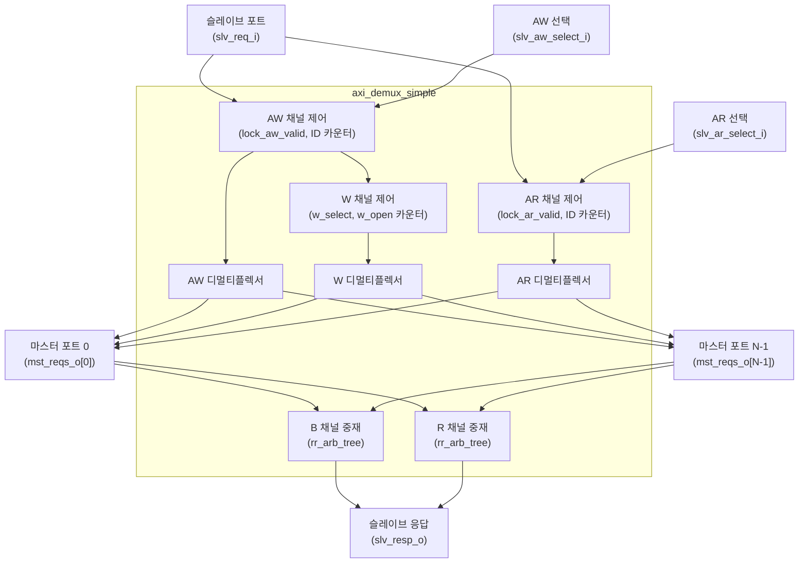

# axi_demux_simple

## 모듈 목적 및 개요

`axi_demux_simple`은 하나의 AXI4+ATOP 슬레이브 포트에서 수신한 트랜잭션을 여러 개의 AXI4+ATOP 마스터 포트로 분배(Demultiplex)하는 모듈입니다.

- **AW / AR 채널**: 각각 `slv_aw_select_i`, `slv_ar_select_i` 선택 신호를 통해 요청을 어느 마스터 포트로 전달할지 결정합니다. 선택 신호는 일반적으로 주소 디코더 모듈에서 생성됩니다.
- **W 채널**: 대응하는 AW 비트의 선택 결과에 따라 데이터를 라우팅합니다. AXI 규격에 따라 W 버스트는 AW 비트와 동일한 순서로 전송되며, 서로 다른 버스트의 비트가 혼재되어서는 안 됩니다.
- **B / R 채널**: 마스터 포트에서 슬레이브 포트로 라운드-로빈(Round-Robin) 중재 트리를 사용하여 응답을 다중화합니다.
- 마스터 포트가 1개일 경우 디멀티플렉싱 없이 직접 연결(Pass-through)됩니다.

---

## 파라미터 테이블

| 이름 | 타입 | 기본값 | 설명 |
|------|------|--------|------|
| `AxiIdWidth` | `int unsigned` | `0` | AXI ID 비트 너비 |
| `AtopSupport` | `bit` | `1` | ATOP(Atomic Operation) 지원 여부 |
| `axi_req_t` | `type` | `logic` | AXI 요청 구조체 타입 |
| `axi_resp_t` | `type` | `logic` | AXI 응답 구조체 타입 |
| `NoMstPorts` | `int unsigned` | `0` | 마스터 포트 수 |
| `MaxTrans` | `int unsigned` | `8` | 최대 동시 진행(Outstanding) 트랜잭션 수 |
| `AxiLookBits` | `int unsigned` | `3` | ID 카운터 조회에 사용할 ID 비트 수 |
| `UniqueIds` | `bit` | `0` | 각 트랜잭션 ID가 고유함을 보장하는 경우 ID 카운터 생략 |
| `SelectWidth` | `int unsigned` | `$clog2(NoMstPorts)` | 선택 신호 비트 너비 (의존적 파라미터, 직접 설정 금지) |
| `select_t` | `type` | `logic[SelectWidth-1:0]` | 선택 신호 타입 (의존적 파라미터, 직접 설정 금지) |

---

## 포트 테이블

| 이름 | 방향 | 너비 | 설명 |
|------|------|------|------|
| `clk_i` | input | 1 | 클록 입력 |
| `rst_ni` | input | 1 | 비동기 리셋 (Active Low) |
| `test_i` | input | 1 | 테스트 모드 입력 |
| `slv_req_i` | input | `axi_req_t` | 슬레이브 포트 AXI 요청 입력 |
| `slv_aw_select_i` | input | `select_t` | AW 채널 마스터 포트 선택 신호 |
| `slv_ar_select_i` | input | `select_t` | AR 채널 마스터 포트 선택 신호 |
| `slv_resp_o` | output | `axi_resp_t` | 슬레이브 포트 AXI 응답 출력 |
| `mst_reqs_o` | output | `axi_req_t[NoMstPorts-1:0]` | 마스터 포트들의 AXI 요청 출력 배열 |
| `mst_resps_i` | input | `axi_resp_t[NoMstPorts-1:0]` | 마스터 포트들의 AXI 응답 입력 배열 |

---

## 내부 동작 및 로직 설명

### AW 채널 처리

1. `slv_req_i.aw_valid`가 어서트되면 ID 카운터(`i_aw_id_counter`)와 W 오픈 카운터(`i_counter_open_w`)가 가득 차지 않았는지 확인합니다.
2. 이전에 진행 중인 W 트랜잭션이 있는 경우(`w_open != 0`), 현재 AW 선택 신호(`slv_aw_select_i`)가 기존 선택(`w_select_q`)과 동일해야 합니다 (W 채널 데드락 방지).
3. `lock_aw_valid_q` 플립플롭으로 AW valid를 래치하여 AXI 프로토콜 준수(valid 비활성화 금지)를 보장합니다.
4. ATOP 트랜잭션이 R 응답을 필요로 하는 경우, AR ID 카운터에 ID를 주입합니다.

### W 채널 처리

- `w_select` 신호가 현재 W 비트를 어느 마스터로 전달할지 결정합니다.
- `w_open` 카운터로 진행 중인 W 버스트 수를 추적합니다. W beat의 `last` 신호로 카운터를 감소시킵니다.

### B 채널 처리 (응답 다중화)

- `rr_arb_tree`(라운드-로빈 중재기)를 통해 여러 마스터 포트에서 오는 B 응답을 중재하여 슬레이브로 전달합니다.

### AR 채널 처리

- AW와 유사하게 `lock_ar_valid_q` 플립플롭으로 AR valid를 래치하여 프로토콜 준수를 보장합니다.
- ATOP inject 시에도 AR valid가 비활성화되지 않도록 보호합니다.

### R 채널 처리 (응답 다중화)

- `rr_arb_tree`를 통해 여러 마스터 포트에서 오는 R 응답을 중재하여 슬레이브로 전달합니다.

### ID 카운터 (`axi_demux_id_counters`)

- `UniqueIds`가 비활성화된 경우, AW 및 AR 각각에 대해 `axi_demux_id_counters` 인스턴스를 생성합니다.
- 이 카운터는 동일 ID의 트랜잭션이 항상 같은 마스터 포트로 전달되도록 보장합니다.

---

## Mermaid 블록 다이어그램



---

## 의존성 모듈 목록

| 모듈 | 설명 |
|------|------|
| `axi_demux_id_counters` | AXI ID별 마스터 포트 선택 정보를 추적하는 카운터 |
| `counter` | 진행 중인 W 트랜잭션 수를 추적하는 제네릭 카운터 |
| `rr_arb_tree` | B/R 채널 응답 다중화를 위한 라운드-로빈 중재 트리 |
| `common_cells/assertions.svh` | 어설션 매크로 헤더 |
| `common_cells/registers.svh` | 레지스터 매크로 헤더 (`FFLARN` 등) |
| `axi/assign.svh` | AXI 구조체 대입 매크로 헤더 |

---

## 사용 예시

```systemverilog
// AXI 타입 정의 (예: axi_pkg를 이용)
`AXI_TYPEDEF_ALL(axi, logic [31:0], logic [7:0], logic [63:0], logic [7:0], logic [0:0])

axi_demux_simple #(
  .AxiIdWidth   ( 8            ),
  .AtopSupport  ( 1'b1         ),
  .axi_req_t    ( axi_req_t    ),
  .axi_resp_t   ( axi_resp_t   ),
  .NoMstPorts   ( 4            ),
  .MaxTrans     ( 8            ),
  .AxiLookBits  ( 3            ),
  .UniqueIds    ( 1'b0         )
) i_axi_demux_simple (
  .clk_i            ( clk             ),
  .rst_ni           ( rst_n           ),
  .test_i           ( 1'b0            ),
  .slv_req_i        ( slv_req         ),
  .slv_aw_select_i  ( aw_select       ), // 주소 디코더에서 생성
  .slv_ar_select_i  ( ar_select       ), // 주소 디코더에서 생성
  .slv_resp_o       ( slv_resp        ),
  .mst_reqs_o       ( mst_reqs        ),
  .mst_resps_i      ( mst_resps       )
);
```

> **참고**: `slv_aw_select_i` 및 `slv_ar_select_i` 신호는 주소 디코더 모듈에서 생성하는 것이 일반적입니다. 선택 값은 반드시 `[0, NoMstPorts-1]` 범위 내여야 합니다.
