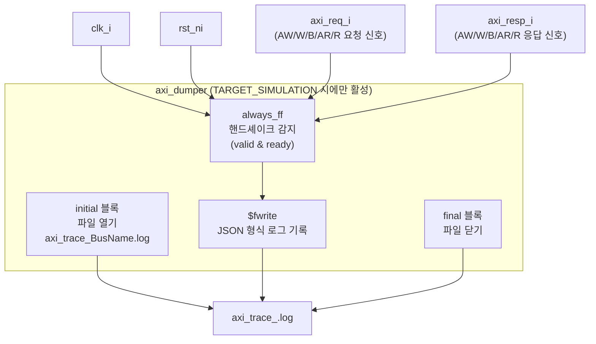

# axi_dumper

## 모듈 목적 및 개요

`axi_dumper`는 시뮬레이션 전용 AXI 트랜잭션 로깅 모듈입니다.

핸드셰이크가 완료된(valid & ready가 동시에 어서트된) AXI 비트를 감지하여 로그 파일에 JSON 형식으로 기록합니다. 채널별로 로깅 활성화 여부를 파라미터로 제어할 수 있어, 필요한 채널만 선택적으로 추적할 수 있습니다.

`TARGET_SIMULATION` 매크로가 정의된 경우에만 동작하며, 합성(Synthesis) 환경에서는 완전히 비활성화됩니다.

동일 파일 내에 `axi_dumper_intf`라는 래퍼 모듈도 포함되어 있으며, `AXI_BUS_DV` 인터페이스를 직접 연결할 수 있습니다.

---

## 파라미터 테이블

### `axi_dumper`

| 이름 | 타입 | 기본값 | 설명 |
|------|------|--------|------|
| `BusName` | `string` | `"axi_bus"` | 로그 파일명 접미사 및 식별자 (`axi_trace_<BusName>.log`) |
| `LogAW` | `bit` | `1` | AW 채널 로깅 활성화 여부 |
| `LogAR` | `bit` | `1` | AR 채널 로깅 활성화 여부 |
| `LogW` | `bit` | `0` | W 채널 로깅 활성화 여부 |
| `LogB` | `bit` | `0` | B 채널 로깅 활성화 여부 |
| `LogR` | `bit` | `0` | R 채널 로깅 활성화 여부 |
| `axi_req_t` | `type` | `logic` | AXI 요청 구조체 타입 |
| `axi_resp_t` | `type` | `logic` | AXI 응답 구조체 타입 |

### `axi_dumper_intf` (추가 파라미터)

| 이름 | 타입 | 기본값 | 설명 |
|------|------|--------|------|
| `AXI_ID_WIDTH` | `int unsigned` | `0` | AXI ID 비트 너비 |
| `AXI_ADDR_WIDTH` | `int unsigned` | `0` | AXI 주소 비트 너비 |
| `AXI_DATA_WIDTH` | `int unsigned` | `0` | AXI 데이터 비트 너비 |
| `AXI_USER_WIDTH` | `int unsigned` | `0` | AXI 사용자 신호 비트 너비 |

---

## 포트 테이블

### `axi_dumper`

| 이름 | 방향 | 너비 | 설명 |
|------|------|------|------|
| `clk_i` | input | 1 | 클록 입력 |
| `rst_ni` | input | 1 | 비동기 리셋 (Active Low) |
| `axi_req_i` | input | `axi_req_t` | AXI 요청 신호 (모니터링 대상) |
| `axi_resp_i` | input | `axi_resp_t` | AXI 응답 신호 (모니터링 대상) |

### `axi_dumper_intf`

| 이름 | 방향 | 너비 | 설명 |
|------|------|------|------|
| `clk_i` | input | 1 | 클록 입력 |
| `rst_ni` | input | 1 | 비동기 리셋 (Active Low) |
| `axi_bus` | Monitor | `AXI_BUS_DV` 인터페이스 | 모니터링할 AXI 버스 (DV 인터페이스) |

---

## 내부 동작 및 로직 설명

### 초기화 (`initial` 블록)

시뮬레이션 시작 후 1 time unit 지연 후 `axi_trace_<BusName>.log` 파일을 쓰기 모드로 열고, 파일 핸들을 저장합니다. 파일명과 경로를 콘솔에 출력합니다.

### 로깅 (`always_ff` 블록)

클록 상승 엣지마다 리셋이 해제된 상태에서 아래 조건을 검사합니다.

| 채널 | 트리거 조건 | 기록 내용 |
|------|------------|----------|
| AW | `aw_valid && aw_ready` | type, time, id, addr, len, size, burst, lock, cache, prot, qos, region, atop, user |
| AR | `ar_valid && ar_ready` | type, time, id, addr, len, size, burst, lock, cache, prot, qos, region, user |
| W | `w_valid && w_ready` | type, time, data, strb, last, user |
| B | `b_valid && b_ready` | type, time, id, resp, user |
| R | `r_valid && r_ready` | type, time, id, data, resp, last, user |

각 엔트리는 Python 딕셔너리 형식의 문자열로 한 줄씩 기록됩니다.

### 종료 (`final` 블록)

시뮬레이션 종료 시 열린 파일 핸들을 닫습니다.

---

## Mermaid 블록 다이어그램



---

## 의존성 모듈 목록

| 모듈/파일 | 설명 |
|----------|------|
| `axi/assign.svh` | AXI 신호 대입 매크로 (`axi_dumper_intf`에서 사용) |
| `axi/typedef.svh` | AXI 타입 정의 매크로 (`axi_dumper_intf`에서 사용) |

> `axi_dumper_intf`는 내부적으로 `axi_dumper`를 인스턴스화합니다.

---

## 사용 예시

### `axi_dumper` 직접 사용

```systemverilog
`AXI_TYPEDEF_ALL(axi, logic [31:0], logic [7:0], logic [63:0], logic [7:0], logic [0:0])

axi_dumper #(
  .BusName    ( "my_bus"    ),
  .LogAW      ( 1'b1        ),
  .LogAR      ( 1'b1        ),
  .LogW       ( 1'b1        ),
  .LogB       ( 1'b1        ),
  .LogR       ( 1'b1        ),
  .axi_req_t  ( axi_req_t   ),
  .axi_resp_t ( axi_resp_t  )
) i_axi_dumper (
  .clk_i      ( clk         ),
  .rst_ni     ( rst_n       ),
  .axi_req_i  ( axi_req     ),
  .axi_resp_i ( axi_resp    )
);
```

### `axi_dumper_intf` 사용 (DV 인터페이스 기반)

```systemverilog
axi_dumper_intf #(
  .BusName        ( "my_bus" ),
  .LogAW          ( 1'b1     ),
  .LogAR          ( 1'b1     ),
  .AXI_ID_WIDTH   ( 8        ),
  .AXI_ADDR_WIDTH ( 32       ),
  .AXI_DATA_WIDTH ( 64       ),
  .AXI_USER_WIDTH ( 1        )
) i_axi_dumper_intf (
  .clk_i   ( clk      ),
  .rst_ni  ( rst_n    ),
  .axi_bus ( axi_dv   )  // AXI_BUS_DV 인터페이스
);
```

> **참고**: 시뮬레이션 실행 시 반드시 `+define+TARGET_SIMULATION` 컴파일 옵션을 추가해야 로깅 기능이 활성화됩니다.
