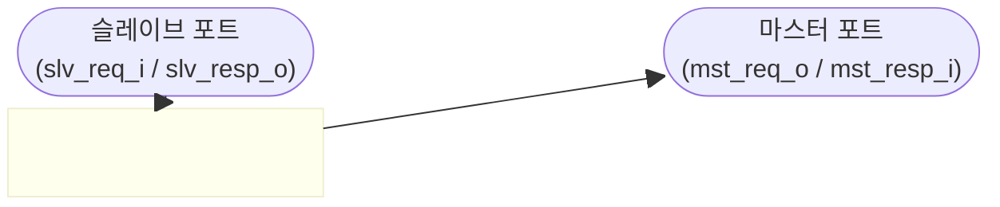
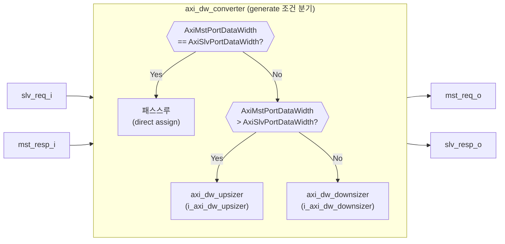

# axi_dw_converter.sv

## 모듈 개요 및 기능

`axi_dw_converter`는 AXI4 버스의 데이터 폭(Data Width)을 변환하는 최상위 래퍼 모듈이다. 슬레이브 포트(Slave Port)와 마스터 포트(Master Port)의 데이터 폭을 비교하여, 동일하면 패스스루(pass-through), 마스터 쪽이 더 넓으면 업사이저(upsizer), 마스터 쪽이 더 좁으면 다운사이저(downsizer)를 선택적으로 인스턴스화하는 구조다. 추가로 `axi_dw_converter_intf`는 SystemVerilog 인터페이스 기반의 래퍼이다.

저자: Matheus Cavalcante (ETH Zurich / University of Bologna)  
라이선스: Solderpad Hardware License v0.51

---

## Mermaid 블록 다이어그램

---

## 파라미터 테이블

| 이름 | 타입 | 기본값 | 설명 |
|---|---|---|---|
| `AxiMaxReads` | `int unsigned` | `1` | 동시에 처리 가능한 최대 읽기 트랜잭션 수 |
| `AxiSlvPortDataWidth` | `int unsigned` | `8` | 슬레이브 포트 데이터 폭 (비트) |
| `AxiMstPortDataWidth` | `int unsigned` | `8` | 마스터 포트 데이터 폭 (비트) |
| `AxiAddrWidth` | `int unsigned` | `1` | 주소 폭 (비트) |
| `AxiIdWidth` | `int unsigned` | `1` | ID 폭 (비트) |
| `aw_chan_t` | `type` | `logic` | AW 채널 구조체 타입 |
| `mst_w_chan_t` | `type` | `logic` | 마스터 포트 W 채널 구조체 타입 |
| `slv_w_chan_t` | `type` | `logic` | 슬레이브 포트 W 채널 구조체 타입 |
| `b_chan_t` | `type` | `logic` | B 채널 구조체 타입 |
| `ar_chan_t` | `type` | `logic` | AR 채널 구조체 타입 |
| `mst_r_chan_t` | `type` | `logic` | 마스터 포트 R 채널 구조체 타입 |
| `slv_r_chan_t` | `type` | `logic` | 슬레이브 포트 R 채널 구조체 타입 |
| `axi_mst_req_t` | `type` | `logic` | 마스터 포트 AXI 요청 구조체 타입 |
| `axi_mst_resp_t` | `type` | `logic` | 마스터 포트 AXI 응답 구조체 타입 |
| `axi_slv_req_t` | `type` | `logic` | 슬레이브 포트 AXI 요청 구조체 타입 |
| `axi_slv_resp_t` | `type` | `logic` | 슬레이브 포트 AXI 응답 구조체 타입 |

### 인터페이스 래퍼(`axi_dw_converter_intf`) 전용 파라미터

| 이름 | 타입 | 기본값 | 설명 |
|---|---|---|---|
| `AXI_ID_WIDTH` | `int unsigned` | `1` | AXI ID 폭 |
| `AXI_ADDR_WIDTH` | `int unsigned` | `1` | AXI 주소 폭 |
| `AXI_SLV_PORT_DATA_WIDTH` | `int unsigned` | `8` | 슬레이브 포트 데이터 폭 |
| `AXI_MST_PORT_DATA_WIDTH` | `int unsigned` | `8` | 마스터 포트 데이터 폭 |
| `AXI_USER_WIDTH` | `int unsigned` | `0` | 사용자 신호 폭 |
| `AXI_MAX_READS` | `int unsigned` | `8` | 최대 동시 읽기 수 |

---

## 포트 테이블

| 이름 | 방향 | 폭 | 설명 |
|---|---|---|---|
| `clk_i` | input | 1 | 상승 엣지 클럭 |
| `rst_ni` | input | 1 | 비동기 리셋, 액티브 로우 |
| `slv_req_i` | input | `axi_slv_req_t` | 슬레이브 포트 AXI 요청 (AW/W/AR/B-ready/R-ready) |
| `slv_resp_o` | output | `axi_slv_resp_t` | 슬레이브 포트 AXI 응답 (AW-ready/W-ready/B/AR-ready/R) |
| `mst_req_o` | output | `axi_mst_req_t` | 마스터 포트 AXI 요청 |
| `mst_resp_i` | input | `axi_mst_resp_t` | 마스터 포트 AXI 응답 |

---

## 내부 아키텍처 설명

이 모듈은 세 개의 `generate if` 블록을 통해 런타임이 아닌 **정적(elaborate-time) 조건 분기**로 동작한다.

1. **`gen_no_dw_conversion`** (`AxiMstPortDataWidth == AxiSlvPortDataWidth`): `slv_req_i`와 `mst_resp_i`를 각각 `mst_req_o`, `slv_resp_o`에 직접 `assign`하여 제로 레이턴시 패스스루를 구현한다.

2. **`gen_dw_upsize`** (`AxiMstPortDataWidth > AxiSlvPortDataWidth`): `axi_dw_upsizer` 인스턴스(`i_axi_dw_upsizer`)를 생성하여 좁은 슬레이브 포트에서 넓은 마스터 포트로 데이터를 확장한다.

3. **`gen_dw_downsize`** (`AxiMstPortDataWidth < AxiSlvPortDataWidth`): `axi_dw_downsizer` 인스턴스(`i_axi_dw_downsizer`)를 생성하여 넓은 슬레이브 포트에서 좁은 마스터 포트로 데이터를 축소한다.

세 블록은 상호 배타적이므로 항상 정확히 하나의 경로만 합성된다.

---

## 인스턴스화하는 서브모듈 목록

| 인스턴스 이름 | 모듈 | 조건 |
|---|---|---|
| `i_axi_dw_upsizer` | `axi_dw_upsizer` | `AxiMstPortDataWidth > AxiSlvPortDataWidth` |
| `i_axi_dw_downsizer` | `axi_dw_downsizer` | `AxiMstPortDataWidth < AxiSlvPortDataWidth` |

---

## 타이밍/레이턴시 특성

- **패스스루 모드**: 완전한 조합 논리 경로(combinational path). 추가 레이턴시 없음.
- **업사이징/다운사이징 모드**: 각각 `axi_dw_upsizer`, `axi_dw_downsizer`의 레이턴시를 따름. 일반적으로 1-사이클 이상의 파이프라인 지연이 발생한다.

---

## 제약 사항 및 주의점

- **WRAP 버스트 미지원**: 업사이저(`axi_dw_upsizer`)는 WRAP 버스트를 지원하지 않으며, 수신 시 `SLVERR`로 응답한다.
- **FIXED 버스트 제한**: 다운사이저(`axi_dw_downsizer`)는 `axlen != 0`인 멀티 비트 FIXED 버스트를 지원하지 않는다. 단일 비트(len=0) FIXED 버스트만 지원한다.
- **데이터 폭 제약**: `AxiSlvPortDataWidth`와 `AxiMstPortDataWidth`는 반드시 8의 배수여야 한다 (바이트 단위 처리).
- **타입 파라미터 일관성**: `aw_chan_t`, `ar_chan_t` 등의 채널 타입 파라미터는 `AxiIdWidth`, `AxiAddrWidth`, 각 포트의 데이터 폭과 일치해야 한다.
- **세 generate 블록**: SystemVerilog 표준상 `if`가 아닌 `if/else if`가 아니므로, 컴파일러에 따라 경고가 발생할 수 있다. 단, 세 조건은 논리적으로 상호 배타적이다.
