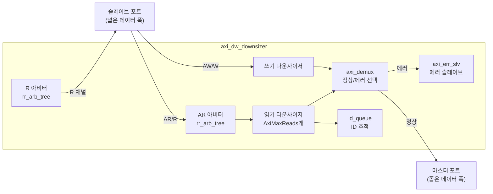
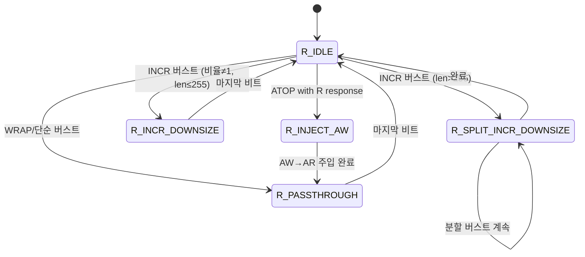
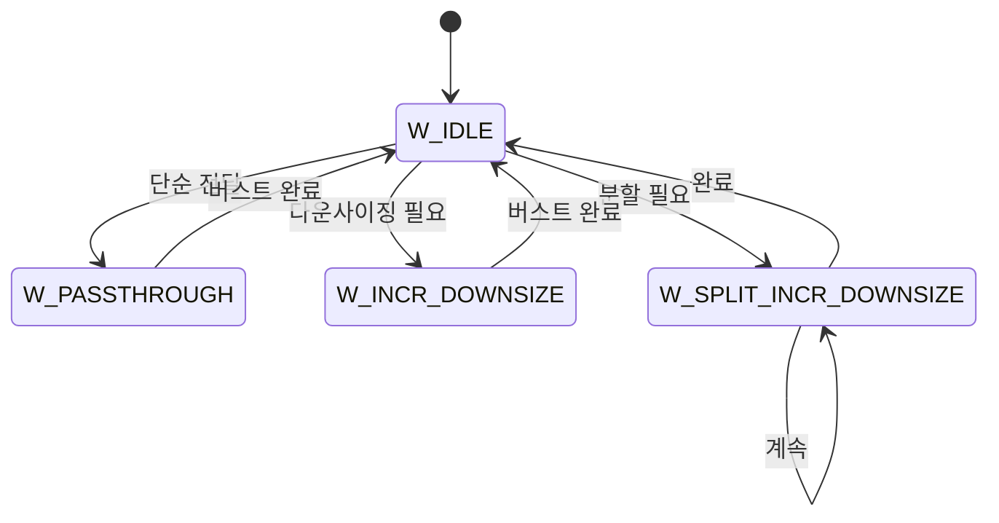

# axi_dw_downsizer.sv

## 개요

데이터 폭 축소 변환기(Data Width Downsizer)입니다. 넓은 데이터 버스를 사용하는 마스터를 더 좁은 데이터 버스를 사용하는 슬레이브에 연결합니다.

**제약사항:**
- WRAP 버스트 타입을 지원하지 않음 (SLVERR 응답 반환)
- 단일 비트 FIXED 버스트만 지원 (다중 비트 FIXED는 SLVERR 반환)

## 블록 다이어그램

## 파라미터

| 파라미터 | 타입 | 기본값 | 설명 |
|---------|------|--------|------|
| `AxiMaxReads` | `int unsigned` | 1 | 동시 처리 가능한 최대 읽기 트랜잭션 수 |
| `AxiSlvPortDataWidth` | `int unsigned` | 8 | 슬레이브 포트 데이터 폭 (비트) |
| `AxiMstPortDataWidth` | `int unsigned` | 8 | 마스터 포트 데이터 폭 (비트) |
| `AxiAddrWidth` | `int unsigned` | 1 | 주소 폭 (비트) |
| `AxiIdWidth` | `int unsigned` | 1 | ID 폭 (비트) |
| `aw_chan_t` | `type` | `logic` | AW 채널 타입 |
| `mst_w_chan_t` | `type` | `logic` | 마스터 W 채널 타입 |
| `slv_w_chan_t` | `type` | `logic` | 슬레이브 W 채널 타입 |
| `b_chan_t` | `type` | `logic` | B 채널 타입 |
| `ar_chan_t` | `type` | `logic` | AR 채널 타입 |
| `mst_r_chan_t` | `type` | `logic` | 마스터 R 채널 타입 |
| `slv_r_chan_t` | `type` | `logic` | 슬레이브 R 채널 타입 |
| `axi_mst_req_t` | `type` | `logic` | 마스터 요청 타입 |
| `axi_mst_resp_t` | `type` | `logic` | 마스터 응답 타입 |
| `axi_slv_req_t` | `type` | `logic` | 슬레이브 요청 타입 |
| `axi_slv_resp_t` | `type` | `logic` | 슬레이브 응답 타입 |

## 포트

| 포트 | 방향 | 설명 |
|------|------|------|
| `clk_i` | 입력 | 클록 |
| `rst_ni` | 입력 | 비동기 리셋 (액티브 로우) |
| `slv_req_i` | 입력 | 슬레이브 포트 요청 |
| `slv_resp_o` | 출력 | 슬레이브 포트 응답 |
| `mst_req_o` | 출력 | 마스터 포트 요청 |
| `mst_resp_i` | 입력 | 마스터 포트 응답 |

## 읽기 상태 머신

## 쓰기 상태 머신

## 동작 원리

### 읽기 (다운사이징)
1. 슬레이브의 넓은 AR 요청을 받아 좁은 마스터 포트로 변환
2. 변환 비율(`conv_ratio = SlvWidth / MstWidth`)에 따라 버스트 길이 조정
3. 마스터에서 수신한 좁은 R 데이터를 직렬화하여 넓은 슬레이브 R 데이터로 조합
4. `id_queue`로 어느 다운사이저가 어떤 트랜잭션을 처리하는지 추적

### 쓰기 (다운사이징)
1. 슬레이브의 넓은 AW/W 요청을 받아 좁은 마스터 포트로 변환
2. 레인 스티어링(lane steering)으로 넓은 W 데이터에서 좁은 W 데이터 추출
3. 여러 B 비트가 발생하는 경우 마지막 B 비트만 슬레이브에 전달

## 의존성

- `rr_arb_tree` (common_cells)
- `lzc` (common_cells)
- `onehot_to_bin` (common_cells)
- `id_queue` (common_cells)
- `fifo_v3` (common_cells)
- `axi_demux`
- `axi_err_slv`
- `axi_pkg`
