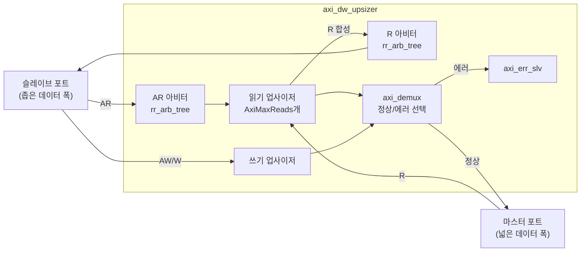
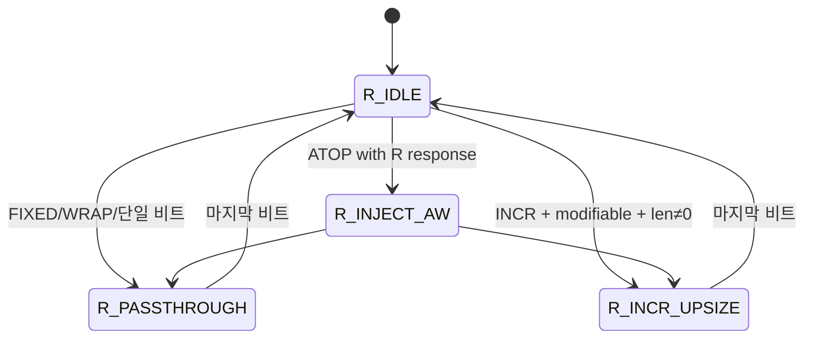
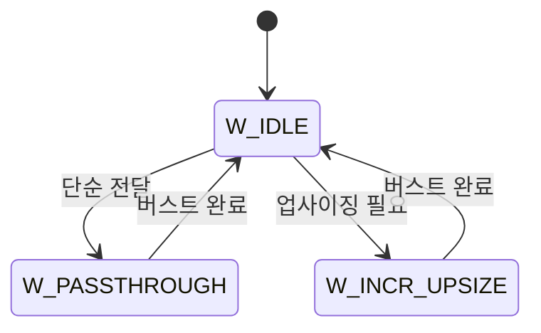

# axi_dw_upsizer.sv

## 개요

데이터 폭 확대 변환기(Data Width Upsizer)입니다. 좁은 데이터 버스를 사용하는 마스터를 더 넓은 데이터 버스를 사용하는 슬레이브에 연결합니다.

**제약사항:**
- WRAP 버스트 타입을 지원하지 않음 (단일 비트 WRAP은 지원)
- INCR 버스트이며 캐시 수정 가능(modifiable) 속성이 있어야 업사이징 활성화

## 블록 다이어그램

## 파라미터

| 파라미터 | 타입 | 기본값 | 설명 |
|---------|------|--------|------|
| `AxiMaxReads` | `int unsigned` | 1 | 동시 처리 가능한 최대 읽기 트랜잭션 수 |
| `AxiSlvPortDataWidth` | `int unsigned` | 8 | 슬레이브 포트 데이터 폭 (비트) |
| `AxiMstPortDataWidth` | `int unsigned` | 8 | 마스터 포트 데이터 폭 (비트) |
| `AxiAddrWidth` | `int unsigned` | 1 | 주소 폭 |
| `AxiIdWidth` | `int unsigned` | 1 | ID 폭 |
| `aw_chan_t` | `type` | `logic` | AW 채널 타입 |
| `mst_w_chan_t` | `type` | `logic` | 마스터 W 채널 타입 |
| `slv_w_chan_t` | `type` | `logic` | 슬레이브 W 채널 타입 |
| `b_chan_t` | `type` | `logic` | B 채널 타입 |
| `ar_chan_t` | `type` | `logic` | AR 채널 타입 |
| `mst_r_chan_t` | `type` | `logic` | 마스터 R 채널 타입 |
| `slv_r_chan_t` | `type` | `logic` | 슬레이브 R 채널 타입 |
| `axi_mst_req_t` | `type` | `logic` | 마스터 요청 타입 |
| `axi_mst_resp_t` | `type` | `logic` | 마스터 응답 타입 |
| `axi_slv_req_t` | `type` | `logic` | 슬레이브 요청 타입 |
| `axi_slv_resp_t` | `type` | `logic` | 슬레이브 응답 타입 |

## 포트

| 포트 | 방향 | 설명 |
|------|------|------|
| `clk_i` | 입력 | 클록 |
| `rst_ni` | 입력 | 비동기 리셋 (액티브 로우) |
| `slv_req_i` | 입력 | 슬레이브 포트 요청 |
| `slv_resp_o` | 출력 | 슬레이브 포트 응답 |
| `mst_req_o` | 출력 | 마스터 포트 요청 |
| `mst_resp_i` | 입력 | 마스터 포트 응답 |

## 읽기 상태 머신

## 쓰기 상태 머신

## 동작 원리

### 읽기 (업사이징)
1. 슬레이브의 좁은 AR 요청을 받아 넓은 마스터 포트 AR로 변환
2. 버스트 길이를 줄임 (여러 좁은 비트 → 1개 넓은 비트)
3. 마스터에서 받은 넓은 R 데이터에서 레인 스티어링으로 슬레이브용 좁은 R 데이터 추출
4. ID 기반으로 어느 업사이저가 처리하는지 추적

### 쓰기 (업사이징)
1. 슬레이브의 좁은 W 데이터를 축적하여 넓은 마스터 W 데이터 구성
2. 단어 경계(aligned address)가 변경되거나 버스트 완료 시 마스터로 전달
3. B 응답은 직접 슬레이브로 전달 (지연 없음)

## 의존성

- `rr_arb_tree` (common_cells)
- `lzc` (common_cells)
- `onehot_to_bin` (common_cells)
- `axi_demux`
- `axi_err_slv`
- `axi_pkg`
