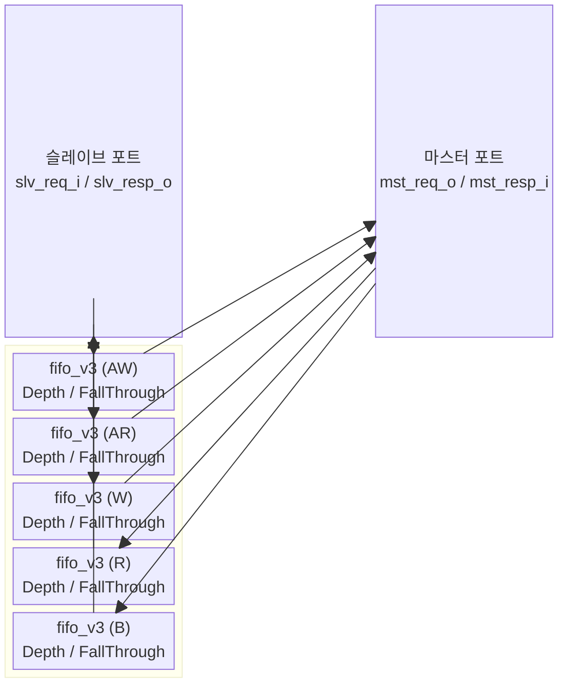

# `axi_fifo` — AXI4 FIFO 버퍼

## 모듈 개요 및 기능

`axi_fifo`는 AXI4 버스의 5개 채널 각각에 **독립적인 FIFO 버퍼**를 삽입하는 모듈입니다. 마스터와 슬레이브 간의 버스트 트랜잭션을 버퍼링하여 백프레셔 내성을 높이고 타이밍 절연을 제공합니다.

`Depth=0`이면 직결(패스스루)로 동작하는 디제네레이트 케이스를 지원합니다.

---

## Mermaid 블록 다이어그램



---

## 파라미터 테이블

| 이름 | 타입 | 기본값 | 설명 |
|---|---|---|---|
| `Depth` | `int unsigned` | `32'd1` | FIFO 깊이 (슬롯 수); 0이면 직결 |
| `FallThrough` | `bit` | `1'b0` | Fall-through 모드 활성화 |
| `aw_chan_t` | `type` | `logic` | AW 채널 페이로드 타입 |
| `w_chan_t` | `type` | `logic` | W 채널 페이로드 타입 |
| `b_chan_t` | `type` | `logic` | B 채널 페이로드 타입 |
| `ar_chan_t` | `type` | `logic` | AR 채널 페이로드 타입 |
| `r_chan_t` | `type` | `logic` | R 채널 페이로드 타입 |
| `axi_req_t` | `type` | `logic` | AXI 요청 구조체 타입 |
| `axi_resp_t` | `type` | `logic` | AXI 응답 구조체 타입 |

---

## 포트 테이블

| 포트 이름 | 방향 | 폭 | 설명 |
|---|---|---|---|
| `clk_i` | input | 1 | 클록 |
| `rst_ni` | input | 1 | 비동기 리셋 (active-low) |
| `test_i` | input | 1 | 테스트 모드 활성화 |
| `slv_req_i` | input | `axi_req_t` | 슬레이브 포트 요청 입력 |
| `slv_resp_o` | output | `axi_resp_t` | 슬레이브 포트 응답 출력 |
| `mst_req_o` | output | `axi_req_t` | 마스터 포트 요청 출력 |
| `mst_resp_i` | input | `axi_resp_t` | 마스터 포트 응답 입력 |

---

## 내부 아키텍처

### 핸드셰이크 제어

FIFO의 `full`/`empty` 신호를 AXI valid/ready에 직접 매핑합니다:

```
mst_req_o.aw_valid  = ~aw_fifo_empty   (FIFO가 비어있지 않으면 유효)
slv_resp_o.aw_ready = ~aw_fifo_full    (FIFO가 가득차지 않으면 수용 가능)
```

### 채널별 데이터 흐름

| 채널 | Push 조건 | Pop 조건 |
|---|---|---|
| AW | `slv_req_i.aw_valid & slv_resp_o.aw_ready` | `mst_req_o.aw_valid & mst_resp_i.aw_ready` |
| AR | `slv_req_i.ar_valid & slv_resp_o.ar_ready` | `mst_req_o.ar_valid & mst_resp_i.ar_ready` |
| W | `slv_req_i.w_valid & slv_resp_o.w_ready` | `mst_req_o.w_valid & mst_resp_i.w_ready` |
| R | `mst_resp_i.r_valid & mst_req_o.r_ready` | `slv_resp_o.r_valid & slv_req_i.r_ready` |
| B | `mst_resp_i.b_valid & mst_req_o.b_ready` | `slv_resp_o.b_valid & slv_req_i.b_ready` |

### FallThrough 모드

`FallThrough=1`이면 push와 pop이 같은 사이클에 가능한 fall-through FIFO로 동작합니다. 제로 레이턴시이지만 조합 경로가 생깁니다.

---

## 인스턴스화하는 서브모듈

| 인스턴스 이름 | 모듈 | 채널 |
|---|---|---|
| `i_aw_fifo` | `fifo_v3` | AW |
| `i_ar_fifo` | `fifo_v3` | AR |
| `i_w_fifo` | `fifo_v3` | W |
| `i_r_fifo` | `fifo_v3` | R |
| `i_b_fifo` | `fifo_v3` | B |

---

## 타이밍/레이턴시 특성

- `FallThrough=0`: 최소 **1 사이클** 레이턴시 (레지스터 단계)
- `FallThrough=1`: **0 사이클** 레이턴시 (조합 경로)
- `Depth=0`: 직결, 추가 레이턴시 없음
- 최대 `Depth`개 트랜잭션 동시 버퍼링

---

## 인터페이스 래퍼 모듈

### `axi_fifo_intf`

AXI4 전용 인터페이스 래퍼. 추가 파라미터:

| 이름 | 설명 |
|---|---|
| `ADDR_WIDTH` | 주소 폭 |
| `DATA_WIDTH` | 데이터 폭 |
| `ID_WIDTH` | ID 폭 |
| `USER_WIDTH` | 사용자 신호 폭 |
| `DEPTH` | FIFO 깊이 |
| `FALL_THROUGH` | Fall-through 모드 |
