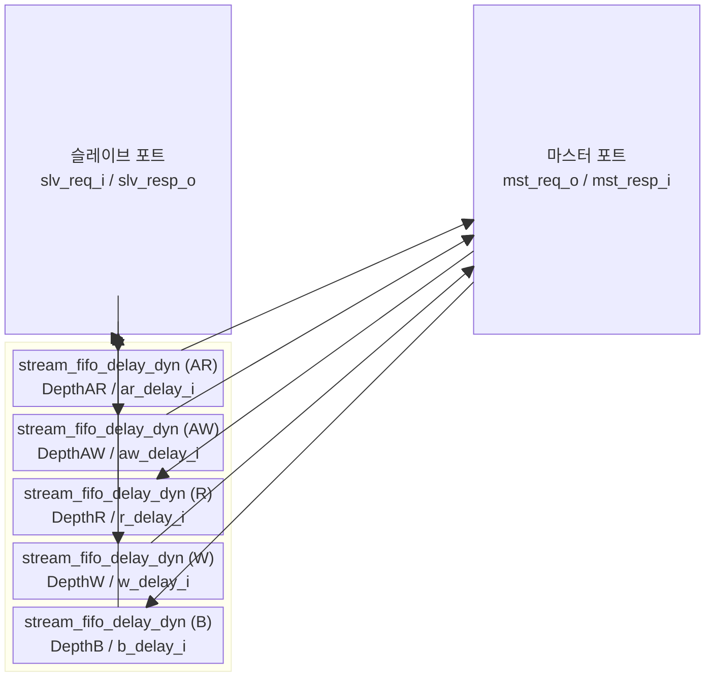

# `axi_fifo_delay_dyn` — AXI FIFO 동적 딜레이 버퍼

## 모듈 개요 및 기능

`axi_fifo_delay_dyn`은 AXI4 버스의 5개 채널 각각에 **런타임에 설정 가능한 딜레이**와 **FIFO 버퍼**를 삽입하는 모듈입니다. 각 채널의 지연 값은 `*_delay_i` 입력 포트를 통해 동적으로 제어됩니다.

시뮬레이션 및 FPGA(Xilinx) 환경을 위한 모듈로, 합성 환경에서는 경고를 출력합니다 (`$fatal` for synthesis without TARGET_XILINX).

포함된 서브모듈 `stream_fifo_delay_dyn`은 데드라인 기반 타이머를 사용하여 정확한 사이클 단위 딜레이를 구현합니다.

---

## Mermaid 블록 다이어그램



각 Depth가 0이면 해당 채널은 직결(pass-through)됩니다.

---

## 파라미터 테이블

| 이름 | 타입 | 기본값 | 설명 |
|---|---|---|---|
| `aw_chan_t` | `type` | `logic` | AW 채널 페이로드 타입 |
| `w_chan_t` | `type` | `logic` | W 채널 페이로드 타입 |
| `b_chan_t` | `type` | `logic` | B 채널 페이로드 타입 |
| `ar_chan_t` | `type` | `logic` | AR 채널 페이로드 타입 |
| `r_chan_t` | `type` | `logic` | R 채널 페이로드 타입 |
| `axi_req_t` | `type` | `logic` | AXI 요청 구조체 타입 |
| `axi_resp_t` | `type` | `logic` | AXI 응답 구조체 타입 |
| `DepthAR` | `int unsigned` | `4` | AR 채널 FIFO 깊이 (2의 거듭제곱) |
| `DepthAW` | `int unsigned` | `4` | AW 채널 FIFO 깊이 (2의 거듭제곱) |
| `DepthR` | `int unsigned` | `4` | R 채널 FIFO 깊이 (2의 거듭제곱) |
| `DepthW` | `int unsigned` | `4` | W 채널 FIFO 깊이 (2의 거듭제곱) |
| `DepthB` | `int unsigned` | `4` | B 채널 FIFO 깊이 (2의 거듭제곱) |
| `MaxDelay` | `int unsigned` | `1024` | 최대 딜레이 사이클 수 |
| `DelayWidth` | `int unsigned` (localparam) | `$clog2(MaxDelay)+1` | 딜레이 입력 포트 폭 |

---

## 포트 테이블

| 포트 이름 | 방향 | 폭 | 설명 |
|---|---|---|---|
| `clk_i` | input | 1 | 클록 |
| `rst_ni` | input | 1 | 비동기 리셋 (active-low) |
| `aw_delay_i` | input | `DelayWidth` | AW 채널 딜레이 값 |
| `w_delay_i` | input | `DelayWidth` | W 채널 딜레이 값 |
| `b_delay_i` | input | `DelayWidth` | B 채널 딜레이 값 |
| `ar_delay_i` | input | `DelayWidth` | AR 채널 딜레이 값 |
| `r_delay_i` | input | `DelayWidth` | R 채널 딜레이 값 |
| `slv_req_i` | input | `axi_req_t` | 슬레이브 포트 요청 입력 |
| `slv_resp_o` | output | `axi_resp_t` | 슬레이브 포트 응답 출력 |
| `mst_req_o` | output | `axi_req_t` | 마스터 포트 요청 출력 |
| `mst_resp_i` | input | `axi_resp_t` | 마스터 포트 응답 입력 |

---

## 내부 아키텍처: `stream_fifo_delay_dyn`

핵심 서브모듈인 `stream_fifo_delay_dyn`은 두 개의 FIFO를 사용합니다:

### 데드라인 기반 타이밍

```
tail_deadline = count_val + delay_i + 1
```

1. 데이터가 들어올 때 현재 카운터 값 + 딜레이를 **데드라인 FIFO**에 저장
2. **데이터 FIFO**에 페이로드 저장
3. 카운터가 데드라인에 도달하면 `ready_count` 증가
4. `ready_count > 0`인 경우에만 다운스트림으로 유효 신호 출력

### 내부 FIFO 구성

| FIFO 이름 | 내용 | 구현 |
|---|---|---|
| `data_fifo` | 페이로드 데이터 | `fifo_v3` (일반) / `xpm_fifo_sync` (Xilinx) |
| `deadline_fifo` | 각 항목의 만료 타임스탬프 | `fifo_v3` (일반) / `xpm_fifo_sync` (Xilinx) |

### 상태 변수

| 변수 | 설명 |
|---|---|
| `ready_count_q` | 딜레이가 만료된 준비 항목 수 |
| `count_val` | 자유 실행 카운터 (업카운터) |
| `head_deadline` | FIFO 헤드의 만료 타임스탬프 |

---

## 인스턴스화하는 서브모듈

| 인스턴스 이름 | 모듈 | 채널 |
|---|---|---|
| `i_ar_fifo_delay` | `stream_fifo_delay_dyn` | AR (DepthAR > 0) |
| `i_aw_fifo_delay` | `stream_fifo_delay_dyn` | AW (DepthAW > 0) |
| `i_r_fifo_delay` | `stream_fifo_delay_dyn` | R (DepthR > 0) |
| `i_w_fifo_delay` | `stream_fifo_delay_dyn` | W (DepthW > 0) |
| `i_b_fifo_delay` | `stream_fifo_delay_dyn` | B (DepthB > 0) |

---

## 타이밍/레이턴시 특성

- 딜레이는 동적으로 설정 가능 (`delay_i` 입력)
- 최소 딜레이: 0 사이클 (`delay_i=0`)
- 최대 딜레이: `MaxDelay` 사이클
- 각 채널 독립적 딜레이 제어
- 딜레이 FIFO 깊이가 0이면 해당 채널 패스스루

---

## 특수 동작 및 제약

- **합성 제한**: `SYNTHESIS` 매크로가 정의되고 `TARGET_XILINX`가 없으면 `$fatal` 오류
- **FPGA 전용 FIFO**: `TARGET_XILINX` 정의 시 `xpm_fifo_sync` 사용
- **깊이 제약**: `Depth`는 반드시 2의 거듭제곱이어야 함 (아닐 경우 `$fatal`)

---

## 인터페이스 래퍼 모듈

### `axi_fifo_delay_dyn_intf`

AXI4 전용 인터페이스 래퍼. 추가 파라미터: `AXI_ID_WIDTH`, `AXI_ADDR_WIDTH`, `AXI_DATA_WIDTH`, `AXI_USER_WIDTH`, `DEPTH_AR/AW/R/W/B`, `MAX_DELAY`.
