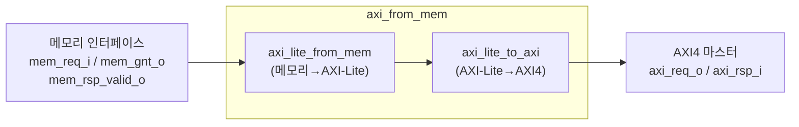

# axi_from_mem.sv

## 개요

메모리 인터페이스 요청을 AXI4 프로토콜로 변환하는 프로토콜 어댑터입니다. SRAM처럼 동작하며 AXI4 요청을 다운스트림으로 전송합니다.

- 복수의 미처리(outstanding) 요청 지원
- 읽기와 쓰기 모두에 대한 응답 생성
- 응답 지연은 고정되지 않으며 1사이클이 아님

## 블록 다이어그램

## 파라미터

| 파라미터 | 타입 | 기본값 | 설명 |
|---------|------|--------|------|
| `MemAddrWidth` | `int unsigned` | 0 | 메모리 요청 주소 폭 |
| `AxiAddrWidth` | `int unsigned` | 0 | AXI4-Lite 주소 폭 |
| `DataWidth` | `int unsigned` | 0 | 메모리 및 AXI4 데이터 폭 |
| `MaxRequests` | `int unsigned` | 0 | 동시 처리 가능한 최대 요청 수 (응답 MUX FIFO 깊이) |
| `AxiProt` | `axi_pkg::prot_t` | `3'b000` | AXI4 트랜잭션에 사용할 보호 신호 |
| `axi_req_t` | `type` | `logic` | AXI4 요청 구조체 타입 |
| `axi_rsp_t` | `type` | `logic` | AXI4 응답 구조체 타입 |

## 포트

| 포트 | 방향 | 폭 | 설명 |
|------|------|----|------|
| `clk_i` | 입력 | 1 | 클록 (상승 에지) |
| `rst_ni` | 입력 | 1 | 비동기 리셋 (액티브 로우) |
| `mem_req_i` | 입력 | 1 | 메모리 요청 활성화 |
| `mem_addr_i` | 입력 | `MemAddrWidth` | 바이트 단위 주소 |
| `mem_we_i` | 입력 | 1 | 쓰기 요청 여부 (`0`=읽기, `1`=쓰기) |
| `mem_wdata_i` | 입력 | `DataWidth` | 쓰기 데이터 |
| `mem_be_i` | 입력 | `DataWidth/8` | 바이트 활성화 (액티브 하이) |
| `mem_gnt_o` | 출력 | 1 | 요청 승인 |
| `mem_rsp_valid_o` | 출력 | 1 | 응답 유효 |
| `mem_rsp_rdata_o` | 출력 | `DataWidth` | 읽기 응답 데이터 |
| `mem_rsp_error_o` | 출력 | 1 | 오류 응답 |
| `slv_aw_cache_i` | 입력 | - | AXI4 AW 캐시 신호 |
| `slv_ar_cache_i` | 입력 | - | AXI4 AR 캐시 신호 |
| `axi_req_o` | 출력 | - | AXI4 마스터 요청 |
| `axi_rsp_i` | 입력 | - | AXI4 마스터 응답 |

## 내부 구조

이 모듈은 두 개의 하위 모듈을 연결합니다:

1. **`axi_lite_from_mem`**: 메모리 인터페이스를 AXI4-Lite로 변환
2. **`axi_lite_to_axi`**: AXI4-Lite를 완전한 AXI4로 변환

## 의존성

- `axi_lite_from_mem`
- `axi_lite_to_axi`
- `axi_pkg`
