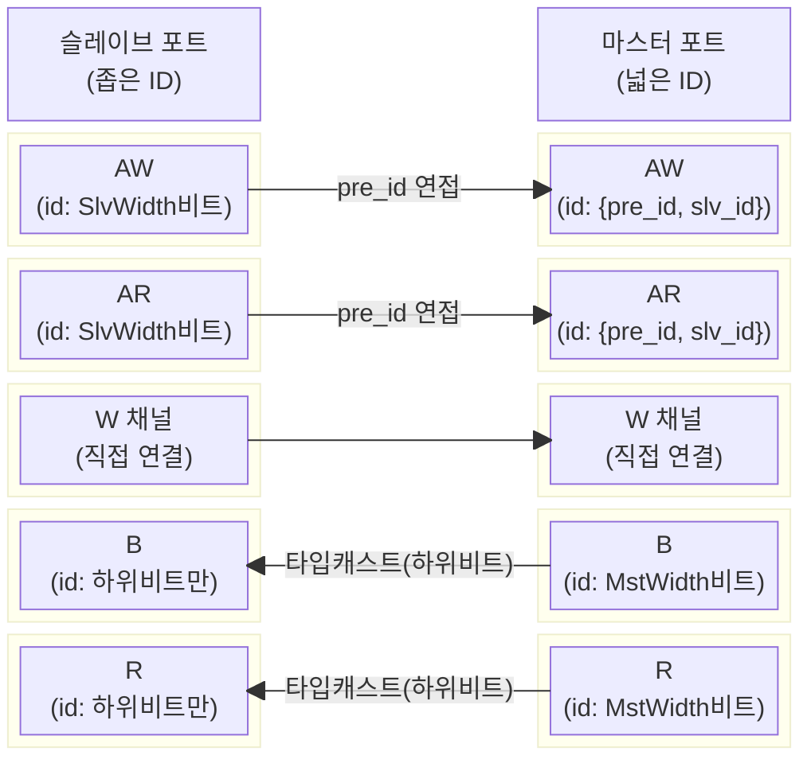
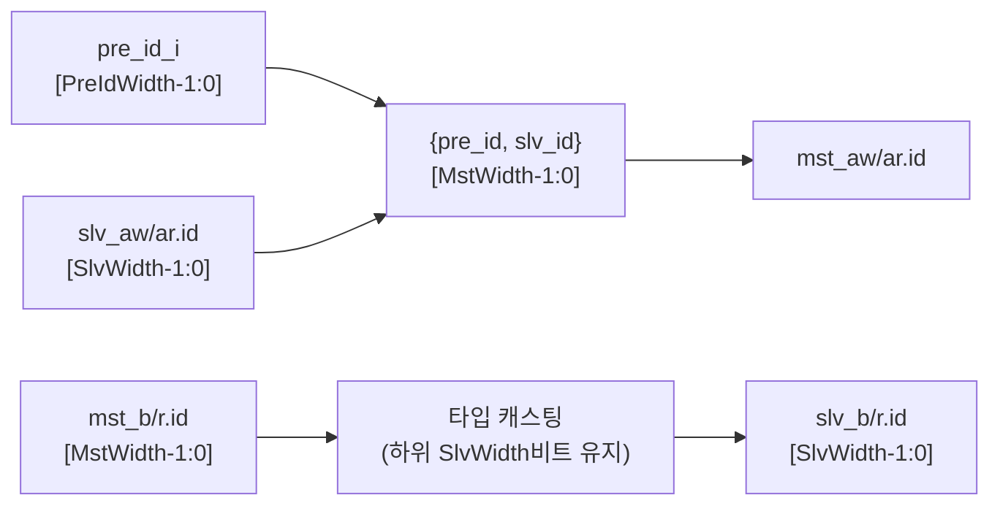

# axi_id_prepend

## 모듈 목적 및 개요

`axi_id_prepend`는 AXI 버스의 ID 필드 앞에 상위 비트(prefix)를 추가하거나, 반대 방향으로 해당 상위 비트를 제거(strip)하는 조합 논리 모듈입니다. 슬레이브 포트의 좁은 ID를 마스터 포트의 넓은 ID로 확장할 때 사용됩니다.

동작 원칙:
- **AW/AR 채널 (슬레이브 → 마스터):** 슬레이브 포트의 ID 앞에 `pre_id_i`를 MSB로 연접(concatenate)하여 마스터 포트의 더 넓은 ID를 구성합니다.
- **B/R 채널 (마스터 → 슬레이브):** 마스터 포트의 넓은 ID에서 하위 `AxiIdWidthSlvPort` 비트만 잘라 슬레이브 포트의 ID로 사용합니다. ID 필드가 struct 최상위 비트에 위치하므로 단순 타입 캐스팅으로 처리됩니다.
- W 채널 및 모든 핸드셰이크 신호는 변경 없이 직접 연결됩니다.
- 여러 버스(`NoBus > 1`)를 동시에 처리하는 벡터 인터페이스를 지원합니다.

---

## 파라미터 테이블

| 이름 | 타입 | 기본값 | 설명 |
|------|------|--------|------|
| `NoBus` | `int unsigned` | `1` | 동시에 처리할 AXI 버스 수 |
| `AxiIdWidthSlvPort` | `int unsigned` | `4` | 슬레이브 포트 AXI ID 비트 폭 |
| `AxiIdWidthMstPort` | `int unsigned` | `6` | 마스터 포트 AXI ID 비트 폭 |
| `slv_aw_chan_t` | `type` | `logic` | 슬레이브 포트 AW 채널 구조체 타입 |
| `slv_w_chan_t` | `type` | `logic` | 슬레이브 포트 W 채널 구조체 타입 |
| `slv_b_chan_t` | `type` | `logic` | 슬레이브 포트 B 채널 구조체 타입 |
| `slv_ar_chan_t` | `type` | `logic` | 슬레이브 포트 AR 채널 구조체 타입 |
| `slv_r_chan_t` | `type` | `logic` | 슬레이브 포트 R 채널 구조체 타입 |
| `mst_aw_chan_t` | `type` | `logic` | 마스터 포트 AW 채널 구조체 타입 |
| `mst_w_chan_t` | `type` | `logic` | 마스터 포트 W 채널 구조체 타입 |
| `mst_b_chan_t` | `type` | `logic` | 마스터 포트 B 채널 구조체 타입 |
| `mst_ar_chan_t` | `type` | `logic` | 마스터 포트 AR 채널 구조체 타입 |
| `mst_r_chan_t` | `type` | `logic` | 마스터 포트 R 채널 구조체 타입 |
| `PreIdWidth` | `int unsigned` | `AxiIdWidthMstPort - AxiIdWidthSlvPort` | 추가되는 상위 ID 비트 폭 (자동 계산, 덮어쓰기 금지) |

---

## 포트 테이블

| 이름 | 방향 | 너비 | 설명 |
|------|------|------|------|
| `pre_id_i` | input | `PreIdWidth` | AW/AR ID 앞에 붙일 상위 ID 값 |
| `slv_aw_chans_i` | input | `NoBus` x `slv_aw_chan_t` | 슬레이브 AW 채널 배열 |
| `slv_aw_valids_i` | input | `NoBus` | 슬레이브 AW valid 신호 배열 |
| `slv_aw_readies_o` | output | `NoBus` | 슬레이브 AW ready 신호 배열 |
| `slv_w_chans_i` | input | `NoBus` x `slv_w_chan_t` | 슬레이브 W 채널 배열 |
| `slv_w_valids_i` | input | `NoBus` | 슬레이브 W valid 신호 배열 |
| `slv_w_readies_o` | output | `NoBus` | 슬레이브 W ready 신호 배열 |
| `slv_b_chans_o` | output | `NoBus` x `slv_b_chan_t` | 슬레이브 B 채널 배열 |
| `slv_b_valids_o` | output | `NoBus` | 슬레이브 B valid 신호 배열 |
| `slv_b_readies_i` | input | `NoBus` | 슬레이브 B ready 신호 배열 |
| `slv_ar_chans_i` | input | `NoBus` x `slv_ar_chan_t` | 슬레이브 AR 채널 배열 |
| `slv_ar_valids_i` | input | `NoBus` | 슬레이브 AR valid 신호 배열 |
| `slv_ar_readies_o` | output | `NoBus` | 슬레이브 AR ready 신호 배열 |
| `slv_r_chans_o` | output | `NoBus` x `slv_r_chan_t` | 슬레이브 R 채널 배열 |
| `slv_r_valids_o` | output | `NoBus` | 슬레이브 R valid 신호 배열 |
| `slv_r_readies_i` | input | `NoBus` | 슬레이브 R ready 신호 배열 |
| `mst_aw_chans_o` | output | `NoBus` x `mst_aw_chan_t` | 마스터 AW 채널 배열 (ID 확장됨) |
| `mst_aw_valids_o` | output | `NoBus` | 마스터 AW valid 신호 배열 |
| `mst_aw_readies_i` | input | `NoBus` | 마스터 AW ready 신호 배열 |
| `mst_w_chans_o` | output | `NoBus` x `mst_w_chan_t` | 마스터 W 채널 배열 |
| `mst_w_valids_o` | output | `NoBus` | 마스터 W valid 신호 배열 |
| `mst_w_readies_i` | input | `NoBus` | 마스터 W ready 신호 배열 |
| `mst_b_chans_i` | input | `NoBus` x `mst_b_chan_t` | 마스터 B 채널 배열 |
| `mst_b_valids_i` | input | `NoBus` | 마스터 B valid 신호 배열 |
| `mst_b_readies_o` | output | `NoBus` | 마스터 B ready 신호 배열 |
| `mst_ar_chans_o` | output | `NoBus` x `mst_ar_chan_t` | 마스터 AR 채널 배열 (ID 확장됨) |
| `mst_ar_valids_o` | output | `NoBus` | 마스터 AR valid 신호 배열 |
| `mst_ar_readies_i` | input | `NoBus` | 마스터 AR ready 신호 배열 |
| `mst_r_chans_i` | input | `NoBus` x `mst_r_chan_t` | 마스터 R 채널 배열 |
| `mst_r_valids_i` | input | `NoBus` | 마스터 R valid 신호 배열 |
| `mst_r_readies_o` | output | `NoBus` | 마스터 R ready 신호 배열 |

---

## 내부 동작 및 로직 설명

### ID 추가 (AW/AR 채널)

`genvar i`를 이용한 `for` 루프로 `NoBus`개의 버스를 동시 처리합니다.

- `PreIdWidth == 0`인 경우: 채널 구조체를 그대로 직접 할당합니다 (`gen_no_prepend`).
- `PreIdWidth > 0`인 경우: `always_comb` 블록에서 마스터 AW/AR 채널 전체를 슬레이브 채널로 초기화한 후, ID 필드만 `{pre_id_i, slv_..._chans_i[i].id[AxiIdWidthSlvPort-1:0]}`으로 덮어씁니다.

### ID 제거 (B/R 채널)

AXI 채널 struct의 `id` 필드가 최상위 비트에 위치한다는 점을 이용합니다. 마스터 B/R 채널(넓은 ID)을 슬레이브 타입으로 단순 캐스팅하면, 넓은 ID의 하위 비트(원래 슬레이브 ID)만 남게 됩니다.

```
slv_b_chans_o[i] = slv_b_chan_t'(mst_b_chans_i[i]);
slv_r_chans_o[i] = slv_r_chan_t'(mst_r_chans_i[i]);
```

### 핸드셰이크 및 W 채널

모든 valid/ready 신호와 W 채널 데이터는 변환 없이 슬레이브와 마스터 포트 사이에 직접 연결됩니다.

### 검증 어서션 (시뮬레이션 전용)

- `NoBus > 0` 확인
- `PreIdWidth`가 마스터/슬레이브 ID 폭의 차이와 일치하는지 확인
- 마스터 포트 ID가 슬레이브 포트 ID보다 넓은지 확인
- AW/AR/B/R 채널의 ID prepend/strip 결과가 올바른지 `assert final`로 확인

---

## Mermaid 블록 다이어그램





---

## 의존성 모듈 목록

이 모듈은 순수 조합 논리로 구성되며 외부 서브모듈에 대한 의존성이 없습니다. 단, 사용 시 AXI 채널 구조체 타입(`slv_*_chan_t`, `mst_*_chan_t`)은 외부에서 정의되어야 합니다.

| 모듈/패키지 | 용도 |
|------------|------|
| AXI 채널 타입 매크로 (`axi/typedef.svh`) | 사용 측에서 채널 타입 정의 시 필요 |

---

## 사용 예시

```systemverilog
// 슬레이브 ID 4비트, 마스터 ID 6비트인 경우 (PreIdWidth = 2)
axi_id_prepend #(
  .NoBus             ( 1              ),
  .AxiIdWidthSlvPort ( 4              ),
  .AxiIdWidthMstPort ( 6              ),
  .slv_aw_chan_t     ( slv_aw_chan_t  ),
  .slv_w_chan_t      ( slv_w_chan_t   ),
  .slv_b_chan_t      ( slv_b_chan_t   ),
  .slv_ar_chan_t     ( slv_ar_chan_t  ),
  .slv_r_chan_t      ( slv_r_chan_t   ),
  .mst_aw_chan_t     ( mst_aw_chan_t  ),
  .mst_w_chan_t      ( mst_w_chan_t   ),
  .mst_b_chan_t      ( mst_b_chan_t   ),
  .mst_ar_chan_t     ( mst_ar_chan_t  ),
  .mst_r_chan_t      ( mst_r_chan_t   )
) i_axi_id_prepend (
  .pre_id_i          ( 2'b01          ), // 상위 2비트: 01 고정
  .slv_aw_chans_i    ( slv_aw         ),
  .slv_aw_valids_i   ( slv_aw_valid   ),
  .slv_aw_readies_o  ( slv_aw_ready   ),
  .slv_w_chans_i     ( slv_w          ),
  .slv_w_valids_i    ( slv_w_valid    ),
  .slv_w_readies_o   ( slv_w_ready    ),
  .slv_b_chans_o     ( slv_b          ),
  .slv_b_valids_o    ( slv_b_valid    ),
  .slv_b_readies_i   ( slv_b_ready    ),
  .slv_ar_chans_i    ( slv_ar         ),
  .slv_ar_valids_i   ( slv_ar_valid   ),
  .slv_ar_readies_o  ( slv_ar_ready   ),
  .slv_r_chans_o     ( slv_r          ),
  .slv_r_valids_o    ( slv_r_valid    ),
  .slv_r_readies_i   ( slv_r_ready    ),
  .mst_aw_chans_o    ( mst_aw         ),
  .mst_aw_valids_o   ( mst_aw_valid   ),
  .mst_aw_readies_i  ( mst_aw_ready   ),
  .mst_w_chans_o     ( mst_w          ),
  .mst_w_valids_o    ( mst_w_valid    ),
  .mst_w_readies_i   ( mst_w_ready    ),
  .mst_b_chans_i     ( mst_b          ),
  .mst_b_valids_i    ( mst_b_valid    ),
  .mst_b_readies_o   ( mst_b_ready    ),
  .mst_ar_chans_o    ( mst_ar         ),
  .mst_ar_valids_o   ( mst_ar_valid   ),
  .mst_ar_readies_i  ( mst_ar_ready   ),
  .mst_r_chans_i     ( mst_r          ),
  .mst_r_valids_i    ( mst_r_valid    ),
  .mst_r_readies_o   ( mst_r_ready    )
);
// slv_aw.id = 4'b1010 이면 mst_aw.id = 6'b01_1010
```

> 참고: `axi_iw_converter`에서 ID 폭 확장(upsize) 경로는 `pre_id_i = '0`으로 고정하여 이 모듈을 내부적으로 사용합니다.
