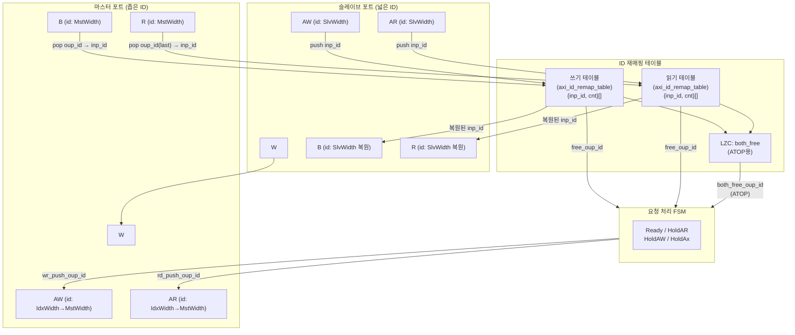

# axi_id_remap

## 모듈 목적 및 개요

`axi_id_remap`은 AXI4+ATOP 슬레이브 포트의 넓은(Wide) ID 공간을 마스터 포트의 좁은(Narrow) ID 공간으로 재매핑(remap)하는 모듈입니다. 마스터 장치가 넓은 ID 포트를 갖지만 실제로는 희소하게만 ID를 사용하는 경우에 적합합니다.

**핵심 특성:**
- **ID 독립성 유지:** 슬레이브 포트에서 서로 다른 ID를 가진 두 트랜잭션은 마스터 포트에서도 서로 다른 ID를 보장합니다.
- 내부적으로 `axi_id_remap_table`을 이용해 진행 중인 트랜잭션의 입/출력 ID 매핑을 추적합니다.
- ID 독립성 없이 더 좁은 ID가 필요하다면 `axi_id_serialize`를 대신 사용해야 합니다.
- ATOP(Atomic Operation) 트랜잭션을 지원하며, 읽기 응답을 유발하는 ATOP의 경우 읽기/쓰기 양쪽 테이블에서 동시에 여유 ID를 찾아 사용합니다.

이 파일에는 세 개의 모듈이 포함됩니다:
1. `axi_id_remap` - 메인 리맵 모듈
2. `axi_id_remap_table` - 내부 ID 매핑 테이블
3. `axi_id_remap_intf` - AXI 인터페이스 래퍼

---

## 파라미터 테이블

### axi_id_remap

| 이름 | 타입 | 기본값 | 설명 |
|------|------|--------|------|
| `AxiSlvPortIdWidth` | `int unsigned` | `0` | 슬레이브 포트 AXI ID 비트 폭 |
| `AxiSlvPortMaxUniqIds` | `int unsigned` | `0` | 슬레이브 포트에서 동시에 진행 가능한 최대 고유 ID 수 (읽기/쓰기 별도 계산, ATOP 제외) |
| `AxiMaxTxnsPerId` | `int unsigned` | `0` | 동일 ID로 동시 진행 가능한 최대 트랜잭션 수 |
| `AxiMstPortIdWidth` | `int unsigned` | `0` | 마스터 포트 AXI ID 비트 폭 (최솟값: ceil(log2(AxiSlvPortMaxUniqIds))) |
| `slv_req_t` | `type` | `logic` | 슬레이브 포트 요청 구조체 타입 |
| `slv_resp_t` | `type` | `logic` | 슬레이브 포트 응답 구조체 타입 |
| `mst_req_t` | `type` | `logic` | 마스터 포트 요청 구조체 타입 |
| `mst_resp_t` | `type` | `logic` | 마스터 포트 응답 구조체 타입 |

### axi_id_remap_table

| 이름 | 타입 | 기본값 | 설명 |
|------|------|--------|------|
| `InpIdWidth` | `int unsigned` | `0` | 입력 ID 비트 폭 |
| `MaxUniqInpIds` | `int unsigned` | `0` | 최대 고유 입력 ID 수 (테이블 엔트리 수) |
| `MaxTxnsPerId` | `int unsigned` | `0` | 동일 ID로 동시 진행 가능한 최대 트랜잭션 수 |

---

## 포트 테이블

### axi_id_remap

| 이름 | 방향 | 너비 | 설명 |
|------|------|------|------|
| `clk_i` | input | 1 | 상승 엣지 클록 |
| `rst_ni` | input | 1 | 비동기 리셋 (Active Low) |
| `slv_req_i` | input | `slv_req_t` | 슬레이브 포트 요청 |
| `slv_resp_o` | output | `slv_resp_t` | 슬레이브 포트 응답 |
| `mst_req_o` | output | `mst_req_t` | 마스터 포트 요청 |
| `mst_resp_i` | input | `mst_resp_t` | 마스터 포트 응답 |

### axi_id_remap_table

| 이름 | 방향 | 너비 | 설명 |
|------|------|------|------|
| `clk_i` | input | 1 | 상승 엣지 클록 |
| `rst_ni` | input | 1 | 비동기 리셋 (Active Low) |
| `free_o` | output | `MaxUniqInpIds` | 각 테이블 엔트리의 여유 여부 (비트맵) |
| `free_oup_id_o` | output | `IdxWidth` | 가장 낮은 여유 출력 ID |
| `full_o` | output | 1 | 테이블이 가득 찼는지 여부 |
| `push_i` | input | 1 | 테이블에 입/출력 ID 쌍 push 요청 |
| `push_inp_id_i` | input | `InpIdWidth` | push할 입력 ID |
| `push_oup_id_i` | input | `IdxWidth` | push할 출력 ID |
| `exists_inp_id_i` | input | `InpIdWidth` | 조회할 입력 ID |
| `exists_o` | output | 1 | 해당 입력 ID가 테이블에 존재하는지 여부 |
| `exists_oup_id_o` | output | `IdxWidth` | 해당 입력 ID에 대응되는 출력 ID |
| `exists_full_o` | output | 1 | 해당 입력 ID의 트랜잭션이 최대치에 도달했는지 여부 |
| `pop_i` | input | 1 | 테이블에서 출력 ID pop 요청 |
| `pop_oup_id_i` | input | `IdxWidth` | pop할 출력 ID |
| `pop_inp_id_o` | output | `InpIdWidth` | pop된 출력 ID에 대응되는 입력 ID |

---

## 내부 동작 및 로직 설명

### ID 재매핑 테이블 (`axi_id_remap_table`)

출력 ID를 인덱스로 하는 테이블로, 각 엔트리는 `{inp_id, cnt}` 구조체를 저장합니다.

- **Push:** 입력/출력 ID 쌍을 등록하고 카운터를 증가합니다. 이미 같은 입력 ID가 존재하면 동일 출력 ID를 재사용하고 카운터만 올립니다.
- **Pop:** 특정 출력 ID의 카운터를 1 감소시킵니다. 카운터가 0이 되면 해당 슬롯은 free 상태가 됩니다.
- **Exists 조회:** 현재 진행 중인 입력 ID가 테이블에 있는지 확인합니다.
- **Free 탐색:** Leading Zero Counter(LZC)로 가장 낮은 여유 슬롯(출력 ID)을 O(1)에 찾습니다.

### 요청 처리 FSM (`axi_id_remap` 메인 로직)

4가지 상태를 갖는 FSM으로 AW/AR 채널의 ID 재매핑을 관리합니다.

| 상태 | 설명 |
|------|------|
| `Ready` | 일반 동작. AR/AW 요청을 처리하고 테이블에 push. |
| `HoldAR` | AR valid가 마스터에 전달됐으나 ready를 받지 못한 상태. AR ID 유지. |
| `HoldAW` | AW valid가 마스터에 전달됐으나 ready를 받지 못한 상태. AW ID 유지. |
| `HoldAx` | AR과 AW 모두 ready 대기 중인 상태. |

**ATOP 처리:**
- ATOP이 읽기 응답을 유발하는 경우(`aw.atop[ATOP_R_RESP]`), 읽기/쓰기 양방향 모두에서 여유 있는 ID(`both_free`)를 LZC로 선택합니다.
- AR 요청이 대기 중일 때 ATOP이 AR을 선점하지 못하도록 `ar_prio_q` 플래그를 사용합니다.

### B/R 채널 ID 역매핑

- B 채널: 마스터의 `b.id`로 테이블을 pop하여 원래 슬레이브 `b.id`를 복원합니다.
- R 채널: 마지막 beat(`r.last`)에서 테이블을 pop하여 슬레이브 `r.id`를 복원합니다.

### ID 직통 신호

ID를 제외한 AW/AR/W/B/R 채널의 모든 필드(addr, len, size, burst, lock, cache, prot, qos, region, atop, user, data, resp 등)는 변환 없이 직접 연결됩니다.

---

## Mermaid 블록 다이어그램



---

## 의존성 모듈 목록

| 모듈 | 위치 | 용도 |
|------|------|------|
| `axi_id_remap_table` | 동일 파일 | ID 입/출력 매핑 추적 테이블 (쓰기/읽기 각 1개 인스턴스) |
| `lzc` | `common_cells` | Leading Zero Counter - 여유 슬롯/매칭 슬롯 탐색 |
| `cf_math_pkg::idx_width` | `common_cells` | 인덱스 비트 폭 계산 함수 |
| `axi_id_remap_intf` | 동일 파일 | AXI 인터페이스 기반 래퍼 (선택적 사용) |
| `common_cells/registers.svh` | `common_cells` | `FFARN` 플립플롭 매크로 |

---

## 사용 예시

```systemverilog
// 슬레이브: 8비트 ID, 최대 4개 고유 ID 동시 사용, 동일 ID 최대 8개 동시 트랜잭션
// 마스터: 2비트 ID (ceil(log2(4)) = 2)
axi_id_remap #(
  .AxiSlvPortIdWidth    ( 8           ),
  .AxiSlvPortMaxUniqIds ( 4           ),
  .AxiMaxTxnsPerId      ( 8           ),
  .AxiMstPortIdWidth    ( 2           ),
  .slv_req_t            ( slv_req_t   ),
  .slv_resp_t           ( slv_resp_t  ),
  .mst_req_t            ( mst_req_t   ),
  .mst_resp_t           ( mst_resp_t  )
) i_axi_id_remap (
  .clk_i,
  .rst_ni,
  .slv_req_i  ( slv_req  ),
  .slv_resp_o ( slv_resp ),
  .mst_req_o  ( mst_req  ),
  .mst_resp_i ( mst_resp )
);
```

**인터페이스 방식 사용:**

```systemverilog
axi_id_remap_intf #(
  .AXI_SLV_PORT_ID_WIDTH    ( 8  ),
  .AXI_SLV_PORT_MAX_UNIQ_IDS( 4  ),
  .AXI_MAX_TXNS_PER_ID      ( 8  ),
  .AXI_MST_PORT_ID_WIDTH    ( 2  ),
  .AXI_ADDR_WIDTH           ( 32 ),
  .AXI_DATA_WIDTH           ( 64 ),
  .AXI_USER_WIDTH           ( 1  )
) i_remap (
  .clk_i,
  .rst_ni,
  .slv ( axi_slave_if  ),
  .mst ( axi_master_if )
);
```

> 주의: `AxiMstPortIdWidth >= ceil(log2(AxiSlvPortMaxUniqIds))`를 반드시 만족해야 합니다. 그렇지 않으면 초기화 단계에서 fatal 어서션이 발생합니다.
