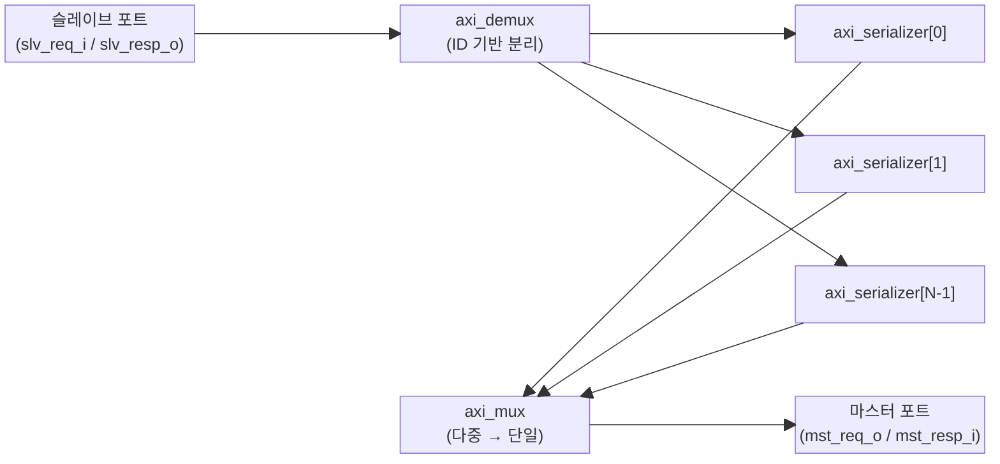

# axi_id_serialize

## 모듈 개요 및 기능

`axi_id_serialize`는 넓은 AXI ID 공간을 임의의 좁은 ID 공간으로 재매핑하는 모듈입니다. 서로 다른 두 개의 Slave 포트 ID를 동일한 Master 포트 ID에 매핑할 수 있으며, 이 경우 해당 트랜잭션들을 직렬화(serializing)하여 순서를 강제합니다. ID의 독립성을 유지하면서 ID 폭만 줄이려면 `axi_id_remap`을 사용해야 합니다.

내부적으로 Master 포트 ID 수(`AxiMstPortMaxUniqIds`)만큼 `axi_serializer` 인스턴스를 생성하고, 이를 `axi_demux`와 `axi_mux`로 연결하는 계층 구조를 가집니다.

---

## Mermaid 블록 다이어그램

> **클록 도메인:** 단일 클록 도메인 (`clk_i`). 비동기 리셋 (`rst_ni`, active low).

---

## 파라미터 테이블

| 이름 | 타입 | 기본값 | 설명 |
|------|------|--------|------|
| `AxiSlvPortIdWidth` | `int unsigned` | `0` | Slave 포트 AXI ID 폭 |
| `AxiSlvPortMaxTxns` | `int unsigned` | `0` | Slave 포트 최대 동시 트랜잭션 수 (읽기/쓰기 별도) |
| `AxiMstPortIdWidth` | `int unsigned` | `0` | Master 포트 AXI ID 폭 |
| `AxiMstPortMaxUniqIds` | `int unsigned` | `0` | Master 포트 최대 고유 ID 수 (직렬화기 인스턴스 수) |
| `AxiMstPortMaxTxnsPerId` | `int unsigned` | `0` | Master 포트 동일 ID 최대 동시 트랜잭션 수 |
| `AxiAddrWidth` | `int unsigned` | `0` | 주소 폭 (양 포트 동일) |
| `AxiDataWidth` | `int unsigned` | `0` | 데이터 폭 (양 포트 동일) |
| `AxiUserWidth` | `int unsigned` | `0` | User 신호 폭 (양 포트 동일) |
| `AtopSupport` | `bit` | `1'b1` | AXI4+ATOP 원자 연산 지원 여부 |
| `slv_req_t` | `type` | `logic` | Slave 포트 요청 구조체 타입 |
| `slv_resp_t` | `type` | `logic` | Slave 포트 응답 구조체 타입 |
| `mst_req_t` | `type` | `logic` | Master 포트 요청 구조체 타입 |
| `mst_resp_t` | `type` | `logic` | Master 포트 응답 구조체 타입 |
| `MstIdBaseOffset` | `int unsigned` | `0` | 출력 ID 오프셋 (modulo `AxiMstPortMaxUniqIds`) |
| `IdMapNumEntries` | `int unsigned` | `0` | 명시적 ID 맵 항목 수 |
| `IdMap` | `int unsigned [N][0:1]` | `'{default: 0}` | 명시적 입출력 ID 매핑 테이블 |

---

## 포트 테이블

| 이름 | 방향 | 폭 | 설명 |
|------|------|----|------|
| `clk_i` | input | 1 | 상승 에지 클록 |
| `rst_ni` | input | 1 | 비동기 리셋 (active low) |
| `slv_req_i` | input | `slv_req_t` | Slave 포트 요청 |
| `slv_resp_o` | output | `slv_resp_t` | Slave 포트 응답 |
| `mst_req_o` | output | `mst_req_t` | Master 포트 요청 |
| `mst_resp_i` | input | `mst_resp_t` | Master 포트 응답 |

---

## 내부 아키텍처 설명

### ID 매핑 로직

파라미터 함수 `map_slv_ids()`가 컴파일 타임에 Slave ID → Master ID의 전체 매핑 테이블(`SlvIdMap`)을 생성합니다.

- 기본 매핑: `output_id = (input_id + MstIdBaseOffset) % AxiMstPortMaxUniqIds`
- 명시적 매핑: `IdMap` 배열을 통해 특정 입력 ID를 원하는 출력 ID로 고정 가능

### 데이터 경로

1. **axi_demux**: Slave 포트의 AW/AR 트랜잭션을 `SlvIdMap`에 의해 결정된 `select` 신호로 `AxiMstPortMaxUniqIds`개의 채널로 분산
2. **axi_serializer (x N)**: 각 채널에서 동일 ID 트랜잭션을 직렬화. 출력 ID는 항상 1비트 0값으로 고정
3. **axi_mux**: 여러 직렬화기 출력을 하나의 Master 채널로 다중화. 이 과정에서 ID 앞에 포트 인덱스 비트 추가
4. **ID 시프트 로직**: Mux가 ID에 추가한 비트를 제거하여 최종 Master ID 폭에 맞춤

### 스필 레지스터

`axi_demux`와 `axi_mux` 모두 AW, AR 채널에 스필 레지스터(Spill register, SpillAw=1, SpillAr=1)를 사용하여 타이밍 클로저를 지원합니다.

---

## 인스턴스화하는 서브모듈 목록

| 서브모듈 | 인스턴스 이름 | 역할 |
|----------|--------------|------|
| `axi_demux` | `i_axi_demux` | Slave 포트 ID 기반 트랜잭션 분배 |
| `axi_serializer` (x N) | `gen_serializers[i].i_axi_serializer` | 채널별 트랜잭션 직렬화 |
| `axi_mux` | `i_axi_mux` | 다중 직렬화기 출력 결합 |
| `axi_id_prepend` | `gen_no_id_shift.i_axi_id_prepend` | ID 폭 1일 때 ID 패딩 |

---

## 타이밍/레이턴시 특성

- AW/AR 채널: `axi_demux` 내 스필 레지스터로 최소 **1사이클 레이턴시**
- `axi_mux` 내 AW/AR 스필 레지스터로 추가 **1사이클 레이턴시**
- 동일 ID 트랜잭션이 동시에 진행 중이면 `axi_serializer`가 이후 트랜잭션을 stall
- W, B, R 채널: Spill 없이 직결(0 추가 레이턴시)

---

## 특수 동작

- **ATOP 처리**: `AtopSupport=1`일 때 원자 연산(ATOP)은 읽기와 쓰기 양쪽 카운터 모두 증가
- **ID 폭 축소 방향만 지원**: `AxiMstPortIdWidth <= AxiSlvPortIdWidth` 조건 필수. 위반 시 시뮬레이션에서 `$fatal` 발생
- **인터페이스 변형**: `axi_id_serialize_intf` 모듈이 `AXI_BUS` 인터페이스 기반 래퍼로 제공
- **파라미터 검증**: 초기화 블록에서 ID 폭, 주소/데이터 폭 일치 여부 assert로 검증
