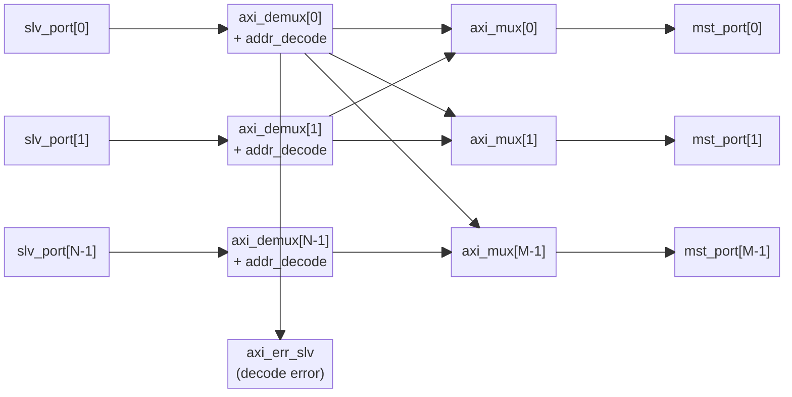

# axi_interleaved_xbar

## 모듈 개요 및 기능

`axi_interleaved_xbar`는 표준 AXI 크로스바(`axi_xbar`)의 인터리브(interleaved) 변형 버전입니다. 실험적(experimental) 모듈로, 주의하여 사용해야 합니다.

일반 크로스바와의 차이점은 `interleaved_mode_ena_i` 신호를 통해 동적으로 라우팅 모드를 전환할 수 있다는 점입니다:

- **일반 모드**: 주소 디코더(`addr_decode`)가 주소 맵 기반으로 Master 포트를 선택
- **인터리브 모드**: 주소의 비트 [16 + log2(NoMstPorts) - 1 : 16] 필드로 뱅크(Bank)를 선택하고, 해당 비트를 주소에서 제거하여 각 메모리 뱅크에 연속 블록(4KiB 단위)으로 분산

여러 Slave 포트에서 여러 Master 포트로의 완전한 크로스 연결을 지원하며, 연결성 행렬(`Connectivity`)로 미연결 경로를 선택적으로 비활성화할 수 있습니다.

---

## Mermaid 블록 다이어그램

> **클록 도메인:** 단일 클록 도메인 (`clk_i`). 비동기 리셋 (`rst_ni`, active low).

---

## 파라미터 테이블

| 이름 | 타입 | 기본값 | 설명 |
|------|------|--------|------|
| `Cfg` | `axi_pkg::xbar_cfg_t` | `'0` | 크로스바 구성 구조체 (포트 수, ID 폭, 레이턴시 모드 등 포함) |
| `ATOPs` | `bit` | `1'b1` | 원자 연산(ATOP) 지원 여부 |
| `Connectivity` | `bit [NoSlvPorts-1:0][NoMstPorts-1:0]` | `'1` | Slave-Master 포트 연결 행렬 |
| `slv_aw_chan_t` | `type` | `logic` | Slave 포트 AW 채널 타입 |
| `mst_aw_chan_t` | `type` | `logic` | Master 포트 AW 채널 타입 |
| `w_chan_t` | `type` | `logic` | W 채널 타입 |
| `slv_b_chan_t` | `type` | `logic` | Slave 포트 B 채널 타입 |
| `mst_b_chan_t` | `type` | `logic` | Master 포트 B 채널 타입 |
| `slv_ar_chan_t` | `type` | `logic` | Slave 포트 AR 채널 타입 |
| `mst_ar_chan_t` | `type` | `logic` | Master 포트 AR 채널 타입 |
| `slv_r_chan_t` | `type` | `logic` | Slave 포트 R 채널 타입 |
| `mst_r_chan_t` | `type` | `logic` | Master 포트 R 채널 타입 |
| `slv_req_t` | `type` | `logic` | Slave 포트 요청 구조체 타입 |
| `slv_resp_t` | `type` | `logic` | Slave 포트 응답 구조체 타입 |
| `mst_req_t` | `type` | `logic` | Master 포트 요청 구조체 타입 |
| `mst_resp_t` | `type` | `logic` | Master 포트 응답 구조체 타입 |
| `rule_t` | `type` | `axi_pkg::xbar_rule_64_t` | 주소 디코딩 규칙 타입 |

---

## 포트 테이블

| 이름 | 방향 | 폭 | 설명 |
|------|------|----|------|
| `clk_i` | input | 1 | 클록 |
| `rst_ni` | input | 1 | 비동기 리셋 (active low) |
| `test_i` | input | 1 | 테스트 모드 활성화 |
| `slv_ports_req_i` | input | `[NoSlvPorts-1:0]` | Slave 포트 요청 배열 |
| `slv_ports_resp_o` | output | `[NoSlvPorts-1:0]` | Slave 포트 응답 배열 |
| `mst_ports_req_o` | output | `[NoMstPorts-1:0]` | Master 포트 요청 배열 |
| `mst_ports_resp_i` | input | `[NoMstPorts-1:0]` | Master 포트 응답 배열 |
| `addr_map_i` | input | `[NoAddrRules-1:0]` | 주소 매핑 규칙 |
| `interleaved_mode_ena_i` | input | 1 | 인터리브 모드 활성화 신호 |
| `en_default_mst_port_i` | input | `[NoSlvPorts-1:0]` | 기본 Master 포트 활성화 플래그 |
| `default_mst_port_i` | input | `[NoSlvPorts-1:0][idx_width(NoMstPorts)-1:0]` | 기본 Master 포트 인덱스 |

---

## 내부 아키텍처 설명

### Slave 포트 측 (gen_slv_port_demux)

각 Slave 포트에 대해:

1. **주소 디코더 (addr_decode)**: AW/AR 주소를 주소 맵과 비교하여 대상 Master 포트 인덱스 결정
2. **인터리브 선택 로직**: `interleaved_mode_ena_i=1`이면 주소 비트 [16 + MstPortsIdxWidth - 1 : 16]에서 뱅크 선택, 주소에서 해당 비트 제거
3. **axi_demux**: 결정된 `select` 신호로 트랜잭션을 `NoMstPorts + 1`개 채널로 분배 (마지막 채널은 decode error 슬레이브)
4. **axi_err_slv**: 잘못된 주소 디코딩 시 DECERR 응답 생성

### 크로스 연결 (gen_xbar_slv_cross)

`Connectivity[i][j]`가 1이면 슬레이브 포트 i의 출력 j를 Master 포트 j의 입력 i에 직접 연결. 0이면 별도 `axi_err_slv` 인스턴스로 DECERR 반환.

### Master 포트 측 (gen_mst_port_mux)

각 Master 포트에 대해 `axi_mux`로 모든 Slave 포트로부터의 요청을 중재.

---

## 인스턴스화하는 서브모듈 목록

| 서브모듈 | 인스턴스 이름 | 역할 |
|----------|--------------|------|
| `addr_decode` (x 2 x NoSlvPorts) | `i_axi_aw_decode`, `i_axi_ar_decode` | AW/AR 주소 디코딩 |
| `axi_demux` (x NoSlvPorts) | `i_axi_demux` | Slave 포트별 트랜잭션 분배 |
| `axi_err_slv` (x NoSlvPorts + 미연결 수) | `i_axi_err_slv` | Decode error / 미연결 응답 |
| `axi_mux` (x NoMstPorts) | `i_axi_mux` | Master 포트별 트랜잭션 중재 |

---

## 타이밍/레이턴시 특성

- `Cfg.LatencyMode` 비트 필드로 각 채널(AW/W/B/AR/R)별 스필 레지스터 여부 제어
  - 비트 [9:5]: Slave 측 demux의 Spill (AW, W, B, AR, R 순)
  - 비트 [4:0]: Master 측 mux의 Spill
- 스필 레지스터 1개당 1사이클 추가 레이턴시
- `Cfg.FallThrough`: mux의 Fall-through 모드 활성화 여부

---

## 특수 동작

- **인터리브 모드**: 주소 비트 [16+:MstPortsIdxWidth]를 뱅크 선택에 사용하고 이를 삭제하여 각 메모리 뱅크에 연속적 주소를 제공. 4KiB 블록 단위 인터리빙
- **안정성 요구사항**: AW/AR가 미처리(valid & !ready) 상태에서 `en_default_mst_port_i` 또는 `default_mst_port_i` 변경 금지 (assertion으로 검증)
- **인터페이스 변형**: `axi_interleaved_xbar_intf` 모듈이 `AXI_BUS` 인터페이스 기반 래퍼로 제공
- **실험적 모듈**: 생산 사용 주의 (주석에 명시)
