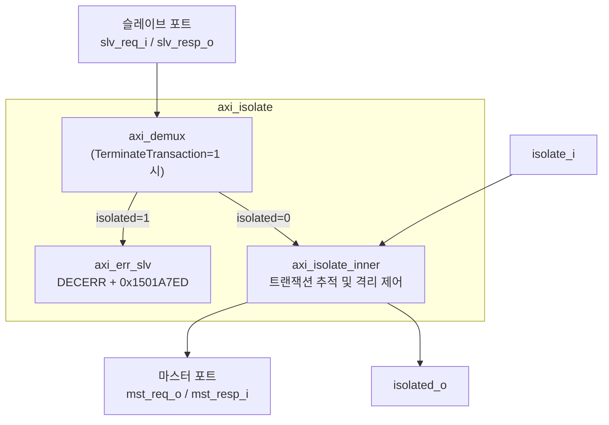
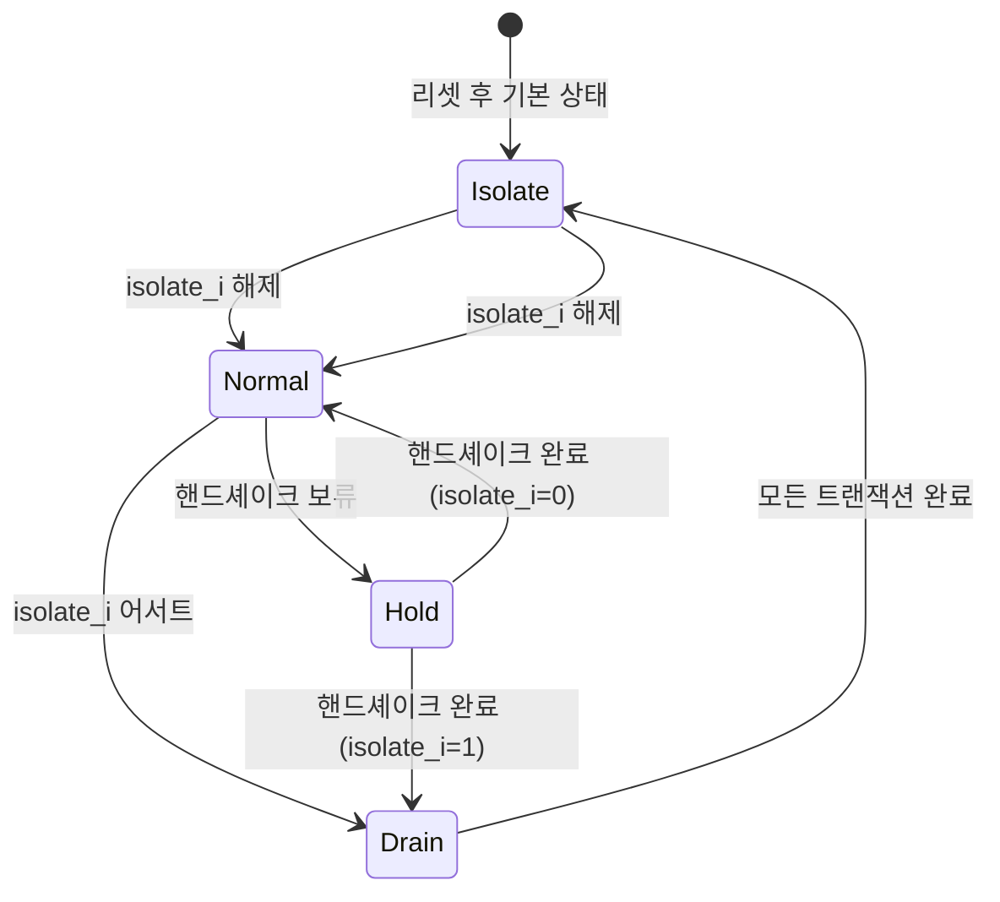

# axi_isolate.sv

## 개요

AXI4+ATOP 버스의 마스터 포트를 슬레이브 포트로부터 격리(isolate)하는 모듈입니다. 격리가 비활성 상태일 때는 두 포트가 직접 연결됩니다.

- 읽기/쓰기 채널별로 미처리 트랜잭션 수 추적
- ATOP(원자적 연산)의 읽기 응답 별도 추적
- `isolate_i` 어서트 시 모든 진행 중인 트랜잭션을 정상 종료 후 격리
- `isolated_o` 어서트 시 `mst_req_o`의 모든 출력 신호가 `'0`으로 침묵

## 블록 다이어그램

## 파라미터

| 파라미터 | 타입 | 기본값 | 설명 |
|---------|------|--------|------|
| `NumPending` | `int unsigned` | 16 | 채널당 최대 보류 요청 수 |
| `TerminateTransaction` | `bit` | `1'b0` | 격리 중 트랜잭션 강제 종료 여부 |
| `AtopSupport` | `bit` | `1'b1` | ATOP 원자적 연산 지원 여부 |
| `AxiAddrWidth` | `int signed` | 0 | 주소 폭 |
| `AxiDataWidth` | `int signed` | 0 | 데이터 폭 |
| `AxiIdWidth` | `int signed` | 0 | ID 폭 |
| `AxiUserWidth` | `int signed` | 0 | 사용자 신호 폭 |
| `axi_req_t` | `type` | `logic` | 요청 구조체 타입 |
| `axi_resp_t` | `type` | `logic` | 응답 구조체 타입 |

## 포트

| 포트 | 방향 | 설명 |
|------|------|------|
| `clk_i` | 입력 | 클록 (상승 에지) |
| `rst_ni` | 입력 | 비동기 리셋 (액티브 로우) |
| `slv_req_i` | 입력 | 슬레이브 포트 요청 |
| `slv_resp_o` | 출력 | 슬레이브 포트 응답 |
| `mst_req_o` | 출력 | 마스터 포트 요청 |
| `mst_resp_i` | 입력 | 마스터 포트 응답 |
| `isolate_i` | 입력 | 격리 요청 신호 |
| `isolated_o` | 출력 | 격리 완료 표시 |

## 격리 상태 머신 (읽기/쓰기 채널 각각)

## TerminateTransaction 동작

| 값 | 동작 |
|----|------|
| `1'b0` | 격리 시 신규 트랜잭션이 de-isolate될 때까지 무한 대기 |
| `1'b1` | 격리 중 신규 트랜잭션에 DECERR 응답, 데이터 `0x1501A7ED` (hexspeak: "isolated") 반환 |

## 제공되는 모듈

| 모듈 | 설명 |
|------|------|
| `axi_isolate` | 구조체 기반 인터페이스 |
| `axi_isolate_inner` | 내부 트랜잭션 추적 로직 |
| `axi_isolate_intf` | SystemVerilog 인터페이스 기반 래퍼 |

## 의존성

- `axi_demux`
- `axi_err_slv`
- `axi_pkg`
- `common_cells/registers.svh`
